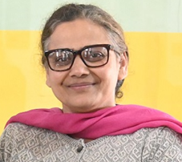

# Department of Applied Science  

## Message from HoD's Desk

Department of Applied Science is a multidisciplinary department and it is functioning with a team of dedicated faculty members who have been actively engaged in imparting quality teaching of the courses in basic science and humanities for graduating engineering students. The core courses offered being Physics, Chemistry, Mathematics, English and Principles of Engineering Economics and Management. Apart from these undergraduate courses, various other research activities are also going in these disciplines. Currently the department is having research scholars in various subjects. Committed minds are always welcome to join hands to build a strong dynamic and wholesome department. It is an endeavor of this department, so that students find applications of science to everyday life, moral and social understanding.

**Dr. Harpreet Kaur Grewal**

HOD, Applied Science Department  

# Department at a Glimpse

 

This department was established in the year 1957, whose role is to deliver excellent quality education in the subject of Applied Sciences and humanities for the future technocrats of all engineering streams. The department also endeavours to inculcate the scientific temper and the spirit of inquest in students. It inspires the students to realize and therefore apply the physical laws to the growth and development of their fields of study. We intensely think that an educational programme should be able to stimulate the development of a balanced and harmonious personality of the students. Hence, the educational program of GNDEC has been customised -to suit such necessities.

 # Extension Lectures, Workshops, and SDP’s Organized

 ## Dr. Rajvir Kaur

1. Served as coordinator in One Week SDP one week SDP *“Empowering Non-Teaching Staff: Skill Development for Sustainable Growth”* for Non-Teaching staff organized by Department of Applied Sciences under the aegis of IQAC, Guru Nanak Dev Engineering College, Ludhiana held from 16-20 Sept, 2024.
2. Conducted (Co-coordinator) One day event *“GNE’S ACME 2024, An Inter-college Literary and Technical Conclave”* under Causmic Club, Department of Applied Sciences, Guru Nanak Dev Engineering College, Ludhiana on March 6, 2024.
3. Conducted (Co-coordinator) One day event *“GNE’S APEX 2023, An Inter-school Multi Event Competition”* under Causmic Club, Department of Applied Sciences, Guru Nanak Dev Engineering College, Ludhiana on October 20, 2023.
4. Conducted One Week workshop *“Web Wizard, A peer to Peer Web Development Workshop”* under Causmic Club, Department of Applied Sciences, Guru Nanak Dev Engineering College, Ludhiana from May 01-15, 2023.
5. Conducted One Week workshop *“Game Engineers” event* by Causmic Club, Department of Applied Sciences, Guru Nanak Dev Engineering College, Ludhiana from March 20-22, 27-29, 2023.
6. Conducted One day event on National Science Day *“Poster Making Competition, Global Science for Global Well-being”* organized by Causmic Club, Department of Applied Sciences, Guru Nanak Dev Engineering College, Ludhiana on February 28, 2023.

## Pf. Jasmine Kaur

1. Conducted a One-Day Workshop on the topic *‘Money and Banking,’* organized on April 10, 2023.
2. Conducted a One-Day Workshop on the topic *‘Indifference Curve Analysis,’* on October 31, 2023.
3. Organized a Two-Day Workshop on the topic *‘Production and Cost,’* from March 5-6, 2024.
4. Conducted a Two-Day Workshop on the topic *‘Inflation and Monetary Policy,’* from 25-09-2024 to 26-09-2024.

## Pf. Nisha

1. Conducted a One- Day Workshop on the topic *‘Mastering the Art of Connection: Unleashing Your Communication Creativity’* on 18th March, 2024.

# Snippets

## GNE’s APEX 2023

 An Inter-School Multi-Event Competition, Dedicated to the founders of Nankana Sahib Education Trust was organised by Causmic Club on 20th October, 2023. Around 30 schools across the city participated in various events like Folk Dance, Folk Singing, Graffiti Odyssey, Clay Canvas, Culinary Innovators, Articulate Expression, The Logical Shuffle, Assumption's Edge, Rangoli Marvels, Sudoku Mind Quest, Media Spotlight, Pencil Shaders, Web Wizards, Digital Identity etc....  

The Valedictory Ceremony was graced by Chief Guest Dr. Harish Anand, AVP Economic Policy and Startegic Planning and Guest of Honour Mrs. Harmeet Kaur Waraich, Principal- Nankana Sahib Public School, Gill Road.  

**Title Sponsors of GNE'S APEX 2023:** Prabal TMT Saria 550 SD and GNDEC Alumni Batch of 1995. A special mention to Mr. Karan Bajwa, Vice President, Asia Pacific, Google Cloud for his unwavering support to the event.  
The **Co-Powered Sponsors** of the event were Safe Engineering, Happy Forgings Ltd, TATA Tiscon 550 SD and IDP Education Pvt. Ltd. Other sponsors included Avon Cycles Ltd, Coca Cola, Powertek Electricals, SK Trophy, Verka, Northern Motors Pvt Ltd, HPS Eye Hospital, Novelty Air Conditioners, Ronica India and Domino's.  

Mr. Gurvinder Singh Bajwa, General Manager, Salsan Steels Pvt. Ltd., Mr. Harpreet Singh, General Manager- Punjab, Prabal TMT Saria 550 SD, Mr. Sanjay Verma Project Manager- Punjab Prabal TMT Saria 550 SD, Mr. G.S. Sandhu, CHRO- Happy Forgings Ltd. and Mr. Devansh Jain, HR- Happy Forgings Ltd. also graced the occasion with their esteemed presence and shared insightful information about their company with the students.  

**Principal Prof.(Dr.) Sehijpal Singh** congratulated all the winners and inspired all the participants to take part in such events in future as these events not only ignite competitive spirit in participants but also are a part of personal growth and community building.  

- **B.C.M. Arya Model Sr. Sec. School, Shastri Nagar** remained the overall winner of GNE'S APEX 2023 and received prize of Rs. 11,100.
- **Guru Nanak International Public School, Model Town** remained the 1st Runner-Up and received prize of Rs. 7,100.
- **D.A.V. Public School, Pakhowal Road** remained the 2nd Runner-Up and received prize of Rs. 5,100.

## GNE’s ACME

GNE's ACME 2024, an Inter-College Literary and Technical Conclave, was organized by the Causmic Club in celebration of AnandUtsav 24. The event, scheduled on March 5th, 2024, featured Mr. Sanjay Verma, the Project Manager at Prabal TMT Saria, as the esteemed Guest of Honour. The conclave garnered sponsorship from reputable organizations such as Prabal TMT Saria, SK Trophy, Sahni Catering, Deepak Studios, and GNDEC Alumni. With a total of 213 participants representing 15 colleges, GNE's ACME 2024 promised to be a vibrant and enriching gathering, fostering intellectual exchange and showcasing talent across various disciplines.

- **Guru Nanak Dev Polytechnic College, Gill Road** remained the overall winner of GNE'S ACME 2024 and received cash prize of Rs. 5,100.
- **Arya College (Boys), Civil Lines** remained the 1st Runner-Up and received cash prize of Rs. 3,100.
- **Guru Nanak Khalsa College for Women, Gujarkhan Campus, Model Town** remained the 2nd Runner-Up and received cash prize of Rs. 2,100.
# Events Attended (FDP’s, STCs, SDTs, Conferences, Workshops, Webinars, etc.)

| **Sr. No** | **Name of the Faculty** | **Name of the Event** | **Duration** | **Date(s)** | **Organizing Institute** |
|------------|--------------------------|-----------------------|--------------|-------------|--------------------------|
| 1. | Dr. Puneet Narang | One Day National seminar on “Understanding the contemporary socio-religious, economic and political issues in Punjab. | One Day | April 2023 | Panjab University Regional Centre, Cauni Mukatsar |
| 2. | Dr. Puneet Narang | International conference on exploring Pluralism, Sustainability and Inclusion: Interdisciplinary Perspectives | One Day | June 2024 | Kanyashree University, Krishnagar, West Bengal |
| 3. | Dr. Puneet Narang | FDP on Technology Enabled Teaching-Learning | One Week | 16-01-2023 to 20-01-2023 | NITTTR, Chandigarh |
| 4. | Dr. Puneet Narang | FDP on Role of Technical Institutions in Rural Infrastructure Development | One Week | 24-04-2023 to 28-04-2023 | NITTTR, Chandigarh |
| 5. | Dr. Puneet Narang | FDP on NBA Accreditation and Teaching-Learning in Engineering | One Week | 01-01-2024 to 06-01-2024 | AICTE Training and Learning (ATAL) Academy |
| 6. | Dr. Puneet Narang | Orientation Programme on NEP 2020 | Two Weeks | 16-01-2024 to 26-01-2024 | UGC-Malaviya Mission Teacher Training Centre (MMTTC), Punjab University, Chandigarh |
| 7. | Dr. Puneet Narang | FDP on Curriculum Development Processes | One Week | 18-03-2024 to 22-03-2024 | NITTTR, Chandigarh |
| 8. | Dr. Puneet Narang | FDP on Inculcating Universal Human Values in Technical Education | Five Days | 17-06-2024 to 21-06-2024 | AICTE |
| 9. | Pf. Sukhminder Singh | NPTEL-AICTE online course on Calculus for Economics, Commerce, and Management | Eight Weeks | July-September, 2023 | IIT Bombay |
| 10. | Pf. Sukhminder Singh | NPTEL-AICTE online course on Multivariable Calculus | Eight Weeks | January-March, 2024 | IIT Roorkee |
| 11. | Pf. Sukhminder Singh | NPTEL-AICTE online course on Basic Calculus-1 | Twelve Weeks | January-April, 2024 | IIT Madras |
| 12. | Pf. Karan Bhalla | NPTEL Course on “Essentials of Biomolecules: Nucleic Acids and Peptides” | Twelve Weeks | January-April, 2024 | IIT Guwahati |
| 13. | Pf. Karan Bhalla | NPTEL Course on “Bioelectrochemistry” | Four Weeks | January-February, 2024 | IIT Kanpur |
| 14. | Pf. Karan Bhalla | NPTEL Course on “Elementary Electrochemistry” | Eight Weeks | January-March, 2024 | IISER Mohali |
| 15. | Pf. Karan Bhalla | NPTEL Course on “Principle of Organic Synthesis” | Twelve Weeks | July-October, 2023 | IIT Guwahati |
| 16. | Pf. Karan Bhalla | NPTEL Course on “Introduction to Polymer Science” | Eight Weeks | July-September, 2023 | IIT Kharagpur |
| 17. | Pf. Karan Bhalla | NPTEL Course on “Biochemistry” | Twelve Weeks | January-April, 2023 | IIT Kharagpur |
| 18. | Dr. Rajvir Kaur | Workshop on “Artificial Intelligence and Punjabi Language: Recent Trends and Challenges” | Three Days | 06-06-2024 to 08-06-2024 | Guru Nanak Dev Engineering College, Ludhiana |
| 19. | Dr. Rajvir Kaur | FDP on “NEP Orientation and Sensitization Programme” | One Week | January 09-18, 2024 | UGC-MMTTC Malaviya National Mission Teachers Teaching Centre, SGTB Khalsa College, University of Delhi |
| 20. | Dr. Rajvir Kaur | AICTE-ATAL FDP on “NBA Accreditation and Teaching-Learning in Engineering” | One Week | 01-01-2024 to 06-01-2024 | Department of Information Technology, Guru Nanak Dev Engineering College, Ludhiana |
| 21. | Dr. Rajvir Kaur | Workshop on “VLSI to System Design: Silicon to End Application Approach” | One Week | 31-07-2023 to 04-08-2023 | AICTE, Arm Education, and ST Microelectronics |
| 22. | Dr. Amarjot Kaur | National Seminar on “Implementation of National Education Policy (NEP-2020) in Technical Education & Technical Terminology in Punjabi” | Two Days | 10-11 March 2023 | Department of Electronics Technology, Guru Nanak Dev University, Amritsar in collaboration with the Commission for Scientific & Technical Terminology, Department of Education, Government of India |
| 23. | Dr. Amarjot Kaur | FDP on Curriculum Development Processes | Five Days | 18-22 March, 2024 | NITTIR, Chandigarh |
| 24. | Dr. Jaspreet Singh | Online FDP on the theme “Inculcating Universal Human Values in Technical Education” | Five Days | 24-28 June, 2024 | AICTE |
| 25. | Pf. Jasmine Kaur | National seminar on implementation of National Education Policy in technical education and technical terminology in Punjabi | Two Days | 10-11 March, 2023 | Commission for Scientific and Technical Terminology at Guru Nanak Dev University, Amritsar |
| 26. | Pf. Jasmine Kaur | FDP on Role of Technical Institutions in Rural Infrastructure Development | One Week | 24-28 March, 2023 | NITTTR, Chandigarh |
| 27. | Pf. Jasmine Kaur | Workshop on “Communication Skills” | One Day | 7th August, 2023 | Guru Nanak Dev Engineering College, Ludhiana |
| 28. | Pf. Jasmine Kaur | FDP on the theme “Inculcating Universal Human Values in Technical Education” | Five Days | 24-28 June, 2024 | AICTE |
| 29. | Pf. Jasmine Kaur | Workshop on Designing Course Outcomes and Outcomes-focused Questions | One Day | 9th August, 2023 | Inpods Ed-Tech |
| 30. | Pf. Jasmine Kaur | International online workshop on Containers and OpenShift | One Day | 28th February, 2024 | Ipsr Solutions Limited |
| 31. | Pf. Nisha | National seminar on implementation of National Education Policy in technical education and technical terminology in Punjabi | Two Days | 10-11 March, 2023 | Commission for Scientific and Technical Terminology at Guru Nanak Dev University, Amritsar |
| 32. | Pf. Nisha | Workshop on “Communication Skills” | One Day | 7th August, 2023 | Guru Nanak Dev Engineering College, Ludhiana |
| 33. | Pf. Nisha | International online workshop on Containers and OpenShift | One Day | 28th February, 2024 | Ipsr Solutions Limited |
| 34. | Pf. Manjot Kaur | Workshop on Communication Skills | One Day | 7th August, 2023 | Department of Applied Sciences and IQAC, GNDEC, Ludhiana |
| 35. | Pf. Manjot Kaur | Online FDP on the theme “Inculcating Universal Human Values in Technical Education” | Five Days | 24-28 June, 2024 | AICTE |

# Faculty Achievements

## Dr. D.S. Pathania
- **Ph.D. Supervision:**  
  Sukhvinder (Regd. No. 1913005) submitted his Ph.D. thesis to PTU Jalandhar on 02/04/2024 entitled *"Mathematical Model in Elastic, Plastic, and Creep Transitions Problems"* under the guidance of Dr. D.S. Pathania.

## Dr. Randhir Singh
1. Judgement during the *‘INSPIRE Awards-MANAK Scheme under District Level Exhibition and Project Competition (DLEPC) for 2022-23 and 2023-24’* held at Guru Nanak Dev Engineering College, Ludhiana from July 5-6, 2024.
2. Conducted a hands-on session *‘Exploring the Physics Experiments’* in a 3-day Summer Internship Programme on *“Skill Development”* organized by the Department of Applied Sciences, GNDEC, Ludhiana, from June 5-7, 2024.
3. Working as a Punjabi Translator and Validator for various courses under the project of the Ministry of Education, India.
4. Successfully completed the AICTE-SPICES grant for Causmic Club in 2023.

## Pf. Sukhminder Singh
1. Achieved **Elite and Silver Medal** in the online course *“Calculus for Economics, Commerce, and Management.”*
2. Achieved **Elite and Gold Medal** in the online course *“Multivariable Calculus.”*
3. Achieved **Elite and Gold Medal** in the online course *“Basic Calculus-1.”*
4. Topped the online course *“Multivariable Calculus.”*

## Dr. Rajvir Kaur
1. Judgement during the *‘INSPIRE Awards-MANAK Scheme under District Level Exhibition and Project Competition (DLEPC) for 2022-23 and 2023-24’* held at GNDEC, Ludhiana, from July 5-6, 2024.
2. Conducted a hands-on session *‘Exploring the Chemistry Experiments’* in a 3-day Summer Internship Programme on *“Skill Development”* organized by the Department of Applied Sciences, GNDEC, Ludhiana, from June 5-7, 2024.
3. Judgement during the *‘State Level Science Exhibition 2023-24 under Rashtriya Aavishkar Abhiyan (RAA)’* held at GNDEC, Ludhiana, on February 2, 2024.
4. Working as a Punjabi Translator and Validator for various courses under the project of the Ministry of Education, India.
5. Successfully completed the *“Faculty Research Fellow-2023”* from Indian Institute of Technology, Delhi.
6. Delivered an expert talk on *‘Hands-on session on LMS and other Tools, Phase II’* in a one-day workshop titled *“Extensive Use of Technologies in Teaching and Learning for School Teachers”* on May 30, 2023, organized by GNDEC, Ludhiana.
7. Delivered an expert talk on *‘Content Uploading in Learning Management System (LMS), Phase I’* in a one-day workshop titled *“Extensive Use of Technologies in Teaching and Learning for School Teachers”* on May 22, 2023, organized by GNDEC, Ludhiana.
8. Successfully completed the AICTE-SPICES grant for Causmic Club in 2023.

## Pf. Karan Bhalla
1. Received **Certificate of Appreciation** from NPTEL as **DOMAIN SCHOLAR in BIOSCIENCES** for completing 3 Core and 2 Elective Courses in different domains.
2. Received **Certificate of Appreciation** from NPTEL as **SUPERSTAR 2023** for topping multiple SWAYAM Chemistry courses.
3. Received **Certificate of Appreciation** from NPTEL as **DISCIPLINE STAR 2023** for completing over 50 weeks of SWAYAM courses in the Chemistry domain.
4. Received **Certificate of Appreciation** from NPTEL as **EVANGELIST 2023** for qualifying more than 18 MOOCs in the last 4 years.
5. Received **Certificate of Appreciation** from NPTEL as **BELIEVERS 2024** for qualifying more than 4 MOOCs in one semester.
6. Achieved **Elite performance** in the MOOC *“Concepts of Chemistry for Engineering”* (2024).
7. Achieved **Silver Medal** and **Elite performance** in the MOOC *“Mechanism in Organic Chemistry”* (2024).
8. Achieved **Silver Medal** and **Elite performance** in the MOOC *“Essential of Biomolecules: Nucleic Acids and Peptides”* (2024).
9. Achieved **Elite performance** in the MOOC *“Biochemistry”* (2024).
10. Achieved **Elite performance** in the MOOC *“Elementary Electrochemistry”* (2024).
11. Achieved **Gold Medal** and **Elite performance** in the MOOC *“Bioelectrochemistry”* (2024).
12. Achieved **Silver Medal** and **Elite performance** in the MOOC *“Organometallic Chemistry”* (2023).
13. Achieved **Silver Medal**, **Topper position**, and **Elite performance** in the MOOC *“Biochemistry”* (2023).
14. Achieved **Silver Medal**, **Topper position**, and **Elite performance** in the MOOC *“Basics of Biology”* (2023).
15. Achieved **Silver Medal**, **Topper position**, and **Elite performance** in the MOOC *“Experimental Biochemistry”* (2023).
16. Achieved **Silver Medal**, **Topper position**, and **Elite performance** in the MOOC *“Introduction to Polymer Science”* (2023).
17. Achieved **Silver Medal** and **Elite performance** in the MOOC *“Introduction to Cell Biology”* (2023).
18. Achieved **Silver Medal** and **Elite performance** in the MOOC *“Principles of Organic Synthesis”* (2023).

# Publications

## Dr. D.S. Pathania
1. Published the paper *“Density parameter in a disk made of cad/mg/beryl material”* in *Structural Integrity and Life*, Vol. 25, No. 2, 2025 (Scopus).
2. Published the paper *“Comparative study of creep in a disk made of rubber/copper material and fitted with a rigid shaft”* in *Structural Integrity and Life*, Vol. 24, No. 2, 2024, pp. 159-165 (Scopus).
3. Published the paper *“Thermal stress distribution of a tube of natural rubber/polyurethane material subjected to internal pressure and mechanical load”* in *Structural Integrity and Life*, Vol. 24, No. 2, 2024, pp. 151-158 (Scopus).

## Dr. Puneet Narang
1. Published the research paper *“Globalization: Rise in Significance of English Language Teaching in Institutions of Higher Education in Punjab”* in *Research Journal of English Language and Literature*, ISSN (Online): 2321-3108, (Print): 2395-2636.
2. Published the research paper *“Globalization: English Language Teaching at Undergraduate Level in Higher Education Institutes of Punjab”* in *Phalanx: A Quarterly Review for Continuing Debate*, ISSN: 2320-7698.
3. Published the research paper *“Content Analysis of English Language Curriculum Prescribed in Government Schools of Punjab”* in *Journal of the K.R. Cama Oriental Institute Mumbai*, ISSN: 0970-0609 (Print Only).

## Dr. Sandeep Kaur Gill
1. Published *“Classes of 𝛽-convergence of Fourier series”* in *South East Asian Journal of Mathematics and Mathematical Sciences*, 20(1), 2024, pp. 457-468.
2. Published *“On 𝛽-convergence of modified complex trigonometric sums with new generalized classes”* in *Bulletin of Mathematical Analysis and Applications*, 15(4), 2023, pp. 43-52.

## Dr. Jaspreet Singh
1. Published *“Two-dimensional Janus antimony chalcohaldies for efficient energy conversion applications”* in *Journal of Materials Chemistry A*, Volume 12.

## Pf. Jasmine Kaur
1. Published a paper entitled *“Understanding the Dynamics of Farmer’s Protest in Contemporary India,”* ISBN: 9798895449509.
2. Published an article entitled *‘The AI Paradox: Balancing Benefits and Risks in India’s Emerging Digital Economy’* in *The Punjab Express Newspaper*.

## Pf. Manjot Kaur
1. Authored a book chapter entitled *"Toni Morrison’s God Help the Child: A Study on Colour Racism, Child Abuse, and Psychological Trauma"* in *The Trauma of Caste, Nation & Identity*, published by Read Tree International.
 
 
---

