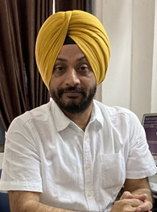

# Department of Civil Engineering  

## Message from HoD's Desk  

It is great to note that the 4th edition of online “Newsletter” is being published, which will be a compilation of all achievements of various departments/sections. The efforts of the Editorial Team is highly appreciable.

Our vision is to prepare every student for the construction industry and for that our faculty keep updating their knowledge by attending conferencing / workshops / seminars and also contributing to the knowledge pool by conducting research. Our department is committed to providing students with a strong, broad-based fundamental engineering education, using cutting edge technologies and modern equipment. That coupled with dedicated efforts of staff and faculty results in excellent outcomes, which make our students shine in every nook and corner of this planet.

We also impart entrepreneurial skills to students through summer internships/workshops, so that they would drive the spirit of growth of our economy and would be able to generate employment opportunities for other qualified and skilled people.

I ensure on behalf of my faculty colleagues and staff that we will continue to strive for greater heights in teaching and research that is relevant and shall help in nation-building.

Hope readers of this newsletter find the information therein valuable.

Dr. Jagbir Singh 
HoD, Civil Engineering Department  

## Department at Glimpse

### UKIERI Concrete Congress  

Department of Civil Engineering, GNDEC alongwith NIT, Jalandhar hosted 5th UKIERI Concrete Congress on **Sustainable Concrete Infrastructure** from March 14-17,2023 in virtual mode. Concrete, being the most powerful material for construction, should have minimal toxic impact on the environment. Keeping this in mind, abundant ideas with feasible solutions were presented by reseachers across world. Dr. Sehijpal Singh, Principal, GNDEC and Dr, H. S. Rai, Head of the Department of Civil Engineering, GNDEC acted as patron and co-patron for this 

 

### Centre of Excellence on Road Safety & Traffic Management 

Guru Nanak Dev Engineering College (GNDEC), Ludhiana, took a significant step forward in promoting road safety and sustainable traffic management inaugurating the Centre of Excellence on Road Safety & Traffic Management on April 8, 2023.

## Faculty Achievements  

### Patent Published

Er. Balihar Singh and Dr. Puneetpal Singh Cheema published a patent named 'Sustainable Soiled Sanitary Pad Ash Based Concrete Composition and Method for Preparation Thereof'

### Awards & Recognitions 

The ISTE Best Teacher Awards(2023) were bestowed upon the following three distinguished educators, recognizing their exceptional contributions to teaching and their dedication to excellence in education.

1. Dr. Harvinder Singh
2. Dr. Puneetpal Singh Cheema
4. Er. Amandeep Singh

### Publications  

- [Junaid Bashir Khan, **Jagbir Singh & Yuvraj Singh.** Experimental Assessment of Unprocessed Rice Husk Ash Effects on Concrete Characteristics. (August, 2023) In: International Research Journal of Engineering and Technology (IRJET)](https://www.irjet.net/archives/V10/i8/IRJET-V10I8106.pdf) 

- [Sleek Chang, Harish Chandra Arora, Aman Kumar, Denise-Penelope N. Kontoni, Prashant Kumar, Nishant Raj Kapoor,**Jagbir Singh** Estimation of confined compressive strength of LRS-FRP concrete specimens with computational intelligence.(August, 2024) In: Journal of Applied Mathematics and Mechanics](https://doi.org/10.1002/zamm.202400455)

- [Shubhendra Kumar, **Hardeep Singh Rai, Mandeep Kaur** Influence of Shredded Latex Gloves Addition on Concrete Properties.(July, 2023) In: International Journal of Innovative Research in Technology (IJIRT)](https://ijirt.org/Article?manuscript=161161)
 
- [**Yuvraj Singh & Harvinder Singh.** Influence of Steel Fibres on the Sorptivity of Corroded Reinforced Concrete.(July, 2023) In: International Journal of Design Engineering (IJDE)](10.1504/IJDE.2023.10054064) 

- [Anshul Sharma, **Harvinder Singh, Savleen Takkar, Yuvraj Singh** Comparison of Autogenous Shrinkage Behaviour of Concrete With and Without Steel Fibres.(September, 2023) In: International Research Journal of Engineering and Technology (IRJET)](IRJET-V10I990.pdf)

- [**Pushpinder Singh, Harvinder Singh, Manvinder Kingra.** The Effect of Openings in the Slab Stiffened with Shallow Beams.(October, 2023) In: International Research Journal of Engineering and Technology (IRJET)](IRJET-V10I1097.pdf)

- [Manpreet Singh Bains, **Yuvraj Singh, Harvinder Singh** Flexural response of corroded RC member: A review.(August, 2024) In: International Research Journal of Engineering and Technology](IRJET-V11I841.pdf)

- [**Yuvraj Singh,Harvinder Singh**, Sushil Bhatia. The Effect of Steel Fibers on the Ductility of Reinforced Concrete Beams.(August, 2023) In: Indian Structural Steel Conference 2020](htttps://doi.org/10.1007/978-981-19-9394-7_21)

- [Suraj Singh Gill, **Harvinder Singh**, Shear Strength of Concrete Beam Cast using Broken Brick Aggregates. (March, 2023) In: UKIERI Concrete Congress-Sustainable Concrete Infrastructure]()

## Conference Organized 

| Sr. No. | Name of Event                                                  | Organising Institute                                                                  | Duration | Date(s)               |                            |
|:------- |:-------------------------------------------------------------- |:------------------------------------------------------------------------------------ |:-------- |:--------------------- |:-------------------------------------- |
| 1       | Sustainable Concrete Infrastructure (UKIERI) |NIT, Jalandhar & GNDEC, Ludhiana | 4 days| March 14th-17th,2023 | 

## Events Attended (FDPs/Conferences/STCs/SDTs/Workshops/Webinars etc.)  

| Sr. No. | Name of Faculty   | Name of Event                                                                                     | Duration | Date(s)               | Organizing Institute                                         |
|:------- |:----------------- |:------------------------------------------------------------------------------------------------- |:-------- |:--------------------- |:----------------------------------------------------------- |
| 1       | H.S.Rai       | Quantum Computing                                                                                     | 6 days   | 18-23 December, 2023  | GNDEC Ludhiana                                                 |
| 2       | Gurdeepak Singh    | Integrated Urban Water Management                                                                | 6 days   | 18-23 December, 2023      | GNDEC, Ludhiana                                            |
| 3       | Prashant Garg      | Integrated Urban Water Management                                                                | 6 days   | 18-23 December, 2023      | GNDEC, Ludhianana                                          |
| 4       | Amandeep Singh      | Integrated Urban Water Management                                                               | 6 days   | 18-23 December, 2023    | GNDEC, Ludhianana                                            |
| 5       | Charnjeet Singh     | Integrated Urban Water Management                                                               | 6 days   | 18-23 December, 2023    | GNDEC, Ludhianana                                            |
| 6       | Sukhwinder Singh   | Sustainable and Durable Green Concrete, Future & Applications                                    | 5 days   | 18-22 December,2023    | Dr. B.R. Ambedkar NIT, Jalandhar                              |
| 7       | Mandeep Kaur      |Structural Equation Modeling: Advances in Research Methodology and Research Publications           | 5 days   | 25-29 December, 2023  | Dr. B.R. Ambedkar NIT, Jalandhar                               |
| 8       | Yuvraj Singh      | Recent Advances in Concrete Technology & Durability of Concrete Structures                        | 3 days   | 22-24 November, 2023   | CSIR/SERC Chennai                                             |
| 9       | Prabhjot Singh     | Sustainable and Durable Green Concrete, Future & Applications                                    | 5 days   | 18-22 December, 2023   | Dr. B.R. Ambedkar NIT, Jalandhar                              |
| 10      | Sandeep Kaur   | Integrated Urban Water Management                                                                    | 6 days   | 18-23 December, 2023   | GNDEC, Ludhiana                                               |
| 11      | Sandeep Kaur  | Water Resources Management & Fluvial Hydraulics in Steep Mountain Streams                             | 5 days   | 27-31 March, 2024  |Dr. B.R. Ambedkar NIT, Jalandhar                                   |
| 12      | Manvinder Kingra  | Road Safety & Road Safety Audit                                                                   | 15 days   | 23 November-7 December, 2023  | Transportation Research & Injury Prevention Centre, IIT Delhi |
| 13      | Manvinder Kingra  | Advance AutoCAD                                                                                   | 5 days   | 15-19 Januray, 2024     | NITTTR Chandigarh                                             |
| 14      | Sukhwinderpal Singh | Integrated Urban Water Management                                                               | 6 days    | 18-23 December, 2023     | GNDEC, Ludhiana                                             |
| 15     | Balihar Singh       | Water Resources Management & Fluvial Hydraulics in Steep Mountain Streams                       | 6 days    | 18-23 December, 2023     | GNDEC, Ludhiana                                             |
| 16     | Avneet Kaur         | Integrated Urban Water Management                                                               | 6 day    | 18-23 December, 2023     | GNDEC, Ludhiana                                              |
| 17     | Savleen Takkar  | NBA Accreditation and Teaching/Learning in Engineering                                              | 6 days    | 1-6 January, 2024     | GNDEC, Ludhiana                                                |
| 18    | Jashandeep Singh | Integrated Urban Water Management                                                                  | 6 day    | 18-23 December, 2023     | GNDEC, Ludhiana                                              |
| 19     | Varinder Singh | NSQF Aligned Curriculum Design and Implementation                                                    | 5 days    | 18-22 September, 2023     | NITTTR, Chandigarh                                         |

## [Association of Civil Engineering Students - Click Here](ACES.md)

