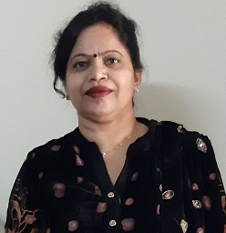

# Department of Computer Science and Engineering  

## Message from HOD

 I congratulate all involved for publication of newsletter. It is a matter of great pleasure and I would like to share few of my thoughts as the Head of Department of Computer Science and Engineering, which was established in 1994. Since then the department is flourishing and achieving new heights. We are offering undergraduate program – B.Tech. in Computer Science and Engineering, and post-graduate program – M.Tech. in Computer Science and Engineering. Department also have Ph.D. program running under autonomous status. 
We are also actively involved in research and development activities. Our faculty members have published their research work in various reputed journals with good impact factors and carrying out research in diverse fields of Computer Science and Engineering. Students of department are also bringing laurel to the institute by participating in various curricular and extra-curricular activities from time-to-time at national and international levels. Department is supporting students in all domains for their overall personality development and organizing different events through societies and clubs managed by department including Computer Society of India and Data Science Club.
Dr. Kiran Jyoti, Head of Department, Computer Science and Engineering

## Department at Glimpse

 Department of Computer Science and Engineering is established in year 1997. Department is offering B.Tech. and M.Tech. programs in Computer Science and Engineering. Laboratories of the department are equipped with state of the art infrastructure to cater course work and research activities. A Good number of books is available in departmental library for prompt access to students and faculty members. Under academic autonomy, study schemes of the offered programs are updated regularly focusing outcome based education, to make students employable as per national and international requirements. Graduates of the department are serving around the globe in eminent companies, academia, as well as in public sector. They are bringing laurel to the department by excelling in fields of their work. Every year a good number of students are clearing different competitive exams

## Student Coordinators
- Kajal Chugh (2303225)
- Jaideep Randhava (2203463)

## Student Achievements
- Ajit Kumar  URN: 2004884, student of 2020-2024 Batch got placed at a highest package of 9 Lakh per Annum in TCS PRIME.
- Shivay Bhandari  URN: 1905398, student of 2019-2023 Batch got placed at a highest package of 20 Lakh per Annum in Zomato.
- Vrishti Gupta   URN: 1905064, student of 2019-2023 Batch got placed at a highest package of 19.5 Lakh per Annum in PhonePe.
- Ekuspreet Singh, Dhruv Kumar, Harsimran Singh, Devesh Sharma, Aarchie Maggu students of CSE got 2nd prize at National Level Smart Hackathon 2023, organized at Shaheed Bhagat Singh State University Technical Campus, Ferozepur.
   
### Students of CSE Department has successfully cleared various NPTEL MOOC’s courses

| Sr.No. | Name                    | U.R. No. | Course Name                                   | Year |
|:--------|:-------------------------|:----------|:-----------------------------------------------|:------|
| 1      | Prabhdeep Kaur          | 2004640  | Affective Computing                           | 2024 |
| 2      | Muskandeep Kaur         | 2004628  | Affective Computing                            | 2024 |
| 3      | Rohit              | 2004653  | Basics of Computational Complexity                        | 2024 |
| 4      | Sukhpreet Kaur         | 2004675  | Software Testing (IIITB)                            | 2023 |
| 5      | Harsh Verma         | 2004586  | Data Analytics with Python                           | 2023 |
| 6      | Saurav Sharma         | 2004662  | Data Analytics with Python                           | 2023 |
| 7      | Vivek Thakur         | 2004687| Data Analytics with Python                           | 2023 |
| 8      | Yakshi Puri         | 2004688| Cloud Computing                            | 2023 |
| 9      | Naman Marria         | 1905807| Model Checking                            | 2023 |
| 10     | Naman Marria         | 1905807| Privacy and Security in Online Social Media                            | 2023 |
| 11      | Jaskamal Singh         | 1905006| Rural Water Resources Management                            | 2023 |
| 12      | Jaskamal Singh         | 1905006| Introduction to Embedded System Design                            | 2023 |

## Students of CSE bagged various positions in Youth Festival  

| S.No. | Name             | URN     | Name of Event                                                                           | Level |
|-------|------------------|---------|-----------------------------------------------------------------------------------------|-------|
| 1     | Avaluday Singh   | 2004554 | Bhangra  (1st Position), Inter-Zonal Youth Festival 2024           | Inter-Zonal |
| 2    | Anhad Kaur     |2302469    | Gidha   (1st Position), Inter-Zonal Youth Festival 2024           | Inter-Zonal |
| 3    | Gurleen Kaur     |2302527    | Gidha   (1st Position), Inter-Zonal Youth Festival 2024           | Inter-Zonal |
| 4    | Husanpreet Kaur     |2004588    | Gidha   (1st Position), Inter-Zonal Youth Festival 2024           | Inter-Zonal |
| 5     | Taranpreet Kaur   |2004678    | Gidha   (1st Position), Inter-Zonal Youth Festival 2024           | Inter-Zonal |
| 6     | Nidhi     |2004630    | Gidha   (1st Position), Inter-Zonal Youth Festival 2024           | Inter-Zonal |
| 7     | Muskandeep Kaur     |2303506    | Gidha   (1st Position), Inter-Zonal Youth Festival 2024           | Inter-Zonal |
| 8     |Simrandeep Kaur     |2302683     | Gidha   (1st Position), Inter-Zonal Youth Festival 2024           | Inter-Zonal |
| 9     | Karthik    |2104134 | Music  (1st Position), Inter-Zonal Youth Festival 2024           | Inter-Zonal |
| 10     | Ravneet Singh Virk     |2004649  | Music  (1st Position), Inter-Zonal Youth Festival 2024           | Inter-Zonal |
| 11    | Vansh Khanna    |2004683  | Music  (1st Position), Inter-Zonal Youth Festival 2024           | Inter-Zonal |
| 12    | Kushali Sharma     |2203487 | Theatre  (1st Position), Inter-Zonal Youth Festival 2024           | Inter-Zonal |
| 13    | Avaluday Singh   | 2004554 | Bhangra  (1st Position), Central Zonal Youth Festival 2023           | Zonal |
| 14    | Ravneet Singh    | 2004554 | Bhangra  (1st Position), Central Zonal Youth Festival 2023           | Zonal |
| 15    | Kushali Sharma     |2203487 | Theatre  (1st Position), Central Zonal Youth Festival 2023           | Zonal |
| 16    | Karthik    |2104134 | Music  (1st Position), Central Zonal Youth Festival 2023           | Zonal |
| 17    | Ravneet Singh Virk     |2004649  | Music  (1st Position), Central Zonal Youth Festival 2023           | Zonal |
| 18    | Vansh Khanna    |2004683  | Music  (1st Position), Central Zonal Youth Festival 2023           | Zonal |
| 19    | Rhythm Kamra    |2203540   | Music    (2nd Position), Central Zonal Youth Festival 2023           | Zonal |
| 20    | Riya Sharma     |2302652   | Music    (2nd Position), Central Zonal Youth Festival 2023           | Zonal |
| 21    | Harsimran Singh Jaagi    |2104117  | Literary   (1st Position), Central Zonal Youth Festival 2023           | Zonal |
| 22     | Ekuspreet Singh    |2104097   | Literary   (1st Position), Central Zonal Youth Festival 2023           | Zonal |
| 23    | Anhad Kaur     |2302469    | Gidha   (1st Position), Central Zonal Youth Festival 2023           | Zonal |
| 24    | Gurleen Kaur     |2302527    | Gidha   (1st Position), Central Zonal Youth Festival 2023           | Zonal |
| 25    | Husanpreet Kaur     |2004588    | Gidha   (1st Position), Central Zonal Youth Festival 2023           | Zonal |
| 26     | Taranpreet Kaur   |2004678    | Gidha   (1st Position), Central Zonal Youth Festival 2023           | Zonal |
| 27     | Nidhi     |2004630    | Gidha   (1st Position), Central Zonal Youth Festival 2023           | Zonal |
| 28     | Muskandeep Kaur     |2303506    | Gidha   (1st Position), Central Zonal Youth Festival 2023           | Zonal |
| 29     |Simrandeep Kaur     |2302683     | Gidha   (1st Position), Central Zonal Youth Festival 2023           | Zonal |
| 30     | Ekuspreet Singh    |2104097   | Literary   (1st Position), Central Zonal Youth Festival 2023           | Zonal |
| 31     | Diya Baweja  |2203425   | Collage Making    (1st Position), Central Zonal Youth Festival 2023           | Zonal |
| 32     | Ravneet Kaur    |2302916   | Poster Making   (2nd Position), Central Zonal Youth Festival 2023           | Zonal |
| 33     | Tanveer Singh Reehal    |2104959    | On Spot Painting   (1st Position), Central Zonal Youth Festival 2023           | Zonal |
| 34     |Manpreet Kaur     |2303020    | Mehndi    (2nd Position), Central Zonal Youth Festival 2023           | Zonal |
| 35     | Avaluday Singh   | 2004554 | Bhangra  (3rd Position),  Inter Univeristy Youth Festival 2023           | Inter-University |
| 36     | Ravneet Singh   | 2303176 | Bhangra  (3rd Position),  Inter Univeristy Youth Festival 2023    | Inter-University |

## Faculty Achievements  

- Dr. Amit Jain, Assistant Professor(CSE), awarded as **ISTE Best Teacher Award** by Indian Society of Technical Education and  has awarded with **two design** patents with a total of five patents. 

## Faculty Research Publications  
- [**Goldendeep Kaur, Kiran Jyoti**, Samer Shorman, Anas Ratib Alsoud, Rohit Salgotra (2024, July). An Efficient Approach for Localizing Sensor Nodes in 2D Wireless Sensor Networks Using Whale Optimization-Based Naked Mole Rat Algorithm. MDPI Mathematics.]
- [Sujay N. Hedge, D.B. Srinivas, M.A. Rajan, **Sita Rani**, Aman Kataria, Hong Min (2024, March). Multi-objective and multi constrained task scheduling framework for computational grids.  Scientific Reports.]
- [Harmeet Singh, **Sita Rani** (2024, January). Flex Sensor Integrated Smart Strap to Verify Correct Wearing of the Face Mask.  IEEE Sensors.]
- [**Diana Nagpal**, Shikha Gupta (2023, December). A Novel Transfer Learning based Multi-Feature Fusion Framework for Elderly Activity Recognition. International Journal of Intelligent Systems and Applications in Engineering.]
- [**Sita Rani** , Sachin Kumar, Aman Kataria, Hong Min (2023, October). SmartHealth: An Intelligent Framework to Secure IoMT Service Applications Using Machine Learning. ICT Express.]
- [**Sita Rani**, Amit Kumar Mishra, Aman Kataria, Saurav Malik, Hong Quin (2023, September). Machine learning -based optimal crop selection system in smart agriculture. Scientific Reports.]
- [**Sita Rani**, Aman Kataria, Sachin Kumar, Prayag Tiwari (2023, August). Federated learning for secure IoMT-applications in smart healthcare systems: A comprehensive review. Knowledge Based Systems.]
- [Ubeeka Jain, **Parminder Singh** (2023, August). Impact of Feature Selection for Emotion Detection from Annotated Punjabi Text. International Journal of Intelligent Systems and Applications in Engineering (IJISAE).]
- [**Kamaldeep Kaur, Parminder Singh** (2023, August). Comparison of Various Feature Selection Algorithms in Speech Emotion Recognition. AIUB Journal of Science and Engineering (AJSE).]
- [**Diana Nagpal**, Shikha Gupta, Deepak Kumar, Zoltan Illes, Chaman Verma, Barnali Dey (2023,June). GoldenAGER: A Personalized Feature Fusion Activity Recognition Model for Elderly. IEEE Access.]
- [Harmehak Singh Khangura, Jasleen Kaur, Gurleen Kaur, **Parminder Singh** (2023, May). Human Computer Interaction: Technologies and Challenges. Journal of Emerging Technologies and Innovative Research (JETIR).]
- [**Priyanka Arora, Parminder Singh**, Akshay Girdhar, Rajesh Vijayvergiya (2023,April).  A State-Of-The-Art Review on Coronary Artery Border Segmentation Algorithms for Intravascular Ultrasound (IVUS) Images. Cardiovascular Engineering and Technology.]
- [**Priyanka Arora, Parminder Singh**, Akshay Girdhar, Rajesh Vijayvergiya (2023,April). Calcification Detection in Intravascular Ultrasound (IVUS) Images Using Transfer Learning Based MultiSVM model. Ultrasonic Imaging.]
- [**Priyanka Arora, Parminder Singh**, Akshay Girdhar, Rajesh Vijayvergiya, Prince Chaudhary (2023,April). CADNet: an advanced architecture for automatic detection of coronary artery calcification and shadow border in intravascular ultrasound (IVUS) images. Physical and Engineering Sciences in Medicine.]
- [Prince Verma, **Kiran Jyoti**, Varsha Sahni, S.Jafar Ali Ibrahim, N.S. Kalyan Chakravarthy (2023,April). Synthesized feature learning model on news aggregator for chatbot. Soft Computing.]
- [Navdeep Kaur, **Parminder Singh** (2023,March). Modeling of Speech Parameters of Punjabi by Pre-Trained Deep Neural Network using Stacked Denoising Autoencoders. ACM Transactions on Asian and Low-Resource Language Information Processing.]
- [**Kamaldeep Kaur, Parminder Singh** (2023,Feburary). Trends in speech emotion recognition: a comprehensive survey. Multimedia Tools and Applications.]
- [Vikram Bali, Shivani Bali, Dev Gaur, **Sita Rani**, Raman Kumar (2023,Feburary). Commercial-Off-The Shelf Vendor Selection: A Multi-Criteria Decision-Making Approach Using Intuitionistic Fuzzy Sets and Topsis.  Journal Of Operational Research in Engineering Science:Theory and Applications .]

### Student-Faculty Conference Publications

| Sr. No. | Title of Paper                                                                             | Name of Authors                      | Name of Journal/ Conference                                                               | Level          | Year |
|---------|--------------------------------------------------------------------------------------------|--------------------------------------|-------------------------------------------------------------------------------------------|----------------|------|
| 1       | An MI-based Hybrid Model for Iiot Attack Classification in Industry 4.0 Ecosystem                                           | Bharatdeep Singh, Divneet Kaur, Sita Rani  | Sixth International Conference on Computational Intelligence in Communications and Business Analytics (CICBA-2024)  | International  | 2024 |
| 2       | From Haze And Smoke To Clarity: An Integration of Deep Learning And Atmospheric Model                                           | Tashneet Kaur, Dhruv Kumar, Sita Rani, Kiran Jyoti  | Sixth International Conference on Computational Intelligence in Communications and Business Analytics (CICBA-2024)  | International  | 2024 |
| 3       | Classification of Fine-Grained Emotions  | Ubeeka Jain, Parminder Singh | Springer International Conference on Multi-Strategy Learning Environment (ICMSLE-2024)  | International  | 2024 |
| 4       | Text Mining for Fine-grained Emotion Detection    | Ubeeka Jain, Parminder Singh | Springer International Conference on information systems and management science (ISMS-2023)  | International  | 2023 |
| 5       | Blockchain-enabled Transcript System integrated with IPFS    | Priyanka Jhamb, Amanjot Singh, Vrishti Gupta, Manpreet Kaur Mand | International Conference on Recent Trends in Advance Computing (ICRTAC)  | International  | 2023 |
| 6       | Calcified Tissue Detection using Deep Learning Models in Intravascular Ultrasound images    | Priyanka Arora, Parminder Singh and Akshay Girdhar | IEEE International Conference on Advances in Electrical, Electronics and Computational Intelligence (ICAEECI-2023)  | International  | 2023 |
| 7       | Performance Comparison of Conventional and Deep Learning Classifiers for Punjabi Dialect Identification                                           | Manjot Kaur Gill, Simpel Rani and Parminder Singh  | IEEE International Conference on Self Sustainable Artificial Intelligence Systems)  | International  | 2023 |
| 8       | DLT Based Smart Medical Ecosystem | Vikram Puri, Aman Kataria, Sita Rani, Piyush Kumar Pareek | IEEE International Conference on Network, Multimedia and Information Technology (NMITCON)  | International  | 2023 |
| 9       | Human Activity Classification using G-XGB | Aman Kataria, Vikram Puri, Piyush Kumar Pareek, Sita Rani  | IEEE International Conference on Data Science and Network Security (ICDSNS)  | International  | 2023 |
| 10       | Virtual Channel Attack by Hardware Trojan in NoC-based TCMP and its Impact Analysis | Abhishek Rana, Amandeep Kaur Sohal  | 2023 Third International Conference on Secure Cyber Computing and Communication (ICSCCC) IEEE  | International  | 2023 |
| 11       | Study on deep learning model-based CHATBOTs| Prince Verma , Kiran Jyoti , Muhammed Junaid  | 7th International Joint Conference on Computing Sciences (ICCS-2023) | International  | 2023 |
| 12       | Human Activity Recognition and Prediction: Overview and Research Gaps| Diana Nagpal, Shikha Gupta  | 8th International Conference for Convergence in Technology IEEE | International  | 2023 |
| 13       | Evolution from Handcrafted to Learned Representation Methods for Vision-based Activity Recognition| Diana Nagpal, Shikha Gupta  | 3rd International Conference on Soft Computing for Security Applications ICSCS 2023 (Springer) | International  | 2023 |
| 14       | Optimization of a Consensus Protocol in Blockchain-IoT Convergence| Manpreet Kaur, Shikha Gupta  | International Conference on Emerging Smart Computing and Informatics (ESCI) | International  | 2023 |
| 15       | Blockchain technology: An overview with notable features and challenges| Manpreet Kaur, Shikha Gupta  | International Conference on Artificial Intelligence, Blockchain, Computing and Security (ICABCS-2023) | International  | 2023 |
| 16       | Quantum Machine Learning in Healthcare: Developments and Challenges| Sita Rani, Piyush Kumar Pareek, Jaskiran Kaur, Meetali Chauhan, Pankaj Bhambri  | IEEE International Conference on Integrated Circuits and Communication Systems | International  | 2023 |

## Events Attended (FDPs / Conferences / STCs /SDTs / Workshops / Webinars / Seminars / Training Program etc.)  

| Sr. No. | Name of Event                                                                                                                 | Faculty Coordinator                                           | Duration | Date(s)                | Organizer(s)                                 |
|:--------|:------------------------------------------------------------------------------------------------------------------------------|:--------------------------------------------------------------|:---------|:-----------------------|:-----------------------------------------------|
| 1       | STC on Continuous Integration and Delivery  | Dr. Daljeet Singh | Seven Days | 17th July, 2024 - 23rd July, 2024  | Infosys Springboard |
| 2       | FDP on Hands - on with GitHub and Docker on Linux| Amanpreet Singh Brar | Three Days | 15th July, 2024 - 17th July, 2024   | GNDEC Ludhiana |
| 3       | FDP on Hands - on with GitHub and Docker on Linux| Dr. Amit Jain  | Three Days | 15th July, 2024 - 17th July, 2024   | GNDEC Ludhiana |
| 4       | FDP on Hands - on with GitHub and Docker on Linux| Diana Nagpal | Three Days | 15th July, 2024 - 17th July, 2024   | GNDEC Ludhiana |
| 5       | FDP on Hands - on with GitHub and Docker on Linux| Dr. Vivek Thapar | Three Days | 15th July, 2024 - 17th July, 2024   | GNDEC Ludhiana |
| 6       | FDP on Hands - on with GitHub and Docker on Linux| Dr. Manpreet Kaur Mand | Three Days | 15th July, 2024 - 17th July, 2024   | GNDEC Ludhiana |
| 7       | FDP on Hands - on with GitHub and Docker on Linux| Dr. Parminder Singh | Three Days | 15th July, 2024 - 17th July, 2024   | GNDEC Ludhiana |
| 8       | FDP on Hands - on with GitHub and Docker on Linux| Goldendeep Kaur| Three Days | 15th July, 2024 - 17th July, 2024   | GNDEC Ludhiana |
| 9       | FDP on Hands - on with GitHub and Docker on Linux| Dr. Hardeep Singh Kang | Three Days | 15th July, 2024 - 17th July, 2024   | GNDEC Ludhiana |
| 10       | FDP on Hands - on with GitHub and Docker on Linux| Jasdeep Kaur | Three Days | 15th July, 2024 - 17th July, 2024   | GNDEC Ludhiana |
| 11       | FDP on Hands - on with GitHub and Docker on Linux| Jaswant Singh Taur | Three Days | 15th July, 2024 - 17th July, 2024   | GNDEC Ludhiana |
| 12       | FDP on Hands - on with GitHub and Docker on Linux| Dr. Kamaldeep Kaur | Three Days | 15th July, 2024 - 17th July, 2024   | GNDEC Ludhiana |
| 13       | FDP on Hands - on with GitHub and Docker on Linux| Kapil Sharma | Three Days | 15th July, 2024 - 17th July, 2024   | GNDEC Ludhiana |
| 14       | FDP on Hands - on with GitHub and Docker on Linux| Dr. Kiran Jyoti | Three Days | 15th July, 2024 - 17th July, 2024   | GNDEC Ludhiana |
| 15       | FDP on Hands - on with GitHub and Docker on Linux| Kuljit Kaur | Three Days | 15th July, 2024 - 17th July, 2024   | GNDEC Ludhiana |
| 16       | FDP on Hands - on with GitHub and Docker on Linux| Lakhvir Kaur Grewal | Three Days | 15th July, 2024 - 17th July, 2024   | GNDEC Ludhiana |
| 17       | FDP on Hands - on with GitHub and Docker on Linux| Maninder Kaur | Three Days | 15th July, 2024 - 17th July, 2024   | GNDEC Ludhiana |
| 18       | FDP on Hands - on with GitHub and Docker on Linux| Meetali | Three Days | 15th July, 2024 - 17th July, 2024   | GNDEC Ludhiana |
| 19       | FDP on Hands - on with GitHub and Docker on Linux| Priti Aggarwal | Three Days | 15th July, 2024 - 17th July, 2024   | GNDEC Ludhiana |
| 20       | FDP on Hands - on with GitHub and Docker on Linux| Harminder Kaur | Three Days | 15th July, 2024 - 17th July, 2024   | GNDEC Ludhiana |
| 21       | STTP on Agile and DevOps| Dr. Inderjit Singh | Five Days | 15th July, 2024 - 19th July, 2024   | Infosys Campus Connect-Infosys Spring Board |
| 22       | STTP on Continuous Integration and Delivery - DevOps | Dr. Priyanka Arora | Nine Days | 15th July, 2024 - 23rd July, 2024   | Infosys Springboard |
| 23       | STTP on Software Engineering and Agile software development | Dr. Priyanka Arora | Three Days | 15th July, 2024 - 17th July, 2024   | Infosys Springboard |
| 24       | STTP on Agile Scrum in Practice | Dr. Priyanka Arora | Three Days | 15th July, 2024 - 17th July, 2024   | Infosys Springboard |
| 25       | STTP on Introduction to Agile Methodology | Dr. Priyanka Arora | Five Days | 15th July, 2024 - 19th July, 2024   | Infosys Springboard |
| 26       | STC on Introduction to Agile Methodology | Daljeet Singh | Eight Days | 12th July, 2024 - 19th July, 2024   | Infosys Springboard |
| 27       | STC on Software Engineering and Agile software development| Daljeet Singh | Seven Days | 11th July, 2024 - 17th July, 2024   | Infosys Springboard |
| 28       | STC on Agile Scrum in Practice| Daljeet Singh | Seven Days | 11th July, 2024 - 17th July, 2024   | Infosys Springboard |
| 29       | STC on Explore Machine Learning using Python| Jaswant Singh Taur | One Day | 26th June, 2024 - 26th June, 2024   | Infosys Springboard |
| 30       | FDP on Inculcating Universal Human Values in Technical Education| Kuljit Kaur | Five Days | 24th June, 2024 - 28th June, 2024   | AICTE |
| 31       | FDP on Inculcating Universal Human Values in Technical Education| Goldendeep Kaur | Five Days | 17th June, 2024 - 21th June, 2024   | AICTE |
| 32       | FDP on Inculcating Universal Human Values in Technical Education| Jasdeep Kaur | Eight Days | 17th June, 2024 - 24th June, 2024   | AICTE |
| 33       | FDP on Inculcating Universal Human Values in Technical Education| Diana Nagpal | Five Days | 17th June, 2024 - 21th June, 2024   | AICTE |
| 34       | FDP on R- Programming on Budding Data Analytics| Kiran Jyoti | Ten Days | 9th June, 2024 - 18th June, 2024   | Research foundation of India and RFI-CARE |
| 35       | FDP on AI and Punjabi language | Daljeet Singh | Three Days | 6th June, 2024 - 8th June, 2024   | GNDEC, Ludhiana |
| 36       | Workshop on Artificial Intelligence and Punjabi Language: Recent Trends and Challenges Emerging Field: Advanced Computing | Kuljit Kaur | Three Days | 6th June, 2024 - 8th June, 2024   | GNDEC, Ludhiana |
| 37       | Workshop on Artificial Intelligence and Punjabi Language: Recent Trends and Challenges Emerging Field: Advanced Computing | Maninder Kaur | Three Days | 6th June, 2024 - 8th June, 2024   | GNDEC, Ludhiana |
| 38       | Workshop on Artificial Intelligence and Punjabi Language: Recent Trends and Challenges Emerging Field: Advanced Computing | Lakhvir Kaur Grewal | Three Days | 6th June, 2024 - 8th June, 2024   | GNDEC, Ludhiana |
| 39       | Workshop on Artificial Intelligence and Punjabi Language: Recent Trends and Challenges Emerging Field: Advanced Computing | Dr. Vivek Thapar | Three Days | 6th June, 2024 - 8th June, 2024   | GNDEC, Ludhiana |
| 40       | FDP on Confluence of Deep Learning, Generative AI and Deep Learning | Dr. Vivek Thapar | Five Days | 6th May, 2024 - 10th May, 2024   | GL Bajaj Institute of Technology and Management Uttar Pradesh |
| 41       | FDP on Effect of Generative AI in modern Research & Industry | Dr Sita Saini | Five Days | 29th April, 2024 - 3rd May, 2024   | Sister Nivedita University, Calcutta |
| 42       | FDP on Effect of Generative AI in modern Research & Industry | Lakhvir Kaur Grewal | Five Days | 29th April, 2024 - 3rd May, 2024   | Sister Nivedita University, Calcutta |
| 43       | FDP on Effect of Generative AI in modern Research & Industry | Maninder Kaur | Five Days | 29th April, 2024 - 3rd May, 2024   | Sister Nivedita University, Calcutta |
| 44       | FDP on Effective Research Paper Writing Strategies and High Impact Journal Publication Techniques | Dr. Inderjit Singh | Five Days | 22nd April, 2024 - 26th April, 2024   | DCA,Kongu Engineering College (Autonomous) NAAC A++ Grade |
| 45       | FDP on Curriculum Development Processes |  Dr. Inderjit Singh | Five Days | 18th March, 2024 - 22nd March, 2024   | NITTTR Chd and GNDEC,Ldh |
| 46       | FDP on Curriculum Development Processes |  Dr. Vivek Thapar | Five Days | 18th March, 2024 - 22nd March, 2024   | AICTE sponsored NITTTR Chandigarh |
| 47       | FDP on Introduction to Soft Computing |  Dr. Inderjit Singh |    | 1st January, 2024 - 31st March, 2024   | NPTEL-AICTE IIT Madras(Govt of India) |
| 48       | FDP on NBA Accreditation and Teaching Learning in Engineering |   Dr. Vivek Thapar | Six Days | 1st January, 2024 - 6th January, 2024   | ATAL sponsored at GNDEC Ludhiana |
| 49       | FDP on Quantum Computing |   Dr. Amandeep Kaur Sohal | Six Days | 18th December, 2023 - 23rd December, 2023   | AICTE and ATAL Academy and GNDEC, Ludhiana |
| 50       | FDP on Quantum Computing |   Dr. Vivek Thapar | Six Days | 18th December, 2023 - 23rd December, 2023   | AICTE and ATAL Academy and GNDEC, Ludhiana |
| 51       | FDP on Quantum Computing |   Dr. Kamaldeep Kaur | Six Days | 18th December, 2023 - 23rd December, 2023   | AICTE and ATAL Academy and GNDEC, Ludhiana |
| 52       | FDP on Quantum Computing |   Kiran Jyoti | Six Days | 18th December, 2023 - 23rd December, 2023   | AICTE and ATAL Academy and GNDEC, Ludhiana |
| 53       | FDP on Quantum Computing |   Dr. Sita Rani  | Six Days | 18th December, 2023 - 23rd December, 2023   | AICTE and ATAL Academy and GNDEC, Ludhiana |
| 54       | Workshop on NIRF India Ranking 2024 |   Dr. Sita Rani  | Two Days | 13th December, 2023 - 14th December, 2023   | Institute of Academic Excellence, Hyderabad |
| 55       | FDP on NSQF Aligned Curriculum Design and Implementation |   Dr. Amandeep Kaur Sohal  | Five Days | 18th September, 2023 - 22nd September, 2023   | Curriculum Development Centre Department|
| 56       | STC on Artifical Intelligence for Next Generation IoT Networks |   Dr. Amandeep Kaur Sohal  | Five Days | 11th September, 2023 - 15th September, 2023   | NIT Jalandhar|
| 57       | Workshop on Communication Skills |   Dr. Manpreet Kaur Mand   | One Day | 7th August, 2023 - 7th August, 2023   | GNDEC, Ludhiana|
| 58       | Workshop on Communication Skills |  Harkomalpreet Kaur   | One Day | 7th August, 2023 - 7th August, 2023   | GNDEC, Ludhiana|
| 59       | FDP on Python for Data Science |  Kuljit Kaur   | One Month | 1st July, 2023 - 1st August, 2023   | NPTEL- AICTE|
| 60       | STTP on An interactive dialogue on governance leadership & management |  Dr. Kiran Jyoti   | Three days | 27th April, 2023 - 29th April, 2023   | Department, Govt. of Telangana and Jawaharlal Nehru Technological University (JNTUH), Hyderabad.|
| 61       | STTP on Capacity development program for college principals |  Dr. Kiran Jyoti   | Three days | 27th April, 2023 - 29th April, 2023   | Institute for Academic Excellence (IAE), Hyderabad in collaboration with Collegiate Education & Technical Education|
| 62       | FDP on Role of Technical Institutions in Rural Infrastructure Development |  Jasdeep Kaur   | Five days | 24th April, 2023 - 28th April, 2023   | NITTTR, Chandigarh|
| 63       | FDP on Cyber Security |  Dr. Sita Rani   | Five days | 20th February, 2023 - 24th February, 2023   | IIT Kanpur|
| 64       | FDP on Technology Enabled Teaching Learning |  Dr.Inderjit Singh   | Five days | 16th January, 2023 - 20th January, 2023   | NITTTR, Chandigarh AICTE and GNDEC, Ludhiana|

## Main Recruiters for CSE Students  

| Sr. No. | Name of Company                           |
|---------|-------------------------------------------|
| 1       | Microsoft                                 |
| 2       | Accenture                                 |
| 3       | Walmart Global Technology Services India  |
| 4       | Cognizant                                 |
| 5       | HCL Technologies Ltd.                     |
| 6       | Infosys Limited                           |
| 7       | TCS                                       |
| 8       | WIPRO Limited  Om Careers                 |
| 9       | Amazon                |
| 10       | PhonePe                |
| 11      | Samsung                |
| 12       | Zomato                |
| 13       | TATRAS Data Services Pvt. Ltd.            |
| 14      | Nagaro                                    |
| 15      | ASG Technologies Pvt. Ltd.                |
| 16      | Yatra Online Freight Services Pvt. Ltd.   |
| 17      | Om Careers                                |
| 18      | Argusoft                                |
| 19      | ZS                               |
| 20      | Josh Technology Group                                 |

## Activities/Events conducted by Department of Computer Science and Engineering under various Societies/Clubs

### Computer Society of India  

| Sr. No. | Name of Event| Event Type| Date|
|---------|----------------|--------|-------|
| 1  |Interactive Session on Cyber Security -Emphasizing Banking Sector           |  Expert Session        |   27-April-24  |
| 2  |Workshop on Cyber Security           |   Workshop        |   27-Feb-24  |
| 3  |Workshop on Data Science     | Workshop       |   06-Feb-24 |
| 4  |Blockchain and Web3 Technologies       |   Expert Talk     |   18-Sep-23  |

### Data Science Club  

| Sr. No. | Name of Event| Event Type| Date|
|---------|----------------|--------|-------|
| 1  |Tech News Presentation(Anand Utsav 2024)     |   Technical Event   |   06/03/2024  |
| 2  |International Webinar on “An Introduction to Internet of Things (IoT) Technology and its Relevance to Engineering”     | Webinar       |   02/03/2024  |
| 3  |CO-DEsigners |   Technical Event     |   02/02/2024  |
| 4  |PUZZEL PARCEL GNE’S APEX 2023     |  Activity        |   20/10/2023  |
| 5  |BRAINIAC BATTLE GNE’S APEX 2023   |   Activity      |   20/10/2023  |
| 6  |Smart Prompts  |   Activity      |   21/09/2023  |
| 7  |International Webinar on “Artificial Intelligence with Business Analytics”    |  Webinar      |   14/04/2023  |
