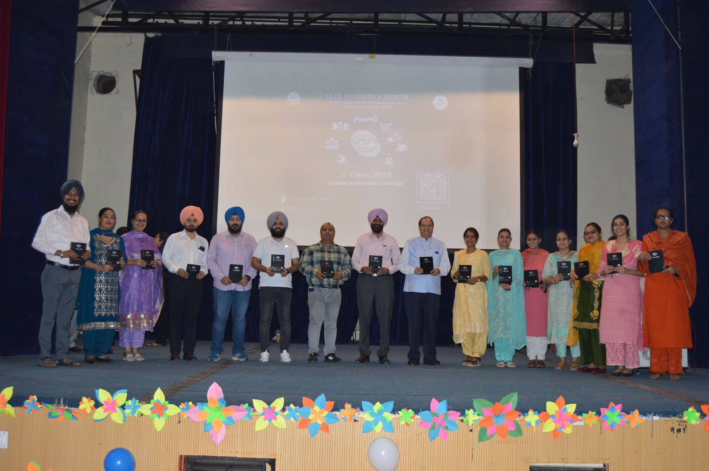
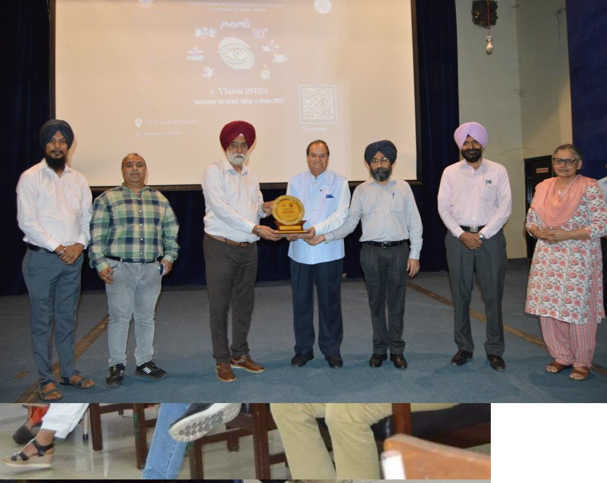

̨̨̨
# Department of Electronics and Communication  Engineering

## Message from HoD's Desk  

The Department of Electronics and Communication Engineering, established in 1981, is one of the most dynamic departments of Guru Nanak Dev Engineering College. It was the first major diversification initiative by the college, 25 years after its establishment. The department is currently running Bachelors and Masters of Technology courses in Electronics and Communication Engineering and has around 10 scholars enrolled for doctorate in areas like Antenna Design, VLSI, Optical communication etc. Ever since its inception, the department has been the hub of academic excellence through some great teachers who have laid a sound foundation as well as the cream of students of the region, who have spread their wings all over the globe. The alumni of the department are not only excelling in India but also in the Silicon Valley and other hubs of Electronics Technology. They are at the forefront of the Telecom revolution of the last 20 years and manning pivotal positions in Telecom operators in India, South East Asia, Pacific region and Africa. In the end, I can say that we incorporate good technical skills and knowledge to each individual associated with us.

Dr. Narwant Singh Grewal  
(Head of Department)

## Department at Glimpse

### The Department's Entrance

-----------------------------------------

### The Departmental Library

-----------------------------------------

### E-Vision 2023 organized by IETE Student Forum on 06, Oct 2023

-----------------------------------------

### Expert talk on Recent Advancements in Optical communication on 12, Aug 2022

------------------------------------------

### Expert talk on Recent Advancements in Optical Field on 12, Aug 2022

-----------------------------------------

### Teachers Day Celebration at ECE Department on 5, Sept 2022

-----------------------------------------

### ECE Student developed website for esteemed Engineering Institute in Maharashtra

**Mohammad Yasir(URN:2104400)** worked on paid project that is development of college’s official website(dynamic) and Alumni portal of SSGMCE, Shegaon, Buldhana District, Maharashtra.

College Website link: https://ssgmce.ac.in/

Alumni portal link: https://www.alumni.ssgmce.ac.in/alumni/

-----------------------------------------

### ECE Students during GNEAPEX on 8, Apr, 2022

Project: Designed a working model of a hydraulic Excavator which works on the principle of of Pascal’s Law

Team Members:
- Ali Ahmad Ansari
- Adarsh Mishra
- Anant Vijay
- Rahul Kumar
- Gurnoor Singh
- Guransh Singh

-----------------------------------------

## Faculty Achievements  

- **Preeti Pannu** earned Elite and Topper certificate for NPTEL 4 week Course on Stress Management from July-Dec, 2022.

- **Preeti Pannu** recognised as mentor for the NPTEL online certification course "Stress Management"(July 2022- Dec 2022).

- **Harminder Kaur D/o S. Avtar Singh** recognised as mentor for the NPTEL online certification course(July 2022- Dec 2022).

- **Gurjot Kaur Walia** was Program Committee Member and Reviewer of International Joint Conference on Advances in Computational Intelligence(IJCACI 2022) organised by SCRIL, South Asian University, New Delhi, India and Jahangir nagar University, Bangladesh on 15-16 October, 2022.

- **Gurjot Kaur Walia** was Reviewer of International Conference on Innovations in Communication Computing and Sciences(ICCS 2022) organised by CEC, Landran on 15-16 September, 2022.

- **Gurjot Kaur Walia** was Program Committee Member and Reviewer of International Conference on Computational Intelligence(ICCI 2022) organised by Indian Institute of Information Technology, Pune on 29-30 December, 2022.

- **Gurjot Kaur Walia** was Program Committee Member and Reviewer in IEEE World Conference on Applied Intelligence and Computing(AIC 2022) held from 17-19, June 2022.

- **Gurjot Kaur Walia, Chahat Jain, Navneet Kaur** won the Best Oral Presentation Award in AICTE Sponsored International Conference on Role of Artificial Intelligence and Sustainable Engineering in Driving Smart Cities, organised by Shri Vishnu Engineering College for Women, Bhimavaram, Andhra Pradesh from 29-31 March, 2022.

- **Gurjot Kaur Walia** earned Elite and Topper certificate for NPTEL 4 week Course on Leadership from Jan-May, 2022.

- **Gurjot Kaur Walia** earned Elite and Topper certificate for NPTEL 4 week Course on Effective Writing from Jan-May, 2022.

- **Navneet Kaur** was Reviewer of 3rd International Conference on Computing, Analytics and Networks (ICAN2022) organised by Chitkara University with technical sponsorship from IEEE during 18-19, November 2022.

- **Navneet Kaur** was Reviewer of International Conference on Innovations in Communication Computing and Sciences(ICCS 2022) organised by CEC, Landran on 15-16 September, 2022.

- **Navneet Kaur** was Reviewer of Journal of Optical Communications.

-**Navneet Kaur** earned Elite and Topper certificate for NPTEL 4 week Course on Effective Writing from Jan-May, 2022.

- **Navneet Kaur** was presented with Top Performing Mentor certificate for NPTEL 4 week Course on Effective Writing from Jan-May, 2022.

- **Navneet Kaur** earned Elite and Topper certificate for NPTEL 4 week Course on Leadership from Jan-May, 2022.

- **Gurpurneet Kaur** earned Elite certificate for NPTEL 4 week Course on Effective Writing from Jan-Feb, 2022.

- **Gurpurneet Kaur** earned Elite and silver certificate for NPTEL 8 week Course on Introduction to Soft Computing from Jan-March, 2022.

- **Gurpurneet Kaur** earned Elite certificate for NPTEL 12 week Course on Digital Circuits from July-October, 2022.

- **Gurpurneet Kaur** earned Elite certificate for NPTEL 8 week Course on System Design Through VERILOG from July-September, 2022.

- **Shivmanmeet Singh** was reviewer of SCIE journal named “frontiers in public health” for paper entitled "The landscape of Photoaging”.

- **Shivmanmeet Singh** received a certificate of appreciation from AICTE for validating the lectures of following SWAYAM course chemical Reaction Engineering-I in the Punjabi language.

- **Shivmanmeet Singh** was reviewer of Scopous (Elsevier) journal named “International Journal of Electrical and Computer Engineering Systems” for paper entitled "Performance Optimization of Universal Filtered Multicarrier Technique for Next Generation Communication Systems”.

- **Simranjit Kaur** organised a one day IP awareness program in collaboration with NIPAM, Govt. of India in GNDEC Ludhiana on 15, March 2022.

- **Simranjit Kaur** presented a research paper in the IEEE international conference, MAPCON 2022 (IEEE-MTT/AP) held in Bangalore, India from 13-15, Dec 2022.

- **Chahat Jain** earned Elite certificate for NPTEL 4 week Course on Leadership from Jan-May, 2022.

- **Chahat Jain** was Reviewer of Journal of Experimental and theoretical artificial intelligence.

## Publications  (Journals)

-  Harleen Kaur, **Narwant Singh Grewal**, "Performance enhancement of visible light communication (VLC) system incorporating WMZCC‐OCDMA codes and PDM‐QPSK‐DSP data encoding." International Journal of Communication Systems 36.1 (2023): e5355.

- **Shivmanmeet Singh, Narwant Singh Grewal, Baljeet Kaur**, "Performance investigation and development of 112 gbit/s dual polarization 16 QAM transmission system using differential encoding." Optical and Quantum Electronics 55.1 (2023): 70.

- **Chahat Jain**, Balwinder S. dhaliwal, Rupinder Singh, Suman Pattnaik, "On Comparison of 3D-Printed ABS and PVDF-Based Sensors for Body-Centric Utility." Arabian Journal for Science and Engineering 48.9 (2023): 12645-12655.

- **Harminder Kaur, Baljeet Kaur**, Ridheyjot Kaur, "A Review on OTDM Transmission." Int. J. Eng. Res. Technol 12 (2023).

- **Chahat Jain**, Balwinder S. dhaliwal, Rupinder Singh, Suman Pattnaik, "On 3D Printed Flexible and Wearable Sensors from Primary Recycled PVDF." National Academy Science Letters 47.2 (2024): 157-160.

- Harleen Kaur, **Narwant Singh Grewal**, "Security enhancement of an integrated mode division multiplexed VLC system using two-dimensional WMZCC codes." Journal of Optics 53.1 (2024): 622-634.

- **Shivmanmeet Singh, Narwant Singh Grewal, Baljeet Kaur**, "Analysis of hybrid PDM-4QAM-OFDM for inter-satellite/mechatronic telecommunication using FSO system." Opto-Electronics Review 31.3 (2023).

- Tarandeep Singh, Aseem Verma, **Navneet Kaur**, Manjeet Singh, "Enhancing conservation seeding techniques: a vibration analysis of spatially modified no-till drill in combine harvested rice fields." Proceedings of the Indian National Science Academy 89.4 (2023): 914-923.

- Pooja Sharma, **Navneet Kaur**, Gurpurneet Kaur, "Performance Assessment of III-V Heterojunction FinFETs at 14nm Gate Length." Journal Punjab Academy of Sciences 23 (2023): 296-301.

- **Harminder Kaur, Baljeet Kaur**, Manjit Singh Bhamrah, "Flat top optical multicarrier generation for ultra dense asymmetrical radio over fiber system." Optoelectronics and Advanced Materials-Rapid Communications 18.May-June 2024 (2024): 263-274.

- **Preeti Pannu**, "Highly compact UWB-MIMO antenna with sharp multi-stop band characteristics." EURASIP Journal on Wireless Communications and Networking 2024.1 (2024): 48.

- Jaspreet Kaur, **Narwant Singh Grewal, Navneet Kaur**, "A Symmetrical 32× 1 and 16× 1 Elements Antenna Array Failure Correction with Nulls Using Brain Storm Optimization." Wireless Personal Communications 136.4 (2024): 2405-2418.

- **Shivmanmeet Singh**, "Intelligent Development in Healthcare With the Internet (chapter)", Computational Intelligence and Blockchain in Biomedical and Health Informatics (Springer 2024).

## Publications  (Conferences)

- Mansi, **Munish Rattan, Gurjot Kaur Walia**, "Performance Analysis Of GAAFET Device Using HfO2 and SiO2", 4th International Conference on Innovative Trends in Electronics Engineering(ICITEE 2023).
  
- **Shivmanmeet Singh, Narwant Singh Grewal and Baljeet Kaur**, "Performance Evaluation of Inter-satellite Optical Wireless System (IsOWC) on nongeostaionary orbit using PDM- 256 QAM with DSP", 4th International Conference on Innovative Trends in Electronics Engineering(ICITEE 2023).

- **Harminder Kaur, Baljeet Kaur**, Manjeet Singh Bhamrah, "Opical Muli-carrier Generation Using Cascaded Three Stage Modulators", 4th International Conference on Innovative Trends in Electronics Engineering(ICITEE 2023).

- **Harminder Kaur, Baljeet Kaur**, Manjeet Singh Bhamrah, "100 GHz Radio Signal Over 160 Gbps-160 km ROF link Using Polarization Division Multiplexing based 256-QAM and Matched Filter", 4th International Conference on Innovative Trends in Electronics Engineering(ICITEE 2023).

- **Navneet Kaur, Gurpurneet Kaur**, Pooja Sharma, "Performance Assessment of III-V Heterojunction FinFETs at 14nm Gate Length", 4th International Conference on Innovative Trends in Electronics Engineering(ICITEE 2023).

- **Narwant Singh Grewal, Preeti Pannu, Gurpurneet Kaur**, "A Linear 16x1 and 42x1 elements antenna array failure correction using brain storm optimization algorithm", 11th International Conference on Advancement in Engineering and Technology(ICAET 2023).

- **Preeti Pannu**, "Breakthrough trends of Nanotechnology in the Biomedical Industry", National Conference on Intelligent Electronic Systems and Applications (NCIESA-2024).

- **Harleen Kaur**, "Parameter Estimation in Design of 5.2GHz Rectangular U Slot Microstrip Patch Antenna with ANFIS", 5th World Conference on Artificial Intelligence: Advances and Applications (WCAIAA 2024).

- Harleen Kaur, **Shivmanmeet Singh, Preeti Pannu**, "Unleashing the power of data in data science", 6th International Conference on Recent Innovations in Science & Technology(RIST 2024).

- **Gurjot Kaur Walia, Navneet Kaur, Chahat Jain**, "Image Demosaicing using Naïve Bayes Classifier for Improved Image Metrics", 6th International Conference on Recent Innovations in Science and Technology(RIST-2024).

- Ramneet Kaur Sahota, **Preeti Pannu, Gurjot Kaur Walia**, "Performance Analysis of Radio Over FSO for Advanced Modulation Formats", 6th International Conference on Recent Innovations in Science and Technology(RIST-2024).

## Publications  (Books)

- **Shivmanmeet Singh**, "Quantum Hits: Hardware, Information, Technology & Simulation", Amazon kindle (Aug 2023).

- **Shivmanmeet Singh, Preeti Pannu**, "Information Management and Data Analytics", Amazon kindle (Oct 2023).

## Events Organized (FDPs/Conferences/STCs/SDTs/Workshops/Webinars etc.)  

| Sr. No. | Name of Event                                                  | Faculty Coordinator           | Duration | Date(s)               | Sponsor(s) |
|:--------|:---------------------------------------------------------------|:------------------------------|:---------|:----------------------|:-----------|
| 1       | Peer Learning(Acceleration zone 3.o) | Shivmanmeet Singh | One Day | 23-02-2023 | GNDEC, Ludhiana |
| 2       |  National Science Day | Simranjit Kaur| One day | 28-02-2023 | FMCRS, GNDEC, Ludhiana |
| 3       | Talk to alumnus on benefits of NBA accreditation in Foreign Universities | Shivmanmeet Singh | One Day | 01-03-2023 | GNDEC, Ludhiana |
| 4       | Khabar Da Safar| Shivmanmeet Singh | One Day | 14-03-2023 | GNDEC, Ludhiana |
| 5       | Shark Chef | Shivmanmeet Singh | One Day | 15-03-2023 | GNDEC, Ludhiana |
| 6       | Tag it | Shivmanmeet Singh | One Day | 16-03-2023 | GNDEC, Ludhiana |
| 7       |  TechWar | Simranjit Kaur| One day | 16-03-2023 | FMCRS, GNDEC, Ludhiana |
| 8       | Gusto Knack-Tech Fest | Shivmanmeet Singh | One Day | 16-03-2023 | GNDEC, Ludhiana |
| 9       | Alumnus talk on how to crack microsoft | Shivmanmeet Singh | One Day | 22-03-2023 | GNDEC, Ludhiana |
| 10      | Introduction to Arduino and Hands-on Soldering | Shivmanmeet Singh |One Day| 13-04-2023 |GNDEC, Ludhiana |
| 11      | Khabar Da Safar | Shivmanmeet Singh | One Day | 18-04-2023 | GNDEC, Ludhiana |
| 12      | Two days workshop on 3D Printing: A future generation Technology | Preeti Pannu, Chahat Jain | Two Days |02-05-2023 to 03-05-2023 | GNDEC, Ludhiana |
| 13      | Reels for Labour day | Shivmanmeet Singh | One Day | 01-05-2023 | GNDEC, Ludhiana |
| 14      | Gaana Gapshup | Shivmanmeet Singh | One Day | 02-05-2023 | GNDEC, Ludhiana |
| 15      | One day event Tag-a-Thon| Simranjit Kaur  | One Day | 20-08-2023 | FMCRS, GNDEC, Ludhiana |
| 16      | National Eye Donation Fortnight | Simranjit Kaur  | Two Weeks |25-08-2023 to 28-09-2023 | FMCRS, GNDEC, Ludhiana |
| 17      | Talent Hunt | Shivmanmeet Singh | One Day | 12-08-2023 | GNDEC, Ludhiana |
| 18      | Peer to Peer Learning Acceleration zone 4.0 | Shivmanmeet Singh | One Day | 31-08-2023 | GNDEC, Ludhiana |
| 19      | Workshop on MYTACS GLOBALLINK scholarship | Shivmanmeet Singh | One Day | 13-09-2023 | GNDEC, Ludhiana |
| 20      | Workshop on Photography and Sound Engineering | Shivmanmeet Singh | One Day | 19-09-2023 | GNDEC, Ludhiana |
| 21      | Ragamala- A Garland of Architecture and Music | Shivmanmeet Singh | One Day | 19-09-2023 | GNDEC, Ludhiana |
| 22      | Gracious giver Apex 2023 | Shivmanmeet Singh | One Day | 20-10-2023 | GNDEC, Ludhiana |
| 23      | Photography Workshop | Shivmanmeet Singh | One Day | 24-01-2024 | GNDEC, Ludhiana |
| 24      | Gaana Gupshup | Shivmanmeet Singh | One Day | 07-02-2024 | GNDEC, Ludhiana |
| 25      | Code Debugging | Shivmanmeet Singh | One Day | 02-02-2024 | GNDEC, Ludhiana |
| 26      | Flash Fiesta- Photography Workshop | Shivmanmeet Singh | One Day | 09-02-2024 | GNDEC, Ludhiana |
| 27      | One day event - Voice of 90.8 | Simranjit Kaur | One day |28-02-2024 | FMCRS, GNDEC, Ludhiana |
| 28      | Problem Poster Debate Techfest| Shivmanmeet Singh | One Day | 06-03-2024 | GNDEC, Ludhiana |
| 29      | Tech Extempore | Shivmanmeet Singh | One Day | 06-03-2024 | GNDEC, Ludhiana |
| 30      | Mind Traps | Shivmanmeet Singh | One Day | 14-03-2024 | GNDEC, Ludhiana |
| 31      | Rahul's Fitness Fiesta | Shivmanmeet Singh | One Day | 21-03-2024 | GNDEC, Ludhiana |
| 32      | Workshop on start up building | Shivmanmeet Singh | One Day | 01-04-2024 | GNDEC, Ludhiana |
| 33      | Financial Freedom | Shivmanmeet Singh | One Day | 16-04-2024 | GNDEC, Ludhiana |
| 34      | "Four week training on Project design using microcontrollers consultancy" | Gurpurneet Kaur, Shivmanmeet Singh, Harminder Kaur, Preeti Pannu | Four weeks | 05-06-2024 to 05-07-2024 | TCC, GNDEC |

## Events Attended (FDPs/Conferences/STCs/SDTs/Workshops/Webinars etc.)  

| Sr. No. | Name of Faculty | Name of Event | Duration | Date(s) | Organizing Institute |
|:--------|:----------------|:--------------|:---------|:--------|:---------------------|
|   1   |	Shivmanmeet Singh	|  Performance Evaluation of Inter-satellite Optical Wireless System |	1 Day |	27-04-2023  |	Punjabi University Patiala  |
|   2   | 	Simranjit Kaur, Dr. Navneet Kaur, Dr. Gurjot Kaur Walia  |	  FDP on Technology Enabled Teaching-Learning  | 1 week   |	28-04-2023 |	NITTTR, Chandigarh |
|   3   |	Simranjit Kaur |	Workshop on "Antenna fabrication using 3D printing |	1 Day | 29-04-2023	  |	NITTTR, Chandigarh |
|   4   | Simranjit Kaur |	Workshop on "Translating academics research into industry applications" |	1 Day  |	30-04-2023 | Start up farms, IT park, sec-13, Chandigarh  |
|   5   | Navneet Kaur |	Webinar on Connecting Curriculum to Careers: Mastering for Credit Online Learning | 1 Day | 03-05-2023 | India Didactics Association and Coursera |
|   6   | Preeti Pannu, Chahat Jain |	Two days workshop on 3D Printing: A future generation Technology	| 2 Days  | 02-05-2023 to 03-05-2023 | GNDEC, Ludhiana |
|   7   | Simranjit Kaur, Dr. Gurjot Kaur Walia |	Workshop on "Artificial intelligence and punjabi language: Recent trends and challenges"	| 3 Days  | 06-06-2024 to 08-06-2024 | AICTE-VAANI , GNDEC, Ludhiana |
|   8   | Navneet Kaur |	Foundations: Data, Data, Everywhere	| 4 weeks  | 06-2023 | Coursera |
|   9   | Preeti Pannu |	One week short term course on blended learning and flipped classroom	| 1 week  | 16-10-2023 to 20-10-2023 | NITTTR, Chandigarh |
|   10  | Preeti Pannu, Dr. Gurjot Kaur Walia |	Workshop on OBE under IQAC	| 1 Day  | 16-11-2023 | GNDEC, Ludhiana|
|   11  | Preeti Pannu |	Workshop on Translating academics research into industry applications	| 1 Day  | 13-12-2023 | IT park, sector 13, Chandigarh|
|   12  | Simranjit Kaur, Dr. Gurjot Kaur Walia |	STP on "branding of HEIs for Institutional Excellence"	| 1 week  | 11-12-2023 to 15-12-2023 | NITTTR, Chandigarh |
|   13  | Navneet Kaur |	Building Advanced Data Analytics Applications with Cloud | 5 Days | 08-01-2024 to 12-01-2024 | AICTE and Edunet Foundation |
|   14  | Preeti Pannu |	Attended knimbus offline training by kansihka Jindal Knimbus india	| 1 Day  | 21-03-2024 | ME Seminar hall, GNDEC, Ludhiana|

## Expert Lecture delivered

- **Harsimranjit Singh Gill**,	delivered expert lecture on Information Security, Organized by ECE Dept., GNDP, Ludhiana, 05-01-2022.

- **Harsimranjit Singh Gill**,	delivered expert lecture on Digital Security, Organized by IEEE GBPIET, Pauri, Uttarakhand, 25-05-2022.

- **Shivmanmeet Singh**,	delivered expert lecture on Adobe Photoshop: A tool for professional digital art, especially in raster graphics editing, organzied by CML on 08-02-2022.

- **Gurjot Kaur Walia**, delivered expert lecture on VLSI Technology, organized by ECE Dept., GNDP, Ludhiana, 02-03-2022.

-  **Gurjot Kaur Walia**, delivered expert lecture on Image Processing and its Apllications in Agriculture, Organized by PAU, Ludhiana, 25-03-2022.

-  **Navneet Kaur**, delivered expert lecture on MATLAB: A Tool for Data Analysis, Graphics & Optimization, organized by PAU Ludhiana  on 28-03-2022.

## Student's Corner  

#### - Student's Achievements

- **Jagjot Singh(URN:2104387)** got 3rd prize in Causmic Club Quiz Event "Fast and Curious" held under Applied Science Department Society on 08-12-2022.

-  **Jaspal Singh(URN:2104391)** attended North India Inter-University Cricket Camp from 17-12-2022 to 22-12-2022.

-  **Riya Saluja(2104418)** Got silver in inter college handball (sangrur), second in heritage annual function and awarded in theater one act play annual function.

- **Sonu Kumar(URN:2004860)**, selected in Inter-University Kabbadi team by Punjab Technical University on 01-12-2022.

- **Pranav Ranjan(URN:2004841)**, was runner up in Inter-year cricket organized by GNDEC on 05-11-2022.

----------------------------------------

- **Anchal verma(URN 2103949)**, participated in intercollege competition at Khalsa College of Engineering & Technology Amritsar. She got 2nd position in pot making competition on 12-05-2022.

----------------------------------------

- **Anmol Kumar Srivastav(URN:2134680)** assigned the event GNE APEX (2022) organized by GNDEC ON 08-04-2022.

-----------------------------------------

-  **Adarsh Mishra(URN:2103943)** was Finalist in “Privatiza”, Cognizance 2022 at IIT Roorkee held a case study competition from 24th to 28-03-2022

- Selected as Virtual Lab Developer at IIT Roorkee in June 2022 (Created 3 working experiments at Lab).

- Organized an event “Science in our Daily life” at GNDEC on 30-01-2022.

- 
 Freelance Intern at PhysicsWallah from April to May 2022.

-----------------------------------------

- **Anant Vijay(URN:2103948)** was GK Quiz Head Organizer at GNE APEX 2022. Organized an inter school event at GNDEC Ludhiana on 08-042022.

- Selected as Virtual Lab Developer at IIT Roorkee in June 2022.

- Organized an event “Science in our Daily life” on 30-01-2022.

- Selected for MERA SWARAJ EDUCATION PROGRAM. A scholarship program run by MAHINDRA and MAHINDRA Swaraj division through “Manav Vikas Sansthan” in March, 2022.

-----------------------------------------

-  **Mohammad Yasir(URN:2104400)** launched his application on "National Workshop on Lifestyle for Environment" for Ministry of Forest and Climate organized at Indira Paryavaran Bhawan Headquarters, Ministry of Forest and Climate Change, Govt of India. The Ministry of Forest and Climate Change conducteds this event and invited
more than 2000 school children, ENVIS partners from all the states of India. Applications namely,
i)Water Footprint Calculator ii)Wetlands in India iii)Traditional Water Management Practice.

-----------------------------------------

## IETE STUDENT FORUM

- The events were organized under the guidance of:

Dr. Munish Rattan (Coordinator, ISF)

Prof. Shivmanmeet Singh (Faculty Incharge, ISF)

-----------------------------------------
### Web development workshop

- 
 IETE Students’ Forum (ISF), Guru Nanak Dev Engineering College, Ludhiana organized a hands-on training session on 5, Feb, 2022 to give students detailed information about electronics circuits in a more practical way. Institution of Electronics and Telecommunication Engineers (IETE Students’ Forum), Guru Nanak Dev Engineering College is thriven to deliver useful detailed information on various ongoing automation. Event was successfully managed by speaker Gursidak Singh.

-----------------------------------------
### Tricky Circuits

IETE Students Forum (ISF) , Guru Nanak Dev Engineering College , Ludhiana , organized acompetition based event ‘Tricky Circuits’ on 13-05-2022 at 11:30pm onwards. The main motive of this event was to aware the students regarding the technical circuits and build the confidence in solving numericals. Institution of Electronics and Telecommunication Engineers (IETE Students’ Forum), Guru Nanak Dev Engineering College is thriven to deliver information on the technical circuits and questions.

-----------------------------------------
### One Day Workshop on Database automation

- IETE Students’Forum(ISF),Guru Nanak Dev Engineering College, Ludhiana organized a hands-on training session to give students detailed information about database automation in a more practical way on 12, Oct, 2022. Institution of Electronics and Telecommunication Engineers (IETE Students’ Forum), GuruNanak Dev Engineering College is thriven to deliver useful detailed information on various on going automation projects.

-----------------------------------------
### Advisor Session (Team building and Motivation)

- IETE Students’ Forum (ISF), Guru Nanak Dev Engineering College, Ludhiana organized a session to give students detailed information about team building and motivation towards joining IETE on 10, Nov, 2022. Institution of Electronics and Telecommunication Engineers (IETE Students’ Forum), Guru Nanak Dev Engineering College is thriven to deliver useful detailed information on various ongoing automation. Event was successfully managed by team of our ISF society.

**Editor: Dr. Preeti Pannu**
