̨̨
# Department of Electronics and Communication  Engineering

## Message from HoD's Desk  

The Department of Electronics and Communication Engineering, established in 1981, is one of the most dynamic departments of Guru Nanak Dev Engineering College. It was the first major diversification initiative by the college, 25 years after its establishment. The department is currently running Bachelors and Masters of Technology courses in Electronics and Communication Engineering and has around 10 scholars enrolled for doctorate in areas like Antenna Design, VLSI, Optical communication etc. Ever since its inception, the department has been the hub of academic excellence through some great teachers who have laid a sound foundation as well as the cream of students of the region, who have spread their wings all over the globe. The alumni of the department are not only excelling in India but also in the Silicon Valley and other hubs of Electronics Technology. They are at the forefront of the Telecom revolution of the last 20 years and manning pivotal positions in Telecom operators in India, South East Asia, Pacific region and Africa. In the end, I can say that we incorporate good technical skills and knowledge to each individual associated with us.

Dr. Narwant Singh Grewal  
(Head of Department)

## Department at Glimpse

### The Department's Entrance

-----------------------------------------

### The Departmental Library

-----------------------------------------

### Two Days workshop on 3D Printing (The Future Generation Technology) from 2, May 2023 to 3, May 2023

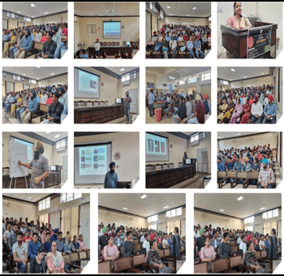

------------------------------------------

### Industrial Visit to BSNL Ludhiana in relation with Four week Training course on Digital Designing and Secured Wireless Communication from 10, July 2023 to 4, Aug 2023

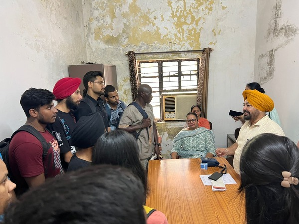

------------------------------------------

### Four week Training course on Project Design using Microcontroller Consultancy from 10, July 2023 to 4, Aug 2023

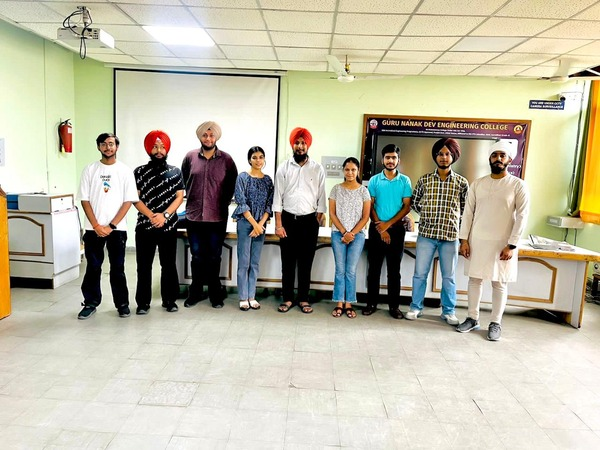
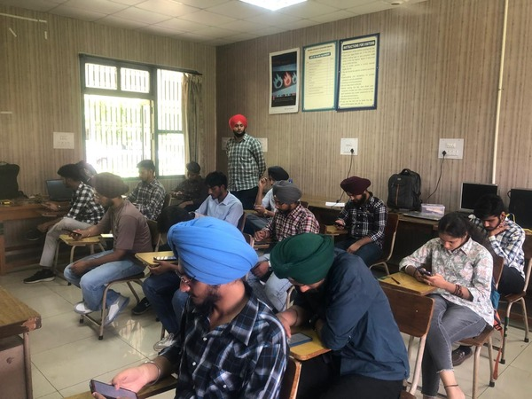

------------------------------------------

### Teachers Day Celebration at ECE Department on 5, Sept 2023

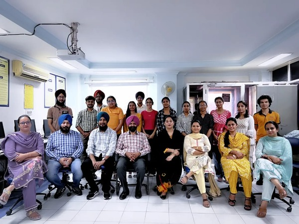

-----------------------------------------

### E-Vision 2023 organized by IETE Student Forum on 06, Oct 2023

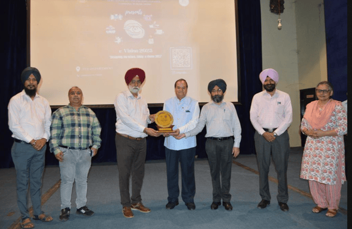

-----------------------------------------

### Two weeks value added workshop on "Hands-on Training Program on Development in Communication Engineering and Electronics" under IETE Student Forum from 19, Feb 2024 to 1, Mar 2024

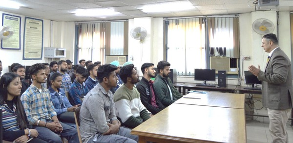
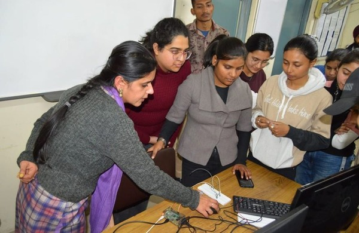

-----------------------------------------

### Four Week Training on Project Design using Microcontroller Consultancy from 5, June 2024 to 5, July 2024

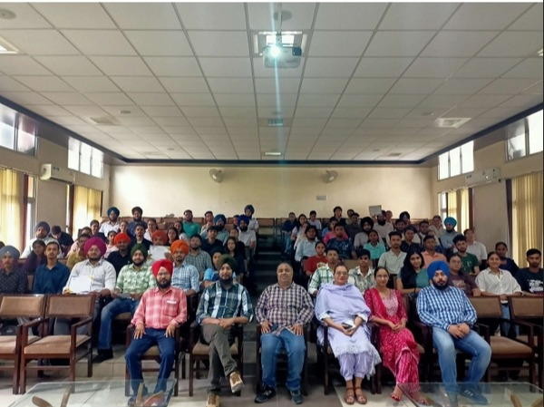
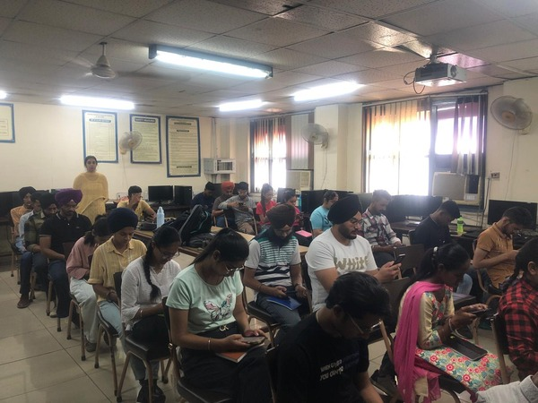

-----------------------------------------

### Four Week Training on Robotics with ML from 11, June 2024 to 11, July 2024

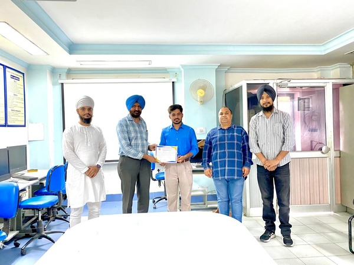
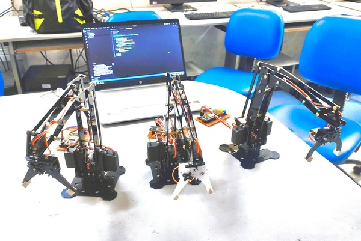

-----------------------------------------

### Four Week Training on Advanced Simulation Techniques for PLC Automation & IoT in Embedded System from 5, June 2024 to 5, July 2024

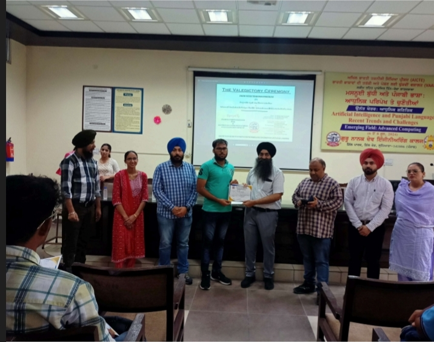

-----------------------------------------

### ECE Students during GNEAPEX on 8, Apr, 2022

Project: Designed a working model of a hydraulic Excavator which works on the principle of of Pascal’s Law

Team Members:
- Ali Ahmad Ansari
- Adarsh Mishra
- Anant Vijay
- Rahul Kumar
- Gurnoor Singh
- Guransh Singh

-----------------------------------------

## Faculty Achievements  

- **Shivmanmeet Singh** validating the lectures of SWAYAM course Chemical Reaction Engineering-I in Punjabi language in July-Dec 2023.

- **Shivmanmeet Singh** reviewed Paper entitled "The landscape of photoaging: From bench to bedside in a bibliometric analysis" of Frontiers in PublicHealth journal which falls under SCIE journal with impact factor "5.2" in July-Dec 2023.
 
- **Shivmanmeet Singh** Selected as organizing committee international member titled “4th international conference on advanced optics & photonics research in engineering” in China, Wuhan in Jan-June 24.

- **Shivmanmeet Singh** Reviewed paper entitled "Adaptation of the ant colony algorithm to avoid congestion in wireless mesh networks" in International Journal of Electrical and Computer Engineering Systems under ESCIE journal with impact factor "0.8" in Jan-June 2024.

- **Shivmanmeet Singh** Reviewed paper entitled "Performance Optimization of Universal Filtered Multicarrier Technique for Next Generation Communication Systems" in International Journal of Electrical and Computer Engineering Systems under ESCIE journal with impact factir "0.8" in Jan-June 2024.

- **Baljeet Kaur** successfully guided two students in completing their Ph.D research in July-Dec 2023.

## Publications  (Journals)

-  Harleen Kaur, **Narwant Singh Grewal**, "Performance enhancement of visible light communication (VLC) system incorporating WMZCC‐OCDMA codes and PDM‐QPSK‐DSP data encoding." International Journal of Communication Systems 36.1 (2023): e5355.

- **Shivmanmeet Singh, Narwant Singh Grewal, Baljeet Kaur**, "Performance investigation and development of 112 gbit/s dual polarization 16 QAM transmission system using differential encoding." Optical and Quantum Electronics 55.1 (2023): 70.

- **Chahat Jain**, Balwinder S. dhaliwal, Rupinder Singh, Suman Pattnaik, "On Comparison of 3D-Printed ABS and PVDF-Based Sensors for Body-Centric Utility." Arabian Journal for Science and Engineering 48.9 (2023): 12645-12655.

- **Harminder Kaur, Baljeet Kaur**, Ridheyjot Kaur, "A Review on OTDM Transmission." Int. J. Eng. Res. Technol 12 (2023).

- **Chahat Jain**, Balwinder S. dhaliwal, Rupinder Singh, Suman Pattnaik, "On 3D Printed Flexible and Wearable Sensors from Primary Recycled PVDF." National Academy Science Letters 47.2 (2024): 157-160.

- Harleen Kaur, **Narwant Singh Grewal**, "Security enhancement of an integrated mode division multiplexed VLC system using two-dimensional WMZCC codes." Journal of Optics 53.1 (2024): 622-634.

- **Shivmanmeet Singh, Narwant Singh Grewal, Baljeet Kaur**, "Analysis of hybrid PDM-4QAM-OFDM for inter-satellite/mechatronic telecommunication using FSO system." Opto-Electronics Review 31.3 (2023).

- Tarandeep Singh, Aseem Verma, **Navneet Kaur**, Manjeet Singh, "Enhancing conservation seeding techniques: a vibration analysis of spatially modified no-till drill in combine harvested rice fields." Proceedings of the Indian National Science Academy 89.4 (2023): 914-923.

- Pooja Sharma, **Navneet Kaur**, Gurpurneet Kaur, "Performance Assessment of III-V Heterojunction FinFETs at 14nm Gate Length." Journal Punjab Academy of Sciences 23 (2023): 296-301.

- **Harminder Kaur, Baljeet Kaur**, Manjit Singh Bhamrah, "Flat top optical multicarrier generation for ultra dense asymmetrical radio over fiber system." Optoelectronics and Advanced Materials-Rapid Communications 18.May-June 2024 (2024): 263-274.

- **Preeti Pannu**, "Highly compact UWB-MIMO antenna with sharp multi-stop band characteristics." EURASIP Journal on Wireless Communications and Networking 2024.1 (2024): 48.

- Jaspreet Kaur, **Narwant Singh Grewal, Navneet Kaur**, "A Symmetrical 32× 1 and 16× 1 Elements Antenna Array Failure Correction with Nulls Using Brain Storm Optimization." Wireless Personal Communications 136.4 (2024): 2405-2418.

- **Shivmanmeet Singh**, "Intelligent Development in Healthcare With the Internet (chapter)", Computational Intelligence and Blockchain in Biomedical and Health Informatics (Springer 2024).

## Publications  (Conferences)

- Mansi, **Munish Rattan, Gurjot Kaur Walia**, "Performance Analysis Of GAAFET Device Using HfO2 and SiO2", 4th International Conference on Innovative Trends in Electronics Engineering(ICITEE 2023).
  
- **Shivmanmeet Singh, Narwant Singh Grewal and Baljeet Kaur**, "Performance Evaluation of Inter-satellite Optical Wireless System (IsOWC) on nongeostaionary orbit using PDM- 256 QAM with DSP", 4th International Conference on Innovative Trends in Electronics Engineering(ICITEE 2023).

- **Harminder Kaur, Baljeet Kaur**, Manjeet Singh Bhamrah, "Opical Muli-carrier Generation Using Cascaded Three Stage Modulators", 4th International Conference on Innovative Trends in Electronics Engineering(ICITEE 2023).

- **Harminder Kaur, Baljeet Kaur**, Manjeet Singh Bhamrah, "100 GHz Radio Signal Over 160 Gbps-160 km ROF link Using Polarization Division Multiplexing based 256-QAM and Matched Filter", 4th International Conference on Innovative Trends in Electronics Engineering(ICITEE 2023).

- **Navneet Kaur, Gurpurneet Kaur**, Pooja Sharma, "Performance Assessment of III-V Heterojunction FinFETs at 14nm Gate Length", 4th International Conference on Innovative Trends in Electronics Engineering(ICITEE 2023).

- **Narwant Singh Grewal, Preeti Pannu, Gurpurneet Kaur**, "A Linear 16x1 and 42x1 elements antenna array failure correction using brain storm optimization algorithm", 11th International Conference on Advancement in Engineering and Technology(ICAET 2023).

- **Preeti Pannu**, "Breakthrough trends of Nanotechnology in the Biomedical Industry", National Conference on Intelligent Electronic Systems and Applications (NCIESA-2024).

- **Harleen Kaur**, "Parameter Estimation in Design of 5.2GHz Rectangular U Slot Microstrip Patch Antenna with ANFIS", 5th World Conference on Artificial Intelligence: Advances and Applications (WCAIAA 2024).

- Harleen Kaur, **Shivmanmeet Singh, Preeti Pannu**, "Unleashing the power of data in data science", 6th International Conference on Recent Innovations in Science & Technology(RIST 2024).

- **Gurjot Kaur Walia, Navneet Kaur, Chahat Jain**, "Image Demosaicing using Naïve Bayes Classifier for Improved Image Metrics", 6th International Conference on Recent Innovations in Science and Technology(RIST-2024).

- Ramneet Kaur Sahota, **Preeti Pannu, Gurjot Kaur Walia**, "Performance Analysis of Radio Over FSO for Advanced Modulation Formats", 6th International Conference on Recent Innovations in Science and Technology(RIST-2024).

## Publications  (Books)

- **Shivmanmeet Singh**, "Quantum Hits: Hardware, Information, Technology & Simulation", Amazon kindle (Aug 2023).

- **Shivmanmeet Singh, Preeti Pannu**, "Information Management and Data Analytics", Amazon kindle (Oct 2023).

## Events Organized (FDPs/Conferences/STCs/SDTs/Workshops/Webinars etc.)  

| Sr. No. | Name of Event                                                  | Faculty Coordinator           | Duration | Date(s)               | Sponsor(s) |
|:--------|:---------------------------------------------------------------|:------------------------------|:---------|:----------------------|:-----------|
| 1       | Peer Learning(Acceleration zone 3.o) | Shivmanmeet Singh | One Day | 23-02-2023 | GNDEC, Ludhiana |
| 2       |  National Science Day | Simranjit Kaur| One day | 28-02-2023 | FMCRS, GNDEC, Ludhiana |
| 3       | Talk to alumnus on benefits of NBA accreditation in Foreign Universities | Shivmanmeet Singh | One Day | 01-03-2023 | GNDEC, Ludhiana |
| 4       | Khabar Da Safar| Shivmanmeet Singh | One Day | 14-03-2023 | GNDEC, Ludhiana |
| 5       | Shark Chef | Shivmanmeet Singh | One Day | 15-03-2023 | GNDEC, Ludhiana |
| 6       | Tag it | Shivmanmeet Singh | One Day | 16-03-2023 | GNDEC, Ludhiana |
| 7       |  TechWar | Simranjit Kaur| One day | 16-03-2023 | FMCRS, GNDEC, Ludhiana |
| 8       | Gusto Knack-Tech Fest | Shivmanmeet Singh | One Day | 16-03-2023 | GNDEC, Ludhiana |
| 9       | Alumnus talk on how to crack microsoft | Shivmanmeet Singh | One Day | 22-03-2023 | GNDEC, Ludhiana |
| 10      | Introduction to Arduino and Hands-on Soldering | Shivmanmeet Singh |One Day| 13-04-2023 |GNDEC, Ludhiana |
| 11      | Khabar Da Safar | Shivmanmeet Singh | One Day | 18-04-2023 | GNDEC, Ludhiana |
| 12      | Two days workshop on 3D Printing: A future generation Technology | Preeti Pannu, Chahat Jain | Two Days |02-05-2023 to 03-05-2023 | GNDEC, Ludhiana |
| 13      | Reels for Labour day | Shivmanmeet Singh | One Day | 01-05-2023 | GNDEC, Ludhiana |
| 14      | Gaana Gapshup | Shivmanmeet Singh | One Day | 02-05-2023 | GNDEC, Ludhiana |
| 15      | One day event Tag-a-Thon| Simranjit Kaur  | One Day | 20-08-2023 | FMCRS, GNDEC, Ludhiana |
| 16      | National Eye Donation Fortnight | Simranjit Kaur  | Two Weeks |25-08-2023 to 28-09-2023 | FMCRS, GNDEC, Ludhiana |
| 17      | Talent Hunt | Shivmanmeet Singh | One Day | 12-08-2023 | GNDEC, Ludhiana |
| 18      | Peer to Peer Learning Acceleration zone 4.0 | Shivmanmeet Singh | One Day | 31-08-2023 | GNDEC, Ludhiana |
| 19      | Workshop on MYTACS GLOBALLINK scholarship | Shivmanmeet Singh | One Day | 13-09-2023 | GNDEC, Ludhiana |
| 20      | Workshop on Photography and Sound Engineering | Shivmanmeet Singh | One Day | 19-09-2023 | GNDEC, Ludhiana |
| 21      | Ragamala- A Garland of Architecture and Music | Shivmanmeet Singh | One Day | 19-09-2023 | GNDEC, Ludhiana |
| 22      | Gracious giver Apex 2023 | Shivmanmeet Singh | One Day | 20-10-2023 | GNDEC, Ludhiana |
| 23      | Photography Workshop | Shivmanmeet Singh | One Day | 24-01-2024 | GNDEC, Ludhiana |
| 24      | Gaana Gupshup | Shivmanmeet Singh | One Day | 07-02-2024 | GNDEC, Ludhiana |
| 25      | Code Debugging | Shivmanmeet Singh | One Day | 02-02-2024 | GNDEC, Ludhiana |
| 26      | Flash Fiesta- Photography Workshop | Shivmanmeet Singh | One Day | 09-02-2024 | GNDEC, Ludhiana |
| 27      | One day event - Voice of 90.8 | Simranjit Kaur | One day |28-02-2024 | FMCRS, GNDEC, Ludhiana |
| 28      | Problem Poster Debate Techfest| Shivmanmeet Singh | One Day | 06-03-2024 | GNDEC, Ludhiana |
| 29      | Tech Extempore | Shivmanmeet Singh | One Day | 06-03-2024 | GNDEC, Ludhiana |
| 30      | Mind Traps | Shivmanmeet Singh | One Day | 14-03-2024 | GNDEC, Ludhiana |
| 31      | Rahul's Fitness Fiesta | Shivmanmeet Singh | One Day | 21-03-2024 | GNDEC, Ludhiana |
| 32      | Workshop on start up building | Shivmanmeet Singh | One Day | 01-04-2024 | GNDEC, Ludhiana |
| 33      | Financial Freedom | Shivmanmeet Singh | One Day | 16-04-2024 | GNDEC, Ludhiana |
| 34      | "Four week training on Project design using microcontrollers consultancy" | Gurpurneet Kaur, Shivmanmeet Singh, Harminder Kaur, Preeti Pannu | Four weeks | 05-06-2024 to 05-07-2024 | TCC, GNDEC |

## Events Attended (FDPs/Conferences/STCs/SDTs/Workshops/Webinars etc.)  

| Sr. No. | Name of Faculty | Name of Event | Duration | Date(s) | Organizing Institute |
|:--------|:----------------|:--------------|:---------|:--------|:---------------------|
|   1   |	Baljeet Kaur	|  Big Data and Analytics |	1 Week |	03-04-2023 to 07-04-2023  |	Dr B R Ambedkar National Institute of Technology Jalandhar |
|   2   |	Shivmanmeet Singh	|  Performance Evaluation of Inter-satellite Optical Wireless System |	1 Day |	27-04-2023  |	Punjabi University Patiala  |
|   3   | 	Simranjit Kaur, Dr. Navneet Kaur, Dr. Gurjot Kaur Walia  |	  FDP on Technology Enabled Teaching-Learning  | 1 week   |	28-04-2023 |	NITTTR, Chandigarh |
|   4   |	Simranjit Kaur |	Workshop on "Antenna fabrication using 3D printing |	1 Day | 29-04-2023	  |	NITTTR, Chandigarh |
|   5   | Simranjit Kaur |	Workshop on "Translating academics research into industry applications" |	1 Day  |	30-04-2023 | Start up farms, IT park, sec-13, Chandigarh  |
|   6   | Navneet Kaur |	Webinar on Connecting Curriculum to Careers: Mastering for Credit Online Learning | 1 Day | 03-05-2023 | India Didactics Association and Coursera |
|   7   | Preeti Pannu, Chahat Jain |	Two days workshop on 3D Printing: A future generation Technology	| 2 Days  | 02-05-2023 to 03-05-2023 | GNDEC, Ludhiana |
|   8   | Simranjit Kaur, Dr. Gurjot Kaur Walia |	Workshop on "Artificial intelligence and punjabi language: Recent trends and challenges"	| 3 Days  | 06-06-2024 to 08-06-2024 | AICTE-VAANI , GNDEC, Ludhiana |
|   9   | Navneet Kaur |	Foundations: Data, Data, Everywhere	| 4 weeks  | 06-2023 | Coursera |
|   10   | Preeti Pannu |	One week short term course on blended learning and flipped classroom	| 1 week  | 16-10-2023 to 20-10-2023 | NITTTR, Chandigarh |
|   11  | Preeti Pannu, Dr. Gurjot Kaur Walia |	Workshop on OBE under IQAC	| 1 Day  | 16-11-2023 | GNDEC, Ludhiana|
|   12  | Preeti Pannu |	Workshop on Translating academics research into industry applications	| 1 Day  | 13-12-2023 | IT park, sector 13, Chandigarh|
|   13  | Simranjit Kaur, Dr. Gurjot Kaur Walia |	STP on "branding of HEIs for Institutional Excellence"	| 1 week  | 11-12-2023 to 15-12-2023 | NITTTR, Chandigarh |
|   14  | Navneet Kaur |	Building Advanced Data Analytics Applications with Cloud | 5 Days | 08-01-2024 to 12-01-2024 | AICTE and Edunet Foundation |
|   15  | Preeti Pannu |	Attended knimbus offline training by kansihka Jindal Knimbus india	| 1 Day  | 21-03-2024 | ME Seminar hall, GNDEC, Ludhiana|

## Expert Lecture delivered

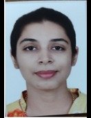

- **Preeti Pannu**,	delivered expert lecture on Parametric study of antenna development in Two days workshop on 3D Printing: A future generation Technology, at GNDEC, Ludhiana, 03-05-2023 and "Expert talk on study and hands on training on antenna design using IE3D in Workshop on “Hands on training program on developments in communication engineering and electronics”, at GNDEC, Ludhiana, 26-02-2024.

- **Shivmanmeet Singh**,	delivered expert lecture on Emerging Technologies at GNDEC, Ludhiana, 05-05-2023 and expert lecture on Communication System at GSSS Sidhwan Kalan, 11-11-2023, at GSSS Bilaspur, 18-11-2023 and at GSSS ukhlir, 25-11-2023.

- **Gurjot Kaur Walia**,	delivered expert lecture on 8051-Microcontroller Organized by GNDEC, Ludhiana, 18-10-2023 and Expert talk on Digital Circuit Design using Vivado and Zedboard, Expert Talk on Study and Hands-on training on Raspberry Pi at GNDEC Ludhiana, 21-02-2024.

## Student's Corner  

#### - Student's Achievements

- **Jagjot Singh(URN:2104387)** got 3rd prize in Causmic Club Quiz Event "Fast and Curious" held under Applied Science Department Society on 08-12-2022.

-  **Jaspal Singh(URN:2104391)** attended North India Inter-University Cricket Camp from 17-12-2022 to 22-12-2022.

-  **Riya Saluja(2104418)** Got silver in inter college handball (sangrur), second in heritage annual function and awarded in theater one act play annual function.

- **Sonu Kumar(URN:2004860)**, selected in Inter-University Kabbadi team by Punjab Technical University on 01-12-2022.

- **Pranav Ranjan(URN:2004841)**, was runner up in Inter-year cricket organized by GNDEC on 05-11-2022.

----------------------------------------

- **Anchal verma(URN 2103949)**, participated in intercollege competition at Khalsa College of Engineering & Technology Amritsar. She got 2nd position in pot making competition on 12-05-2022.

----------------------------------------

- **Anmol Kumar Srivastav(URN:2134680)** assigned the event GNE APEX (2022) organized by GNDEC ON 08-04-2022.

-----------------------------------------

-  **Adarsh Mishra(URN:2103943)** was Finalist in “Privatiza”, Cognizance 2022 at IIT Roorkee held a case study competition from 24th to 28-03-2022

- Selected as Virtual Lab Developer at IIT Roorkee in June 2022 (Created 3 working experiments at Lab).

- Organized an event “Science in our Daily life” at GNDEC on 30-01-2022.

- 
 Freelance Intern at PhysicsWallah from April to May 2022.

-----------------------------------------

- **Anant Vijay(URN:2103948)** was GK Quiz Head Organizer at GNE APEX 2022. Organized an inter school event at GNDEC Ludhiana on 08-042022.

- Selected as Virtual Lab Developer at IIT Roorkee in June 2022.

- Organized an event “Science in our Daily life” on 30-01-2022.

- Selected for MERA SWARAJ EDUCATION PROGRAM. A scholarship program run by MAHINDRA and MAHINDRA Swaraj division through “Manav Vikas Sansthan” in March, 2022.

-----------------------------------------

-  **Mohammad Yasir(URN:2104400)** launched his application on "National Workshop on Lifestyle for Environment" for Ministry of Forest and Climate organized at Indira Paryavaran Bhawan Headquarters, Ministry of Forest and Climate Change, Govt of India. The Ministry of Forest and Climate Change conducteds this event and invited
more than 2000 school children, ENVIS partners from all the states of India. Applications namely,
i)Water Footprint Calculator ii)Wetlands in India iii)Traditional Water Management Practice.

-----------------------------------------

## IETE STUDENT FORUM

- The events were organized under the guidance of:

Dr. Munish Rattan (ISF Coordinator)
Prof. Shivmanmeet Singh (ISF Secretary)

Savnoor Channi (Student Convenor)
DhairyaSobti (Student Co-Convenor)
Anmol Kumar Srivastav (Student Co-Convenor)

-----------------------------------------
### Gusto Knack

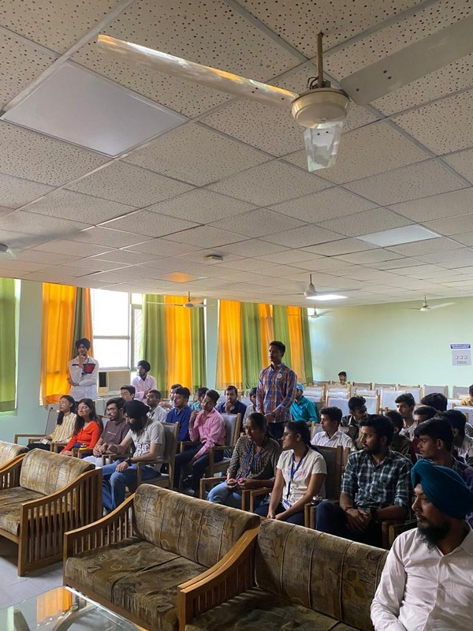

- 
 This event was organized in the Anand Utsav’s Techn-o-Mela on the 16th March 2023. In this event; a team of two or three members were made. There were questions which had to be answered as a team in the first round. Furthermore; the qualifying teams had to split up and the members individually had to play another round of quiz and ones answering the fastest were awarded first, second and third positions respectively.

-----------------------------------------
### Workshop on Arduino and Soldering

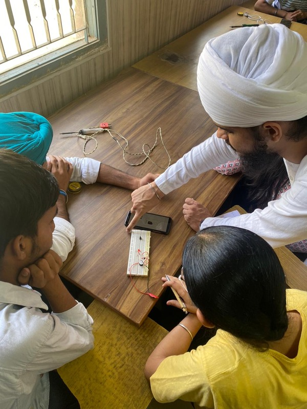

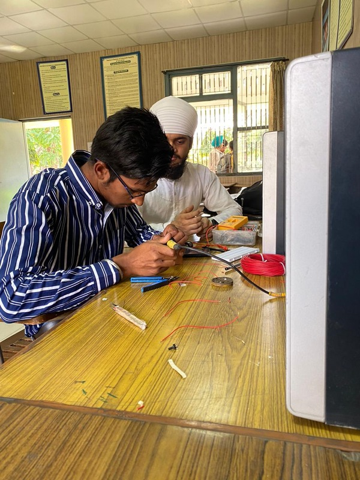

- 
 This event was organized in April 2023; Every Thursday for 3 weeks starting 13th April 2023.This was a workshop organized to make the students familiar with topics like Arduino and Soldering. This was a peer-to-peer event and our kind seniors Puran Singh and Satnam Singh were the tutors for the event. This was a practical learning workshop where students practiced everything themselves simultaneously.

-----------------------------------------
### Expert Talk on Emerging Technologies by Prof. P. Prabhakar(Immediate Past President of IETE Student’s Forum)

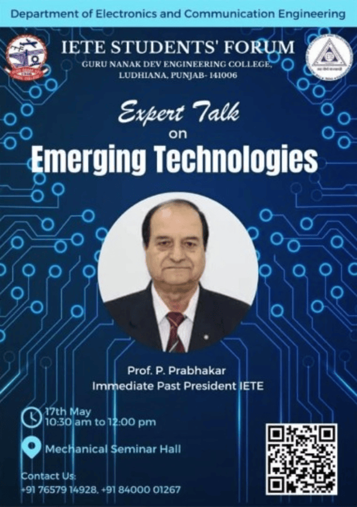

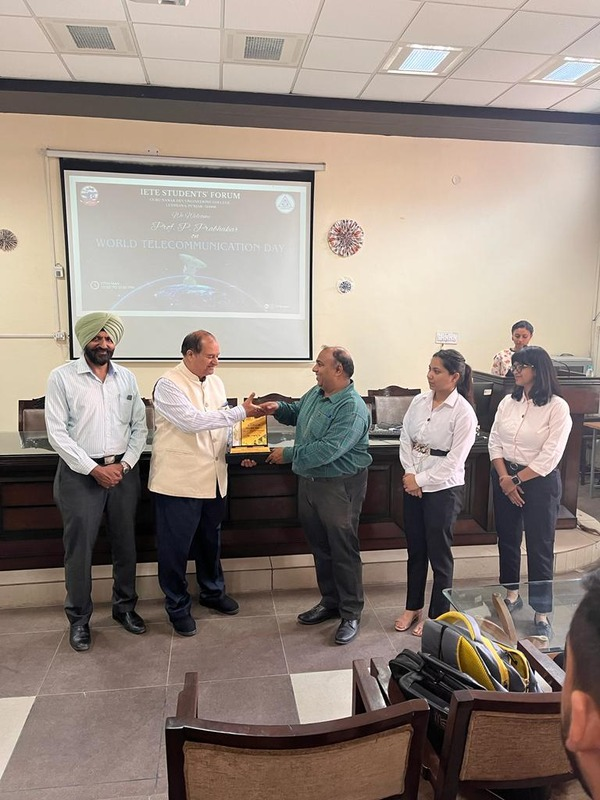

- 
This event was organized on 17th May 2023.The expert lecture was given by IETE Student’s Forum Immediate Past President Prof. P. Prabhakar. Sir educated us about his detailed knowledge about the Emerging Technologies. The listeners also asked any questions they had and discussed about the new possibilities in the technology area.

-----------------------------------------
### Expert Talk on Wireless Communication

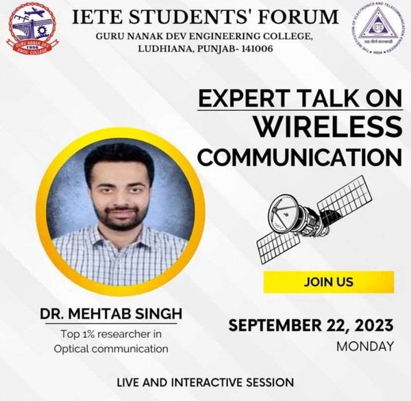

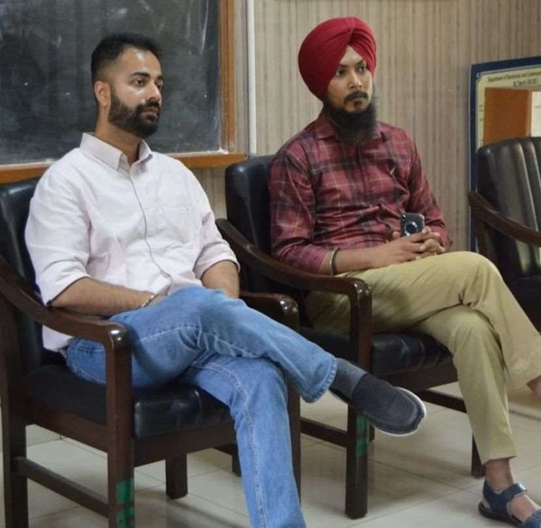

- 
This event was organized on 22nd September 2023.The expert lecture was given by Dr. MehtabSingh(Top 1% Researcher in Optical Communication). Sir educated about his detailed knowledge in the topic. He was very cooperative and answered many questions of the listeners. His detailed knowledge in the given topic was extremely helpful to the listeners.

-------------‐---------------------------
### Code Debugging

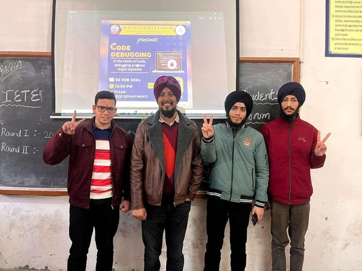

- 
This event was conducted on 02nd February 2024.In this event; in the first round the participants were provided with codes in basic programming languages with errors in them and the participants had to find out the errors in those codes. This round was comparatively kept a little easy than the second round. The selected participants from the first round were forwarded to second round. With  higher difficulty, the errors had to be found in the given codes. Three winners were selected on the basis of the higher score.
 

----------------------------------------
### Flash Fiesta- A peer to peer learning on Photography

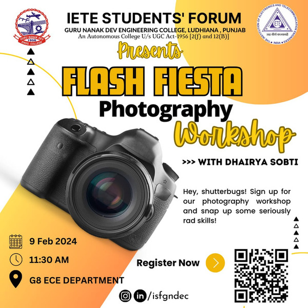

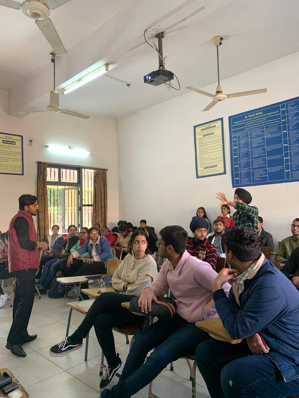

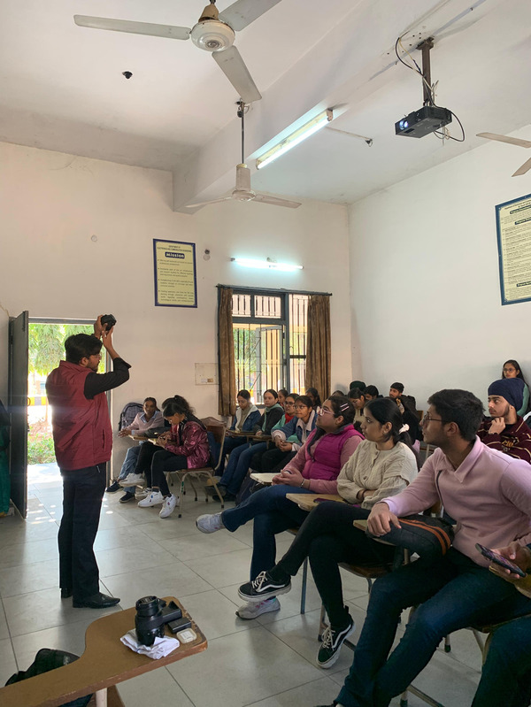

- 
This event was organized on 09th February 2024. This event  was led by our Co-Convenor DhairyaSobti. He shared his immense knowledge in Photography. He shared with us great knowledge about lens , about different camera settings and a lot more. Following which; we followed up a photography competition to test the knowledge taken in. The three winners were selected accordingly.
 

------------------------------------------
### Problem Poster Debate 

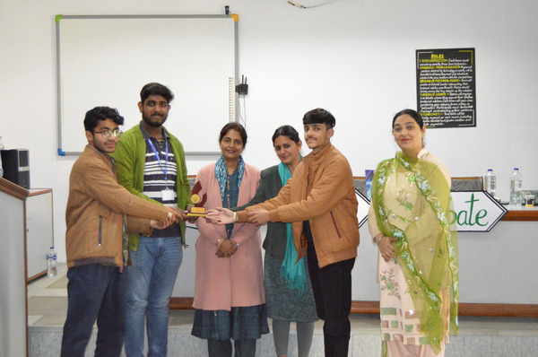

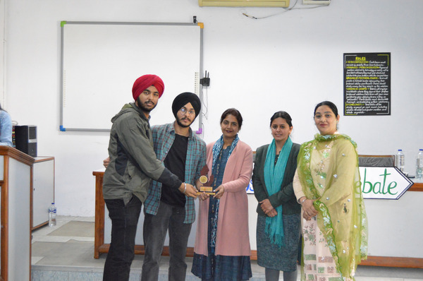

- 
This event was organized in Anand Utsav’s Technomelaon  6th March 2024.A team of three members was made. This was a three round event. In the first round , a problem related to technology or society was provided to the team and they had to find a solution to the given problem in the specified time period. In the second round; a poster representing the problem’s solution had to be made. In the third round; The teams engaged in a debate where they defend their proposed solutions. The teams that stood out in the three rounds were awarded 1st, 2nd and 3rd position accordingly.
 

------------------------------------------
### Expert Talk on Machine Learning and its application using python 

- 
This event was organized on 20th March 2024. The expert talk was given by Mr. Ansh Aneja and his team members. Sir and his team shared great knowledge on the given topic. He demonstrated multiple experimentations and projects related to the topic. This lecture was a really resourceful one.

-------------------------------------------
### Project Exhibition
## Expert Lecture on PLC for Industrial Applications

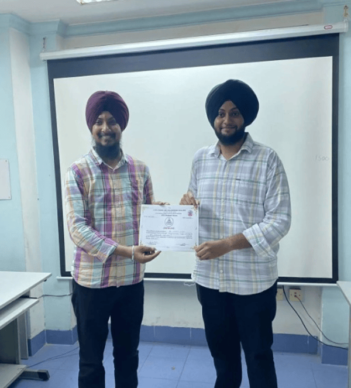

- 
This event was organized on 14th August 2024.The event was graced by tutors Satnam Singh and Rajjot Singh. The speakers were well versed with the topic and their great knowledge was so helpful to us in getting detailed knowledge of the topic. The different experiments and projects were helpful in better understanding. We even saw hardware parts of the plc used in industrial applications.

-------------------------------------------
### Workshop on Cyber Security with Shell Scripting Automation 

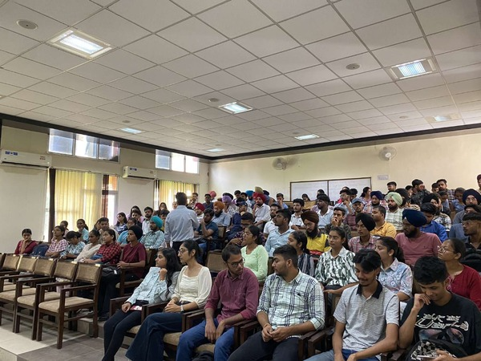

- 
This event was organized on 3rd September 2024. The expert talk was given by Mr. Ansh Aneja and his team members. Sir and his team shared great knowledge on the given topic. He demonstrated multiple experimentations and projects related to the topic. This lecture was a really resourceful one. The experiments actually give an insightful experience on how things in the industry work.

--------------------------------------------
### Hands on Experience on Soldering and Desoldering

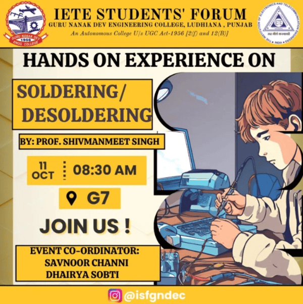

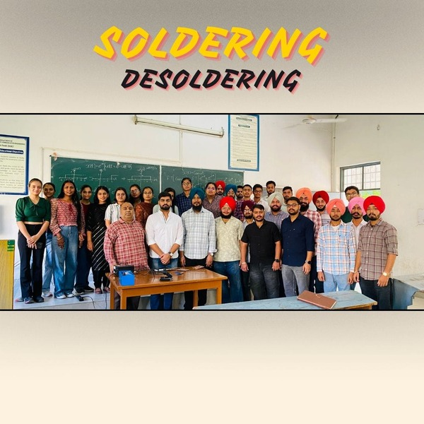

- 
This event was organized on 11th October 2024.This event was led and supervised by Prof. Shivmanmeet Singh. The event was coordinated by Savnoor Channi(Convenor ISF) and Dhairya Sobti(Co-Convenor ISF).Sir first talked about Soldering and Desoldering. Then a hands on training was done and all the participants did also practice soldering and desoldering.

----------------------------------------------
### Digital Artistry

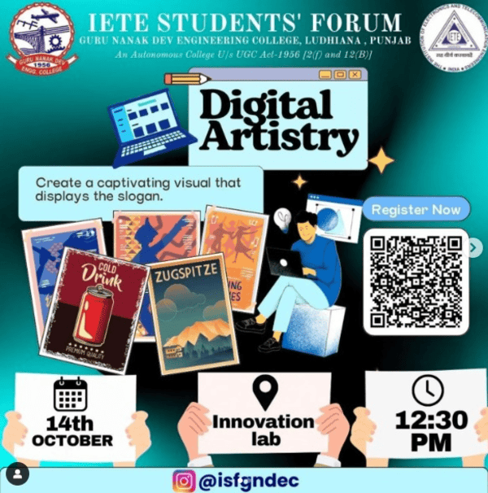

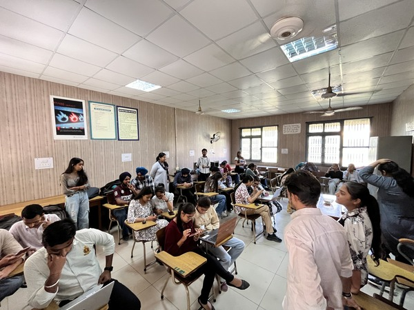

- 
This event was organized on 14th October 2024.In this event, team was created of two members each. Further; they were provided with a slogan. They had to present the slogan in the form of a poster. Also; they also had to present their poster and explain it and the presentation should be very appropriate to the slogan.

----------------------------------------------
### Two Day Workshop : Digital Electronics and VHDL: From theory to Practice

- 
This event was organized on 28th and 29th October 2024. The Workshop Coordinator was Er. KuldeepakSingh . The expert talk was given by Dr. Gurjot Kaur Walia and Er. Kunwar Partap Singh. The topics that were covered were: Combinational Circuit Design and its real life applications, Signal Conversions : Analog and Digital Signals and Programming and Design using VHDL.

---------------------------------------------
### Poster Designing Competition in collab with Central Library

- 
This event was held on 29th October 2024.This competition was held for students to make them familiar with the topics like How to access McGraw Hill ebooks, How to use DELNET, How to access EBSCO Journals, How to access IEEE Journals, How to search a book in WebOpac ; making the students familiar with the library resources. The students were awarded with three positions according to their posters.

---------------------------------------------
### 2 Day’s Workshop on 3D Printing : Peer to Peer Learning 

- 
This event was held on 11th and 13th November 2024. This workshop was coordinated by Dr. Gurpurneet Kaur and co-coordinated by Prof. Shivmanmeet Singh and the student demonstrator was Anmol Kumar Srivastav(Co-Convenor ISF).The event on day 1 was familiarizing the participants with the topic and day 2 highlighted actually printing in the 3D printing.

---------------------------------------------
### TechNova- Project Exhibition

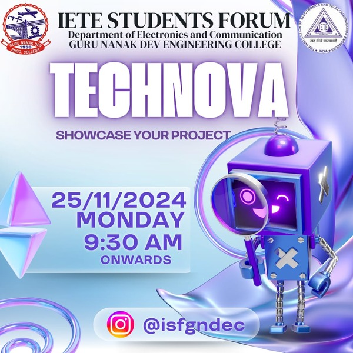

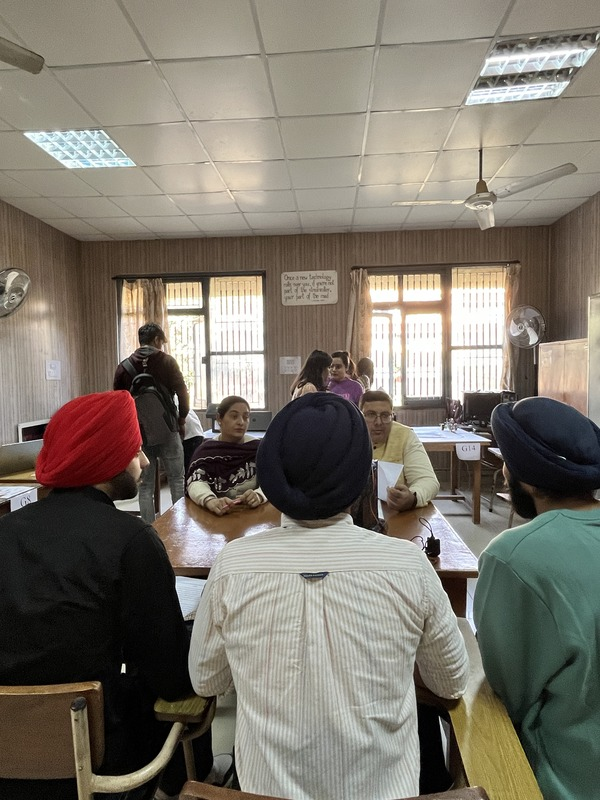

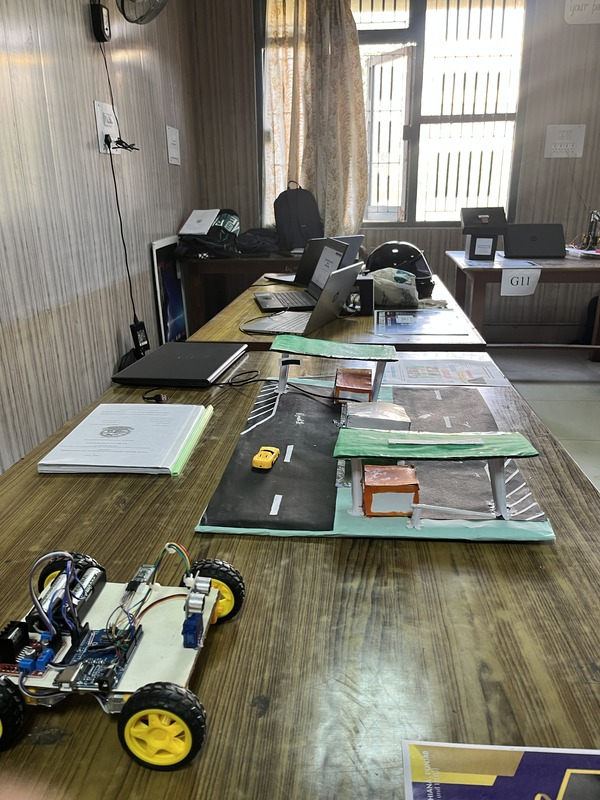

**Editor: Dr. Preeti Pannu**
