# **GNDEC in News**

## UGC confers 10 years academy autonomy to GNDEC

###### |🕒 Published on June 6,2023

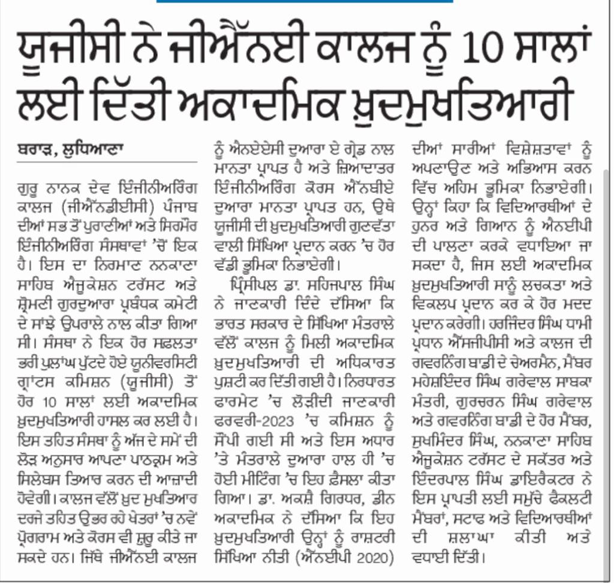

UGC confers academy autonomy to GNDEC for ten years.
Guru Nanak Dev Engineering College (GNDEC) has been conferred academic autonomy by University Grants Commission (UGC) for another 10 years in the third cycle. Under this autonomy, the institution will have liberty to design its own curriculum and syllabus as per need of the hour. New programs and courses in the emerging areas can also be started by the college under the autonomous status. While GNDEC is accredited by NAAC with A grade and most of the engineering courses are accredited by NBA, the UGC autonomy will play big role in imparting quality education. Dr. Sehijpal Singh Principal confirmed that official communication has been received from the Ministry of Education, Govt of India. The required information in the prescribed format was submitted to the commission in February 2022 and on the basis of this information, the decision of imparting academic autonomy to GNDEC has been taken in the recent meeting by the ministry.  “It will help us to adopt and exercise many features of National Education Policy (NEP 2020)” Dr Akshay Girdhar Dean Academic said. He further added that the skill and knowledge of students can be enhanced by following NEP for which the academic autonomy provides large number of flexibilities and options. S Harjinder Singh Dhami President SGPC and Chairman Governing Body (GB) of GNDEC, S. Maheshinder Singh Grewal, S. Gurcharan Singh Grewal and other members of GB,  S Sukhminder Singh Secretary education and Nankana Sahib Education Trust (NSET) , and S Inderpal Singh Director NSET applauded and congratulated entire faculty, staff and students for this achievement.

# **GNDEC in News**

## GNDEC students excels in campus placements

###### |🕒 Published on JUNE 26,2023

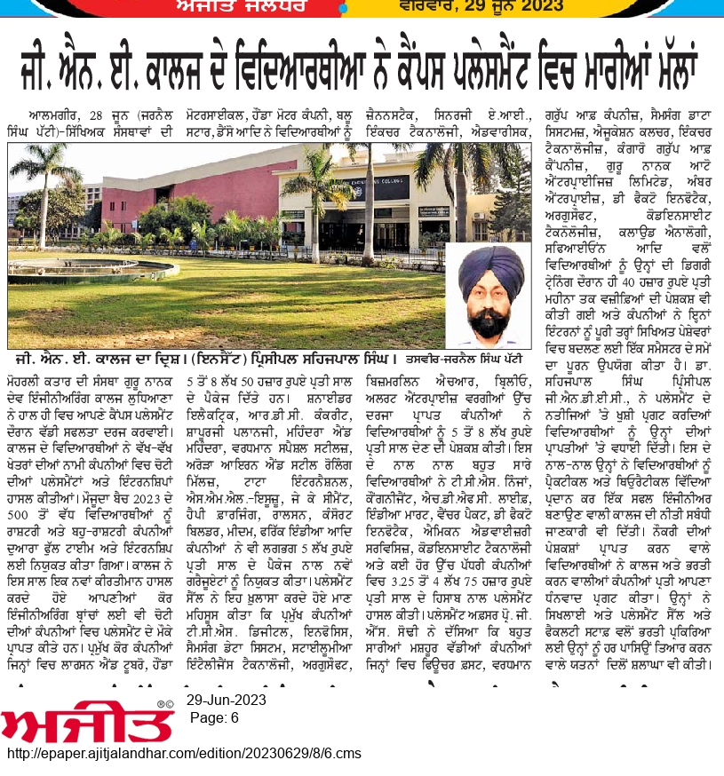

GNDEC Students Excel in Campus Placements, Bagging Top Roles in Leading Core Companies 

Guru Nanak Dev Engineering College (GNDEC), one of the leading institutions for higher education, has seen a great success in their campus placement drives recently. The students of the college have grabbed top placements and internships in renowned companies across various sectors. More than 500 students of current batch 2022 were hired by national and multinational companies for full time roles and internships.

The college has set a new benchmark this year, with more core engineering branches getting placement opportunities in top companies. The students have secured placements in leading core companies like Larsen & Toubro Ltd., Honda Motorcycle and Scooter India, Honda Motor Company, Blue Star Ltd., Denso etc. offered students a package between Rs. 5.00-8.50 LPA. Other companies such as Schneider Electric, RDC Concrete (India), Shapoorji Pallonji and Company Private Ltd., Mahindra & Mahindra Ltd.,Vardhman Special Steels Ltd., Arora Iron & Steel Rolling Mills, Tata international Ltd., SML-ISUZU Ltd. JK Cement Happy Forgings, Ralson (India) Ltd.,Consort Builders, MWIDM, Frick India Limited also hired fresh graduates with package of  around 5.0 LPA.

Training and Placement Cell takes pride to disclose that leading companies such as TCS Digital, Infosys, Samsung Data Systems, Stylumia Intelligence Technology, Argusoft, XenonStack, Synergy A.I.,Incture Technologies, Advarisk, Bizmerlin HR, Brillio, Alert Enterprises and ChicMic offering of Rs.5.00-7.60 LPA. Many students have secured placements in top-notch organisations like TCS Ninga, Cognizant, HDFC Life, IndiaMART, Venture Pact, De Facto Infotech, Emicon Advisory Services, CodeInsight Technologies and many others provided decent jobs offers in range Rs. 3.25-4.75 LPA.

Prof. G.S. Sodhi, Training and Placement officer shared about one promising trend for the engineering students that various MNCs, MSMEs & leading industries like Futures First, Vardhman Group of Companies, Samsung Data Systems, Education Culture, Incture Technologies, Kangaro Group of Companies, Guru Nanak Auto Enterprises Ltd., Amber enterprises, De Facto Infotech, Argusoft India Ltd.,CodeInsight Technologies Pvt. Ltd.,Cloud Analogy. SafeAeon Inc. and many more have come forward to offer internships to students with handsome stipends from Rs.10K-40K per month. “The companies have provisioned one full semester tim

# **GNDEC in News**

## Sustainability hub launched at GNDEC

###### |🕒 Published on May 28,2023

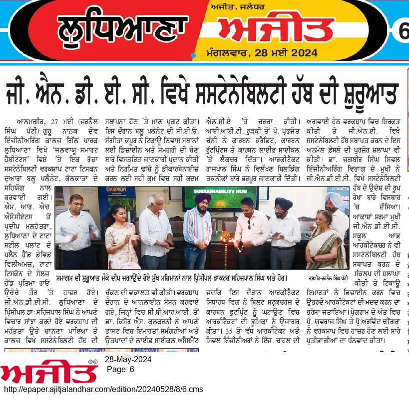

Sustainability Hub Launched at GNDEC During Sensitization Workshop on Climate-Smart Habitats
 
A one-day sustainability sensitizing workshop on "Mainstreaming Sustainability for Climate-Smart Habitats” was organized at Guru Nanak Dev Engineering College (GNDEC), Ludhiana. The workshop was supported by Tata Tiscon under their Discovery Pro 2.0 initiative, with Blue Planet, Kolkata serving as the knowledge partner. The local facilitation was provided by Mr. Pardeep Malhotra of MRH Associates. Mr. David Williams, Plan Head of the upcoming Tata Steel Plant in Ludhiana, and Ms. Pratima Rao, Sales Head North at Tata Tiscon also graced the occasion.
In his opening remarks, Dr. Sehijpal Singh, Principal of GNDEC, Ludhiana, emphasized the importance of such sensitization workshops. He expressed pride in the establishment of a Sustainability Hub at GNDEC, Ludhiana. Ms. Sangeeta Kapoor, CEO of Blue Planet, provided detailed insights into the design and choice of materials for sustainable habitats and advocated for taking the right steps in the right order to decarbonize built structures.
The workshop featured two online sessions. Dr. Kishor S. Kulkarni from CBRI discussed life cycle assessment (LCA) for buildings, materials, and products in his talk. Prof. Prabhjot Chani from IIT Roorkee lectured on carbon credits, carbon footprints, and the carbon life cycle. Ar. Rajpal Singh delivered an enriching session on alternative building techniques, while Ar. Siddhartha Wig from Elements, Panchkula, shared his expertise on minimizing waste and optimizing efficiency in built structures, highlighting the role of architects in reducing the carbon footprint of built structures.
More than 35 architects and civil engineers led by Er. Chahal from Ludhiana and adjoining areas attended the workshop. They appreciated the idea of setting up of sustainability hub at an institute of prestige.
Dr. Jagbir, Professor and Head of the Department of Civil Engineering, outlined the purpose of the Sustainability Hub at GNDEC. Ar. Akansha Sharma, Head, GNDEC School of Architecture, also appreciated the concept of setting up Sustainability Hub and would help the budding architects to design sustainable buildings. Prof. Yuvraj Singh and Prof. Arvind Dhingra thanked all participants for attending the workshop.

# **GNDEC in News**

## GNDEC marks 68th foundation day

###### |🕒 Published on April 9,2023

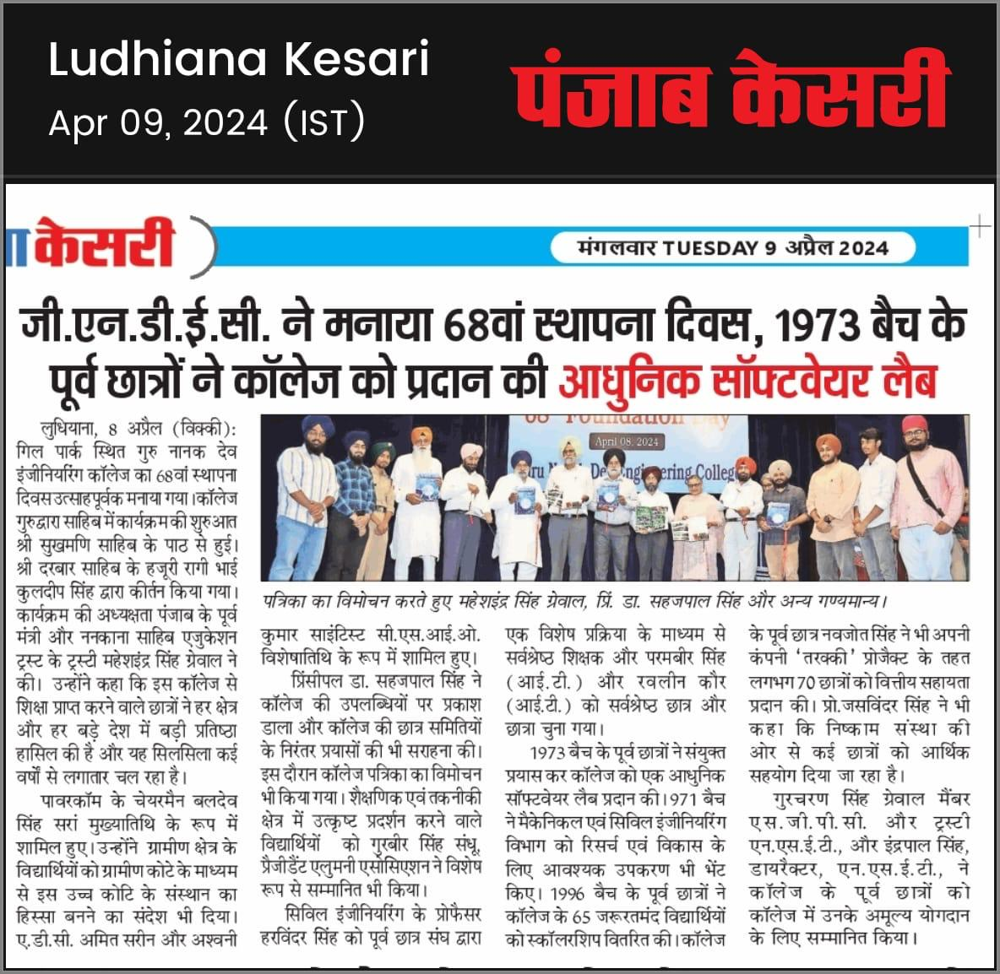

Press Note:
Guru Nanak Dev Engineering College Marks 68th Foundation Day with Enthusiasm

Guru Nanak Dev Engineering College, situated in Gill Park, Ludhiana, joyfully commemorated its 68th Foundation Day on April 8, 2023. The event commenced with the recitation of Sukhmani Sahib at the college Gurudwara Sahib, followed by a soulful Kirtan performance by Bhai Kuldeep Singh Ji, Hazuri raggi from Shri Darbar Sahib.

S. Maheshindar Singh Grewal, former Punjab Minister and Trustee of Nankana Sahib Education Trust presided over the function. He lauded the college's track record of producing accomplished graduates excelling in diverse domains across the globe. S. Baldev Singh Sran, Chairman of PSPCL, graced the occasion as the chief guest, urging rural students to seek admission to this esteemed institution through the Rural Quota. Special Guest Shri Amit Sareen, Additional Deputy Commissioner Ludhiana, also lent his presence to the celebration.

Dr. Sehijpal Singh, Principal of the college, enlightened the audience about its achievements and applauded the relentless efforts of student societies. The unveiling of the college magazine marked a significant moment during the ceremony. Meritorious students were felicitated for their academic and technical prowess, with deserving candidates receiving scholarships. The Alumni Association honored Professor Harvinder Singh of the Civil Engineering department as the Best Teacher.

The spirit of generosity permeated the event as former students from the 1973 batch donated a modern software lab to the college. Contributions from the 1971 alumni batch further bolstered research and development initiatives in the Mechanical and Civil Engineering departments.

The occasion also witnessed acts of philanthropy, with scholarships distributed to 65 underprivileged students by the alumni of the 1996 batch. Former student Navjot Singh extended financial aid to approximately 70 students through his company's Tarakee project. Prof. Jaswinder Singh shed light on the ongoing support provided by Nishkam Sewa to numerous students.

S. Gurcharan Singh Grewal, Member of SGPC and Trustee, along with S. Inderpal Singh, Director of NSET, expressed gratitude for the alma mater's contributions and extended warm wishes on the momentous occasion of its 68th Foundation Day. Dr. Parminder Singh, Dean Student Welfare, efficiently coordinated the program, ensuring its success.

# **GNDEC in News**

## Anand Utsav celebrated with full enthusiasim  at GNDEC

###### |🕒 Published on March 8,2023

 ਦਿਨ ਪਹਿਲਾ

“ਅਨੰਦ ਉਤਸਵ 2023 "  ਦਾ ਪੂਰੇ ਜੋਸ਼ੋ ਖ਼ਰੋਸ਼ ਨਾਲ ਜੀਐਨਡੀਈਸੀ ਵਿਖੇ ਹੋਇਆ ਆਗਾਜ਼ 

ਗੁਰੂ ਨਾਨਕ ਦੇਵ ਇੰਜਨੀਰਿੰਗ ਕਾਲਜ,ਗਿੱਲ ਪਾਰਕ, ਲੁਧਿਆਣਾ, ਵਿਖੇ 6 ਮਾਰਚ 2023 ਨੂੰ ਦੋ - ਰੋਜ਼ਾ ਸੱਭਿਆਚਾਰਕ ਮੇਲਾ "ਅਨੰਦ ਉਤਸਵ 2023" ਦੀ ਜੋਸ਼ੋ ਜਨੂੰਨ ਸਹਿਤ   ਸ਼ੁਰੁਆਤ ਹੋਈ। ਪ੍ਰੋਗਰਾਮ ਵਿੱਚ ਕਲਚਰਲ ਅਤੇ ਟੈਕਨੀਕਲ ਦੋਨੋ ਤਰ੍ਹਾਂ ਦੇ ਈਵੈਂਟਸ ਕਰਵਾਏ ਗਏ । ਇਹਨਾਂ ਈਵੈਂਟਸ ਵਿਚ ਕਾਲਜ ਦੇ ਅਲੱਗ -2 ਵਿਭਾਗਾਂ ਤੋਂ  ਵਿਦਿਆਰਥੀਆਂ ਨੇ ਪੂਰੇ ਉਤਸਾਹ ਨਾਲ ਸਮੂਲੀਅਤ ਕੀਤੀ ।

ਫੈਸਟ ਦੇ ਪਹਿਲੇ ਦਿਨ ਜੋ ਕੋਲ
ਕਾਲਜ ਟੈਕਨੋ ਕਲਚਰਲ ਗਤੀਵਿਧੀਆਂ ਕਰਵਾਈਆਂ ਗਈਆਂ  ਉਹ ਸਨ ,ਸੋਲੋ ਡਾਂਸ,  ਸਕਿੱਟ, ਗਰੁੱਪ ਡਾਂਸ, ਫੋਕ ਡਾਂਸ, ਮਹਿੰਦੀ,ਰੰਗੋਲੀ,ਕਲੇਅ ਮਾਡਲਿੰਗ, ਫੋਟੋਗਰਾਫੀ, ਪੋਸਟਰ ਮੇਕਿੰਗ ਆਦਿ। ਅਲੱਗ ਅਲੱਗ  ਖੇਤਰਾਂ ਤੋਂ  ਆਈਆਂ ਉੱਘੀਆਂ ਸ਼ਖਸੀਅਤਾਂ  ਨੇ ਇਸ ਮੌਕੇ  ਈਵੈਂਟਸ ਦੌਰਾਨ ਵਿਜੇਤਾ ਵਿਦਿਅਰਥੀਆਂ ਦੀ ਬਹੁਤ ਨਿਰਪੱਖਤਾ ਨਾਲ ਚੋਣ ਕੀਤੀ। ਇਸਦੇ ਨਾਲ ਨਾਲ  ਟੈਕਨੀਕਲ ਈਵੈਂਟਸ  ਵੀ ਕਰਵਾਏ ਗਏ  ਜਿਸ ਵਿੱਚ ਬ੍ਰਿਜ ਮਾਡਲਿੰਗ, ਸੋਪ ਕਾਰਵਿੰਗ, ਵੈੱਬ ਵਿਜ਼ਾਰਡ , ਡਿਜੀਟਲ ਪੋਸਟਰ ਕ੍ਰਿਏਸ਼ਨ,ਟੈੱਕ ਕੁਇਜ਼,ਟੈੱਕ ਓਸ਼ਨ ,ਹਿੱਟ ਦਾ ਬੁਲਜ਼ ਆਈ,ਆਦਿ ਸ਼ਾਮਿਲ ਸਨ।

ਇਸ ਮੌਕੇ ਜੀਐਨਡੀਈਸੀ ਦੇ ਕਾਸਮਿਕ ਕਲੱਬ ਵੱਲੋਂ ਵਿਸ਼ੇਸ਼ ਉਪਰਾਲਾ ਕਰਦੇ ਹੋਏ ਅੰਤਰਕਾਲਜ ਐਕਮੇ-2023 ਦਾ ਵੀ ਸੰਚਾਲਨ ਕੀਤਾ ਗਿਆ। ਐਕਮੇ-2023  ਵਿੱਚ ਸੰਜੇ ਵਰਮਾ, ਸੇਲਜ਼ ਐਂਡ ਮਾਰਕੇਟਿੰਗ ਹੈੱਡ, ਪ੍ਰਬਲ ਟੀਐਮਟੀ, ਨੇ ਬਤੌਰ ਮੁੱਖ ਮਹਿਮਾਨ ਸ਼ਿਰਕਤ ਕੀਤੀ।ਇਸ ਵਿੱਚ ਸਾਹਿਤਕ ਅਤੇ ਟੈਕਨਿਕਲ ਦੋਨੋ ਤਰਾਂ ਦੇ ਮੁਕਾਬਕੇ ਕਰਵਾਏ ਗਏ ਜਿਨ੍ਹਾਂ ਵਿਚ 15 ਤੋਂ ਵੱਧ ਕਾਲਜ ਅਤੇ 250 ਦੇ ਕਰੀਬ ਵਿਦਿਆਰਥੀਆਂ ਨੇ ਭਾਗ ਲਿਆ। ਇਹਨਾ ਮੁਕਾਬਲਿਆਂ ਵਿਚ ਪੋਇਟਰੀ ਰਿਸੀਟੇਸ਼ਨ, ਗਰੁੱਪ ਡਿਸਕਸ਼ਨ, ਡਿਬੇਟ ਆਦਿ ਸ਼ਾਮਲ ਰਹੇ।ਪ੍ਰੋਗਰਾਮ ਦੀ ਸ਼ੋਭਾ ਨੂੰ ਚਾਰ ਚੰਨ ਲਾਉਂਦੇ ਹੋਏ ਮਸ਼ਹੂਰ ਪੰਜਾਬੀ ਫ਼ਿਲਮ ਬਲੈਕੀਆ ਦੀ ਸਟਾਰ ਕਾਸਟ ਜਿਨ੍ਹਾਂ ਵਿਚ ਦੇਵ ਖਰੌੜ, ਜਪਜੀ ਖਹਿਰਾ, ਆਰੂਸ਼ੀ ਸ਼ਰਮਾ ਨੇ ਵੀ ਆਨੰਦ ਉਤਸਵ ਵਿੱਚੇ ਹਾਜ਼ਰੀ ਭਰੀ।

ਆਨੰਦ ਉਤਸਵ ਵਿੱਚ ਬਤੌਰ ਮੁੱਖ ਮਹਿਮਾਨ ਵਜੋਂ ਪਹੁੰਚੇ ਸ.ਸੁਖਵਿੰਦਰ ਸਿੰਘ ਸੁੱਖੀ, ਮਸ਼ਹੂਰ ਪੰਜਾਬੀ ਲੋਕ ਗਾਇਕ,ਅਤੇ ਗੈਸਟ ਆਫ ਆਨਰ ਸ.ਗੁਰਦੀਪ ਸਿੰਘ ਸਿੱਧੂ, ਬੈਕਟਰ ਇੰਡਸਟਰੀ,ਨੇ ਇਸ ਮੌਕੇ ਆਪਣੇ ਵਿਚਾਰ ਸਾਂਝੇ ਕਰਦਿਆਂ  ਵਿੱਦਿਆਰਥੀਆਂ ਨੂੰ ਹਮੇਸ਼ਾਂ ਸੱਚਾਈ ਦਾ ਸਾਥ ਦੇਣ ਅਤੇ ਆਪਣੇ ਸਭਿਆਚਾਰ ਦੀ ਇੱਜ਼ਤ ਕਰਨ ਦਾ ਸੁਨੇਹਾ ਦਿੱਤਾ। 

ਸ.ਗੁਰਚਰਨ ਸਿੰਘ ਗਰੇਵਾਲ, ਸੀਨੀਅਰ ਟਰੱਸਟੀ,ਐਨਐੱਸਈਟੀ,ਨੇ ਇਸ ਮੌਕੇ ਆਪਣੇ ਵਿਚਾਰ ਸਾਂਝਾ ਕਰਦਿਆਂ ਕਿਹਾ ਕਿ ਭਾਵੇਂ ਵਿੱਦਿਆ ਦਾ ਖੇਤਰ ਹੋਵੇ, ਯਾਂ ਖੇਡਾਂ ਤੇ ਭਾਵੇਂ ਕਲਚਰਲ ਗਤੀਵਿਧੀਆਂ ਦਾ ,ਜੀਐਨਈ ਦੇ ਵਿਦਿਆਰਥੀਆਂ ਨੇ ਹਮੇਸ਼ਾਂ ਸਫਲਤਾ ਦੇ ਝੰਡੇ ਗੱਡੇ ਹਨ।ਡਾ. ਸਹਿਜਪਾਲ ਸਿੰਘ, ਪ੍ਰਿੰਸੀਪਲ, ਜੀਐਨਡੀਈਸੀ,ਨੇ ਇਸ ਮੌਕੇ ਆਪਣੇ ਵਿਚਾਰ ਸਾਂਝਾ ਕਰਦਿਆਂ ਕਿਹਾ ਕਿ ਇਸ ਤਰਾਂ ਦੇ ਪ੍ਰੋਗਰਾਮ ਵਿਦਿਆਰਥੀਆਂ ਦਾ ਆਤਮ ਵਿਸ਼ਵਾਸ ਵਧਾਉਣ ਵਿੱਚ ਬਹੁਤ ਸਹਾਈ ਸਿੱਧ ਹੁੰਦੇ ਹਨ। ਇਸਦੇ ਨਾਲ ਨਾਲ ਉਹਨਾਂ ਸਭ ਨੂੰ ਪੰਜਾਬੀ ਮਾਤ ਭਾਸ਼ਾ ਨਾਲ ਜੁੜਨ ਦਾ ਵੀ ਸੁਨੇਹਾ ਦਿੱਤਾ।ਸ.ਇੰਦਰਪਾਲ ਸਿੰਘ, ਡਾਇਰੈਕਟਰ, ਨਨਕਾਣਾ ਸਾਹਿਬ ਐਜੂਕੇਸ਼ਨ ਟਰੱਸਟ, ਨੇ ਵੀ ਉੱਚੇਚੇ ਤੌਰ ਉੱਤੇ ਪ੍ਰੋਗਰਾਮ ਵਿਚ ਹਾਜ਼ਰੀ ਭਰੀ ਅਤੇ ਵਿਦਿਆਰਥੀਆਂ ਦਾ ਅਲੱਗ ਅਲੱਗ ਮੁਕਾਬਲਿਆਂ ਵਿੱਚ ਉੱਚ ਕੋਟਿ ਦਾ ਪ੍ਰਦਰਸ਼ਨ ਦੇਖ ਕਲਚਰਲ ਕਮੇਟੀ ਨੂੰ ਵਧਾਈ ਵੀ ਦਿੱਤੀ। 

  ਡਾ. ਕੇ. ਐਸ. ਮਾਨ, ਡਾ.ਹਰਪ੍ਰੀਤ ਕੌਰ ਗਰੇਵਾਲ,ਡਾ.ਅਰਵਿੰਦ ਢੀਂਗਰਾ,ਪ੍ਰੋਫ. ਜਸਵੰਤ ਸਿੰਘ ਟੌਰ, ਡਾ.ਪਰਮਪਾਲ ਸਿੰਘ,ਪ੍ਰੋਗਰਾਮ ਕੋਆਰਡੀਨੇਟਰ ਅਤੇ ਸਮੂਹ ਕਲਚਰਲ ਕਮੇਟੀ ਨਾਲ ਜੁੜੇ ਅਧਿਆਪਕਾਂ ਅਤੇ ਵਿਦਿਆਰਥੀਆਂ ਨੇ ਇਸ ਮੌਕੇ ਸਮਾਗਮ ਦਾ ਸਫਲਤਾਪੂਰਵਕ ਸੰਚਾਲਨ ਕੀਤਾ।

# **GNDEC in News**

## GNDEC much awaited 2022,2023 batch convocationn held

###### |🕒 Published on November 20,2023

GNDEC much awaited Convocation held for 2022, 2023 passout batch

Guru Nanak Dev Engineering College, Gill park, Ludhiana organized its annual convocation ceremony for 2023 batch on Friday,  24, Nov 2023 and for 2022 batch on Saturday, 25, Nov 2023 . The days began with a majestic and grand academic procession followed by recitation of Mool mantar.

The day 1 ceremony began with a convocation address by Dr. Susheel Mittal, VC, IKG PTU, chief guest of the day. He congratulated the graduates and encouraged them to strengthen their networking and communication abilities, develop relevant skills periodically, think like an entrepreneur and develop leadership qualities. S. Gurcharan Singh Grewal, Trustee, N.S.E.T has embraced the occasion with his esteemed presence. He reflected on the role of an institution in shaping future leaders and the evolving higher education sector in India. Dr. Charanjit Singh Grewal, Dean, COA, PAU, Guest of the honour, advised the graduating students to respect the Guru and lead life with moral and ethical values. A total of 590 students in which 14 M.Tech, 27 MBA, 13 MCA, 18 BCA and 518 B.Tech graduates of 2023 batch conferred with their respective degrees. A total number of 16 gold medals and 14 silver medals were awarded to students in the convocation.

While congratulating the young graduates on day 2, S. Harjinder Singh Dhami, President, SGPC and NSET, encouraged graduates to continue learning and to be ready for the constant changes and disruptions happening in the world. Baldev Singh Sran, CMD, PSPCL, Chief Guest deliver the convocation address. He acknowledged the role of parents, family, and teachers in the success of graduates and encouraged them to take advantage of opportunities and contribute to the society. Dr. Amanpreet Singh, Director, SFC, IKG PTU, Guest of honour of the day graced the occasion with his precence. The degrees presented to nearly 2 PhD,445 students includes 20 M.Tech, 15 MBA, 8 MCA, 402 B.Tech graduates of 2022 batch. In this, 15 gold medals and 14 silver medals were presented.

Principal, Dr.Sehijpal Singh, presented the annual report on both days and shared silent growth factors in terms of publications, research, awards, student achievements, among others. S. Inderpal Singh, Director, N.S.E.T congratulated the graduates and advised them to remain in touch with their almamter. The events concluded with the presentation of medals and merit certificates to students who excelled in their specializations, the conferral of degrees to all graduates, bringing the ceremony to a memorable finish. Dr. Akshay Girdhar, Dean Academics, GNDEC and Prof. Harmeet Singh Gill, Deputy Registrar, GNDEC thanked all the staff members for the smooth conduct of convocation.

# **GNDEC in News**

## Annual Alumini Meet-2023 at GNDEC

###### |🕒 Published on November 18,2023

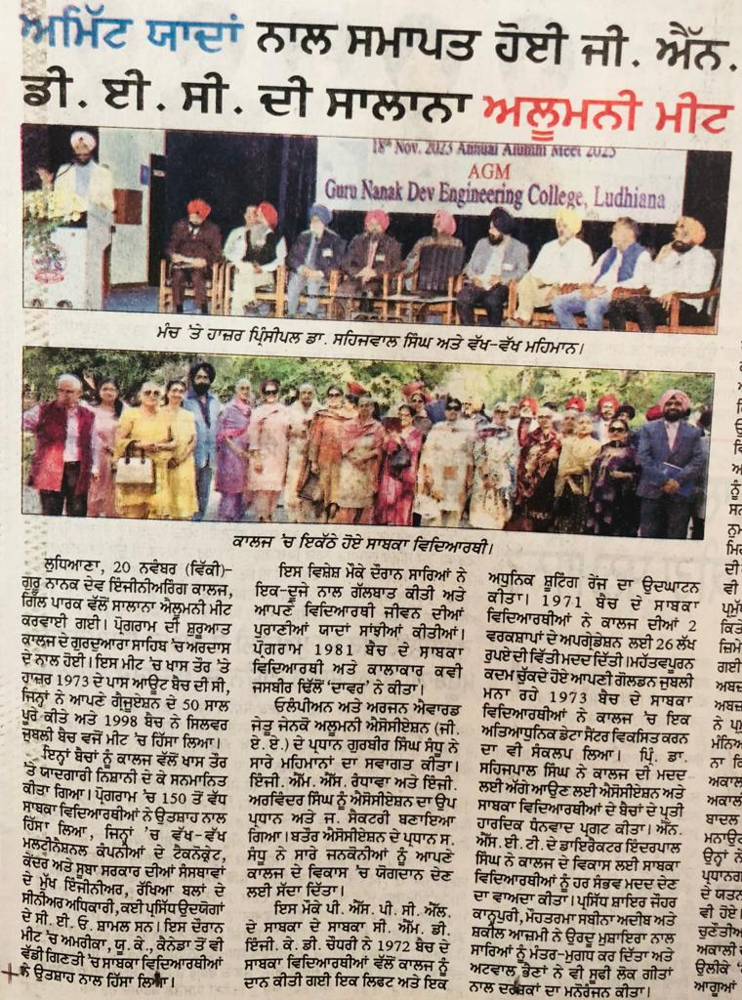

GNDEC's Annual Alumni Meet-2023 concluded  leaving behind memorable moments

Guru Nanak Dev Engineering College, Gill Park, Ludhiana, organized the much awaited Annual Alumni Meet in the college campus.The event started with prayers in the College Gurudwara Sahib. The special appearance in this meet was of 1973 passout batch who completed 50th year of their graduation and that of 1998 batch as silver jubilee batch.The college honored these batches with souvenirs. More than 150 Alumni across all batches came to attend the meet which includes technocrats of various multinational companies, chief engineers of central and state government organizations, senior officers of defense forces, MDs, CEOs of many reputed industries attende the meet. A good number of alumni from  USA, UK, Canada participated enthusiastically. During this special occasion everyone interacted with each other and shared old memories of their student life.The program was organised by 1981 Batch alumnus and talented poet Jasbir Dhillon’Davar’.

Olympian and Arjuna Awardee S.Gurbir Singh Sandhu, President, GENCO Alumni Association (GAA), welcomed all the guests. During AGM new constitution of GAA was approved. Er. M.S. Randhawa and Er. Arvinder Singh were nominated as Vice President and General Secretary of the association. The president called upon the genconians to contribute  towards the development of the almamater. Er. K.D Chaudhary Ex. CMD of PSPCL inagurated a lift and modern shooting range donated to the college by the alumni of 1972 batch. Alumni of 1971 batch  providing financial  support of Rs 26 lakh for the upgradation of two college laboratries which includes non-destructive testing equipment and CNC simulator.

The alumni of various batches promised to provide full support in guiding the students for placement. 1973 batch alumni who celebrated their Golden jubilee graduation promised to develop modern Data Center in the college. Principal of GNDEC Dr. Sehijpal Singh expressed sincere gratitude to GAA and the batches of alumni who came forward to support the college.Mr.Inderpal Singh, Director, NSET, promised the alumni for all cooperation for the development of the college.Highly acclaimed poets-Janab Jauhar Kanpuri, Mohtarma Sabina Adeeb and Janab Shakil Azmi presented Urdu mushaira and upcoming singers Atwal Sisters entertained the audience with Sufi folk songs. At the end of this memorable meet,  everyone bid farewell to each other with a promise to meet again.

# **GNDEC in News**

## GNE'S APEX 2023 Was organised

###### |🕒 Published on October 21,2023

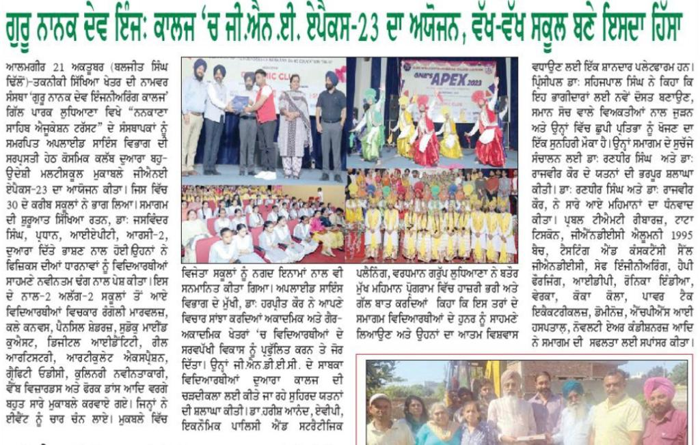

Guru Nanak Dev Engineering College, Ludhiana, organized a thrilling and much-anticipated multischool competition GNE'S APEX 23 which is presented by coasmic club trust under the auspices of the Department of Applied Science on 20th Oct 2023. The event was dedicated to the founders of Nankana Sahib Education Trust.
An enthusiastic participation from approximately 21 schools were noticed.

The gala event commenced with an expert talk by our Shiksha Ratan, Dr Jaswinder Singh, President IAPT RC-2. He practically demonstrated the concepts of physics. The students from different schools took part in a variety of activities including Fork dancing, Rangoli Marvels, Clay convas, Pencil shaders, Sudoku mind quest, Digital identity, Reel artistry, Articulate expressions, Graffiti odyssey, Culinary innovators and web wizards etc. The winners of these competitions were rewarded with cash prizes.

Dr Harpreet Kaur, HOD, of Applied Science, said this event will promote each student’s holistic development in both academic and non-academic spheres. She also appreciated the sincere efforts being put in by GNDEC GENCONIANS. The Chief Guest of the day, Dr. Harish Anand, AVP Economic Policy and Stretegic Planning, Vardhman Group, Ludhiana and the Guest of honours, Mr. Sanjay Verma, Project Manager- Punjab, Prabal TMT Saria 550 SD, Mr. Harpreet Singh Chadha, General Manager- Punjab, Prabal TMT Saria 550 SD, Mr. Gurvinder Singh Bajwa, General Manager, Salsan Steels Pvt. Ltd. graced the occasion with their presence. Dr Anand said it is an incredible platform for students to glimpse the diverse array of opportunities. 

Dr Sehijpal Singh, Principal, GNDEC said it is an opportunity for participants to make new friends, connect with like-minded individuals, and discover their hidden talents. He lauded the efforts of Dr Randhir Singh (Coordinator, causmic club) and Dr Rajvir Kaur (Co-coordinator, causmic club) for the smooth conduct of the event. 

PRABAL TMT REBARS 550, SATH JIVAN BHAR KA was the title sponsor of the event. The event was copowered by TATA TISCON 550 SD, GNDEC ALUMNI 1995 Batch, TESTING AND CONSULTANCY CELL GNDEC LDH, SAFE ENGINEERING, HAPPY FORGINGS LTD., IDP and Other sponsors were Ronica India, VERKA, COCA COLA, Powertek Electricals, DOMINOS, HPS EYE HOSPITAL, NOVELTY AIR CONDITIONERS.

# **GNDEC in News**

## Tricity Genconians meet

###### |🕒 Published on March 22, 2023

TRICITY GENCONIANS MEET

A one of it's kind get-together named Tricity Genconians Meet was organised for Tricity based Alumni of Guru Nanak Dev Engineering College Ludhiana. An impressive gathering of more than 100 Alumni who attended with families had a spectrum of renowned Engineers who served in high positions globally and nationally including defence, merchant navy, entrepreneurs, working abroad and in government top positions. In the special Interactive Session, all participants discussed ways and means to help their Alma mater in various projects of research & development, establishing an up to mark data center and assisting students in placements. Eminent speakers were Prof (Wg Pradeep Prabhakar, Mr SMS Sandhu former Chairman of Punjab Infotech Corporation, Olympian & Arjuna Awardee Gurbir Sandhu President of Genco Alumni Association, PSPCL Chairman S. Baldev Singh Sran and Dr Sehijpal Singh Principal of Guru Nanak Engg College Ludhiana. Alumni who attended the event were also from very old batches of the college with 1957-61 being the oldest among the those present on the occasion. Panchkula Mayor Sh. Kulbhushan Goel who is an Alumni of GNDEC also attended the function. A Phone Directory dedicated to it's longest served Principal Tara Singh was also released carrying the names, batch, branch and contact numbers of all the 266 Alumni who are members of the Tricity Genconians group. Brass name plates and "I am Genconian" stickers were also given to all participants. 
A specially dedicated punjabi song "Assin GNE College de Munde" produced by 1981 Genconian Jasbir Singh Daawar was released on this occasion, which made everyone to come on the floor and dance to the thrilling beats of this song.
Everyone enjoyed with lavish lunch. The event was organised by Chief Engineer Manjit Randhawa, an Executive Member of the Genco Alumni Association. A special group photograph and various entertainment activities marked the occasion.

# **GNDEC in News**

## GNDEC organises workshopon AI and Punjabi Language

###### |🕒 Published on June 25, 2024

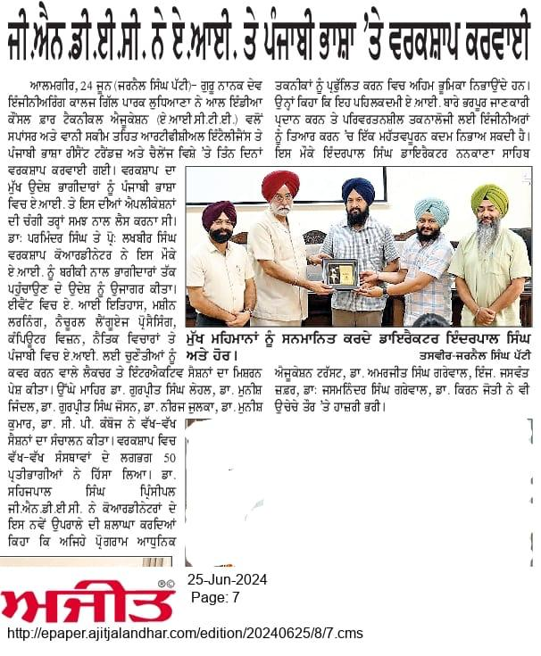

GNDEC conducts Workshop on AI and Punjabi Language 

Guru Nanak Dev Engineering College, Gill Park Ludhiana, recently hosted a three-day workshop titled “Artificial Intelligence and Punjabi Language: Recent Trends and Challenges,” sponsored by the All India Council for Technical Education (AICTE) under the VAANI scheme. The workshop aimed to equip participants with a thorough understanding of AI and its applications in the Punjabi language.

Dr. Parminder Singh and Mr. Lakhbir Singh coordinators  highlighted the workshop's goal of making AI accessible to a broader audience. The event featured a mix of lectures and interactive sessions covering AI history, machine learning, natural language processing, computer vision, ethical considerations, and the challenges of AI in Punjabi.

Prominent experts, including Dr. Gurpreet Singh Lehal, Dr. Munish Jindal, Dr. Gurpreet Singh Josan, Dr. Neeraj Julka, Dr. Munish Kumar, and Dr. C.P. Kamboj conducted various the sessions. Around 50 participants from various institutions attended this workshop.

Principal Dr. Sehijpal Singh while appreciating this new initiatives of coordinators, said that such programs play significant role promoting modern technologies.  The event concluded with the presence of S.Inderpal Singh, director ,NSET,Dr. Amarjit Singh Grewal, Er. Jaswant Zafar, Dr. Jasmaninder Singh Grewal, and Dr. Kiran Joyti. Principal Sehijpal Singh said "This initiative represents a significant step in promoting AI literacy and preparing individuals for transformative technology"

# **GNDEC in News**

## Aspirants in beeline for admissions in engineering at GNDEC

###### |🕒 Published on May 22, 2024

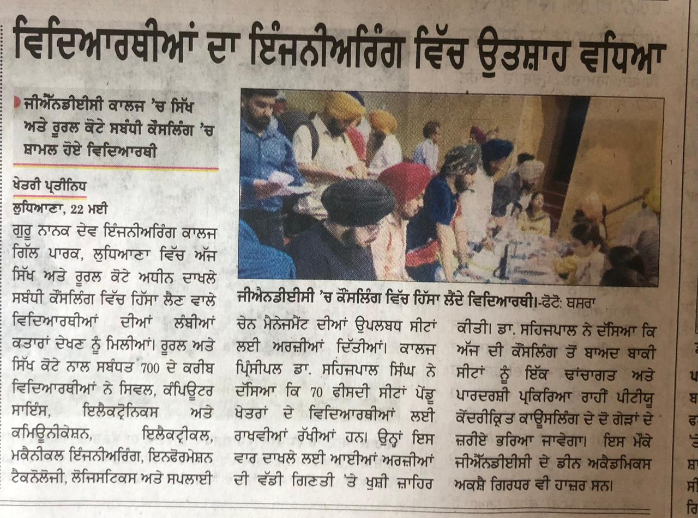

 Aspirants make beeline for Engineering Admission at GNDEC

Guru Nanak Dev Engineering College (GNDEC) has witnessed an overwhelming response from admission seekers for sikh
Minority and Rural quota counselling in various engineering programs. Nearly 700 students, predominantly from rural areas and the Sikh minority community, have applied for the available seats across various engineering streams, including Civil Engineering, Computer Science Engineering, Electronics and Communication Engineering, Mechanical Engineering, Logistics & Supply Chain Mangaemnt and Information Technology.

The college has reserved 70% of its seats for students from rural areas, reflecting its commitment to providing quality education to underprivileged  section of society. Additionally, seats for Sikh minority students are allocated through the SRE (Sikh Religious Examination) exam, ensuring opportunities for students within this demographic to pursue their engineering ambitions.

Dr. Sehijpal Singh, Principal of GNDEC, expressed his delight at the high number of applications, stating, "We are thrilled to see such a positive response from students across the state. This demonstrates the trust and reputation GNDEC has built over the years." He also announced that after this round of admissions, the remaining seats will be filled through a online counsiling of IKG Punjab Techncial University followed by a third round of open counseling to be conducted by GNDEC. These measures are designed to ensure a fair and equitable admission process for all candidates.

Dean Academics, Akshay Girdhar, commented on the application process, "We have seen a diverse range of applicants, from the entire state. Our robust admission process ensures that we attract and select the best talent."

# **GNDEC in News**

## GNDEC launches website for Sikh Religion Examination

###### |🕒 Published on February 7, 2024

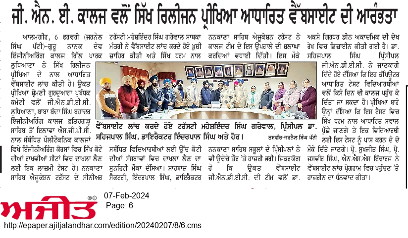

 GNDEC launches Website for Sikh Religion  Examination - 2024

Guru Nanak Dev Engineering College, Gill Park, Ludhiana, has launched a website for the Sikh Religion Examination (SRE-2024). This exam, conducted by the Shiromani Gurdwara Parbandhak Committee (SGPC), is a mandatory test for admission under sikh minority quota at GNDEC, Baba Banda Singh Bahadur Engg. College, Fatehgarh Sahib and SGPC related Polytechnic Colleges in the field of engineering.

While presiding over the website launch program, S. Maheshinder Singh Grewal, former minister, Punjab, and Senior Trustee, Nankana Sahib Education Trust, expressed his happiness and termed it as a golden opportunity for students associated with Sikh religion to take admission in top-ranked institutions. The website was designed by GNDEC team under the guidance of Dr Akshay Girdhar, Dean Academics. S. Shahbaz Singh, Secretary, and S. Inderpal Singh, Director, NSET appreciated the college team.

Dr. Sehijpal Singh, Principal, GNDEC, informed that students can take this computer-based test on any day in the college campus. He added that the test will include multiple-choice questions based on Sikh religion and students can avail two chances to pass this test. The coordinators of SRE- 2024, Prof. Sukhjeet Singh and Prof. Jasvir Singh, NSS Incharge expressed gratitude for everyone's participation in the website launch program.
    

 # **GNDEC in News**

## GNDEC launches admission portal & Help disk for 2024

###### |🕒 Published on February 1, 2024

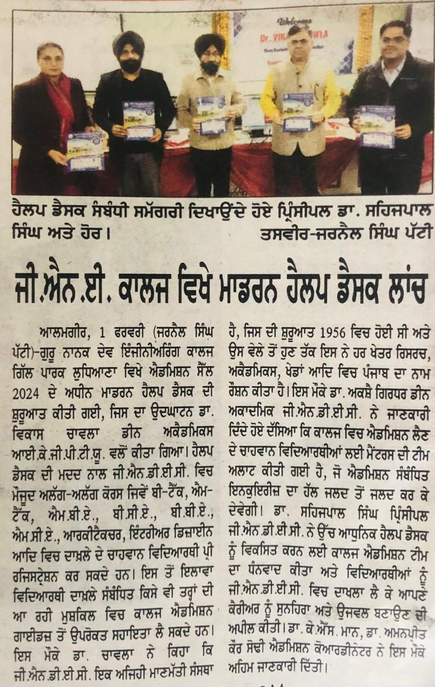

 GNDEC Launches admission portal and  Help Desk for 2024

In a significant move towards enhancing the admissions process, Guru Nanak Dev Engineering College (GNDEC) Gill park,Ludhiana ,has inaugurated its Modern Help Desk and online portal for the 2024 admissions. Dr. Vikas Chawla, Dean Academics at IK Gujral Punjab Technical University, graced the inauguration ceremony, marking the commencement of this advanced facility.

Prospective students are encouraged to explore the user-friendly help desk, easily accessible through the college website. This platform facilitates pre-admission registrations for a diverse range of courses including B.Tech, M.Tech, MBA, BCA, BBA, MCA, Architecture, and Interior Design. Moreover, the help desk offers personalized assistance to students navigating the admission process. Dean Academic Dr Akshay Girdhar while explaining about the portal told that special mentors will  be allocated to admission aspirants as a single point of contact. This will support the aspirants in big way.

Highlighting the esteemed history of GNDEC, Dr. Chawla underscored the institution's noteworthy contributions across various fields since its establishment in 1956. He emphasized GNDEC's standing as a prestigious educational hub.

Dr. Sehijpal Singh, the college principal, expressed gratitude towards the admission team for the development of this high-tech help desk. He urged aspiring students to consider GNDEC as the launchpad for a promising and successful career.

Adding to the announcement, Dr. K.S. Mann and Dr. Amanpreet Kaur Sodhi, Admission Coordinators, revealed essential information during the event. Notably, GNDEC is offering 50% Sikh quota and 70% rural quota seats, opening doors for students from rural areas to be part of this esteemed institution.

The launch of the Modern Help Desk signifies GNDEC's commitment to provide a seamless and accessible admissions experience, fostering educational opportunities for a diverse range of students. Aspiring individuals are encouraged to leverage this resource for a smooth and informed admission journey.
    

  # **GNDEC in News**

## GNDEC bags overall youthfest trophy

###### |🕒 Published on November 6, 2024

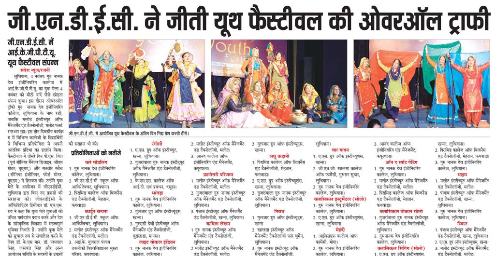

ਜੀਐਨਡੀਈਸੀ, ਲੁਧਿਆਣਾ, ਵਿਖੇ ਯੂਥ ਫੈਸਟੀਬਲ ਦੇ ਦੂਜੇ ਦਿਨ ਵੀ ਵਿਦਿਆਰਥੀਆਂ ਨੇ ਮਾਰੀਆਂ ਮੱਲਾਂ

ਗੁਰੂ ਨਾਨਕ ਦੇਵ ਇੰਜਨੀਅਰਿੰਗ ਕਾਲਜ ,ਗਿੱਲ ਪਾਰਕ,ਲੁਧਿਆਣਾ, ਵਿਖੇ ਚੱਲ ਰਹੇ ਆਈਕੇਜੀਪੀਟੀਯੂ ਯੁਵਕ ਮੇਲੇ ਦੇ ਦੂਜੇ ਦਿਨ ਕਵਿਤਾ ਉਚਾਰਨ, ਭਾਸ਼ਣ, ਡਿਬੇਟ, ਪੋਸਟਰ ਮੇਕਿੰਗ, ਆਨ ਸਪਾਟ ਪੇਂਟਿੰਗ, ਮਹਿੰਦੀ, ਕੋਲਾਜ ਮੇਕਿੰਗ, ਸਕਿੱਟ,ਮਾਈਮ, ਕਲਾਸੀਕਲ ਵੋਕਲ ਸੋਲੋ, ਕਲਾਸੀਕਲ ਇੰਸਟਰੂਮੈਂਟਲ ਸੋਲੋ ਅਤੇ ਵਾਰ ਗਾਇਨ ਦੇ ਮੁਕਾਬਲੇ ਕਰਵਾਏ ਗਏ। ਇਹਨਾ ਤੋਂ ਅਲਾਵਾ ਆਪਣੀ ਰਚਨਾਤਮਿਕਤਾ ਅਤੇ ਨਵੀਨਤਾ ਵਰਗੇ ਗੁਣਾ ਨੂੰ ਸਭ ਦੇ ਅੱਗੇ ਪ੍ਰਦਰਸ਼ਿਤ ਕਰਦੇ ਹੋਏ ਵਿਦਿਆਰਥੀਆਂ ਨੇ ਡਿਬੇਟ, ਇਲੋਕਿਊਸ਼ਨ, ਸਟੋਰੀ, ਕਵਿਤਾ ਅਤੇ ਲੇਖ ਲਿਖਣ ਵਰਗੇ ਮੁਕਾਬਲਿਆਂ ਵਿੱਚ ਭਾਗ ਲਿਆ।

ਸ਼੍ਰੀ.ਸਮੀਰ ਸ਼ਰਮਾ, ਅਸਿਸਟੈਂਟ ਡਾਇਰੈਕਟਰ, ਯੂਥ ਅਫੇਅਰਜ਼,ਆਈਕੇਜੀਪੀਟੀਯੂ,ਨੇ ਵੀ ਉਚੇਚੇ ਤੌਰ ਉੱਤੇ ਪ੍ਰੋਗਰਾਮ ਵਿੱਚ ਸ਼ਿਰਕਤ ਕੀਤੀ।ਉਨ੍ਹਾਂ ਨੇ ਰਾਸ਼ਟਰ ਨਿਰਮਾਣ ਵਿੱਚ ਨੌਜਵਾਨਾਂ ਦੀ ਅਹਿਮ ਮਹੱਤਤਾ ਬਾਰੇ ਆਪਣੇ ਵਿਚਾਰ ਸਾਂਝਾ ਕੀਤੇ। ਡਾ.ਐਮ.ਐੱਸ.ਤੂਰ, ਸਾਬਕਾ ਪ੍ਰੋਫੈਸਰ,ਪੀਏਯੂ, ਨੇ ਬਤੌਰ ਆਬਜ਼ਰਵਰ ਆਈਕੇਜੀਪੀਟੀਯੂ ਪ੍ਰੋਗਰਾਮ ਨੂੰ ਸਹੀ ਮਾਪਦੰਡਾਂ ਦੇ ਜ਼ਰੀਏ ਕਰਵਾਉਣ ਵਿਚ ਅਹਿਮ ਭੂਮਿਕਾ ਨਿਭਾਈ।ਦੂਸਰੇ ਦਿਨ ਦੇ ਅੰਤ ਵਿਚ ਕੋਕ ਸਟੂਡੀਓ ਵੱਲੋਂ ਦਿੱਤੀ ਗਈ ਲਾਈਵ ਪਰਫਾਰਮੈਂਸ ਨੇ ਸਭ ਦਾ ਮਨ ਮੋਹ ਲਿਆ।

ਡਾ.ਸਹਿਜਪਾਲ ਸਿੰਘ, ਪ੍ਰਿੰਸੀਪਲ , ਜੀਐਨਡੀਈਸੀ, ਡਾ.ਕੇ.ਐੱਸ.ਮਾਨ, ਡਾ. ਪਰਮਪਾਲ ਸਿੰਘ, ਪ੍ਰੋ.ਜਸਵੰਤ ਸਿੰਘ ਟੌਰ, ਨੇ ਪ੍ਰੋਗਰਾਮ ਦੇ ਦੂਜੇ ਦਿਨ ਪਹੁੰਚੇ ਮੁੱਖ ਮਹਿਮਾਨਾਂ ਅਤੇ ਬਤੌਰ ਭਾਗੀਦਾਰ ਬਣ ਪਹੁੰਚੇ ਕਾਲਜਾਂ ਦਾ ਧੰਨਵਾਦ ਕੀਤਾ।
 

 
 # **GNDEC in News**

## GNDEC organises hackathon 2023

###### |🕒 Published on October 28, 2023

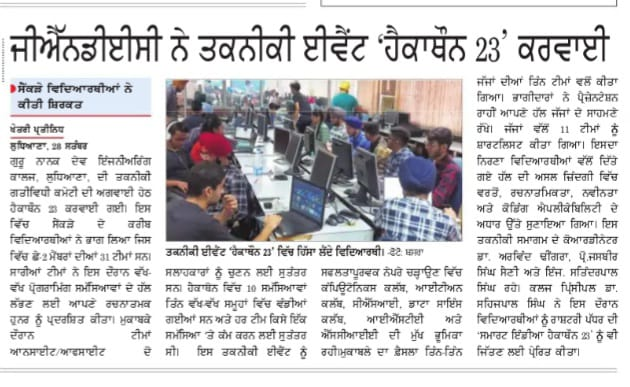

GNDEC organised hackathon 2023 

Hackathon-2023 organised under the aegis of the technical activity committee of Guru Nanak Dev Engineering College, Ludhiana. Hundreds of students (31 teams) participated and put their creative and programming  skills to find solutions of various problems. The teams were free to pick upto onsite/offsite two mentors.

10 problem statements divided in three different groups were given and teams were free to work on any one problem. The solution for the problem statement needs to be implemented on the college server. 

The various clubs involved in this technical event were computonics club, ITIan club,  CSI, data science club, ISTE and SCIE.  The judgement was done by three teams comprising of three judges each. The judges selected 11 teams after rigorous evaluation.The evaluation was based on criteria’s like application in the real life situation, creativity, innovativeness , coding applicability.Participants showed their solutions through presentations. 

The coordinators of the event were Dr. Arvind Dhingra, Prof.Jasbir Singh Saini and  Er. Satinderpal Singh. Dr. Sehijpal Singh, Principal, GNDEC motivated the students to win the National level " Smart India Hackathon 23".
            

 # **GNDEC in News**

## ISRO scientists interact with GNDEC

###### |🕒 Published on October 13, 2023

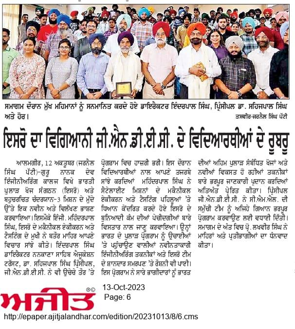

  ISRO scientist interacts with GNDEC students 

Guru Nanak Dev Engineering College (GNDEC) organized a captivating Expert Talk on the Indian Space Research Organisation (ISRO) and the highly-anticipated CHANDRAYAAN-3 mission. The event featured Dr Mahinderpal Singh, the esteemed Head of Mechanical Integration and Testing at ISRO. This enlightening session was graced by the presence of Mr. S. Inderpal Singh, Director of Nankana Sahib Education Trust, and Dr.Sehijpal Singh, Principal of GNDEC Ludhiana. 

The talk was regarding India's space endeavours and the upcoming CHANDRAYAAN-3 mission. Dr Mahinderpal Singh delved into the intricacies of ISRO's groundbreaking work, focusing on the mechanical integration and testing aspects of satellite missions. His talk shed light on the innovative engineering techniques, challenges faced, and the tremendous dedication of the ISRO team that has propelled India's space program to great heights.

The Expert Talk left the audience not only informed but also inspired to explore and contribute to India's space endeavours. Principal, GNDEC congratulated the CML team for such an awesome event. At the end of the event, Prof.Lakhveer Singh Khana proposed a vote of thanks to experts and participants.

**PRO: Dr. Satjot Singh Dhillon**    

**APRO: Dr. Preeti Pannu**

**Student's Executive Members: Harmanpreet Kaur(URN:2104509, IT Branch)  
Chahat Jarewal(URN:2104487, IT Branch)**

