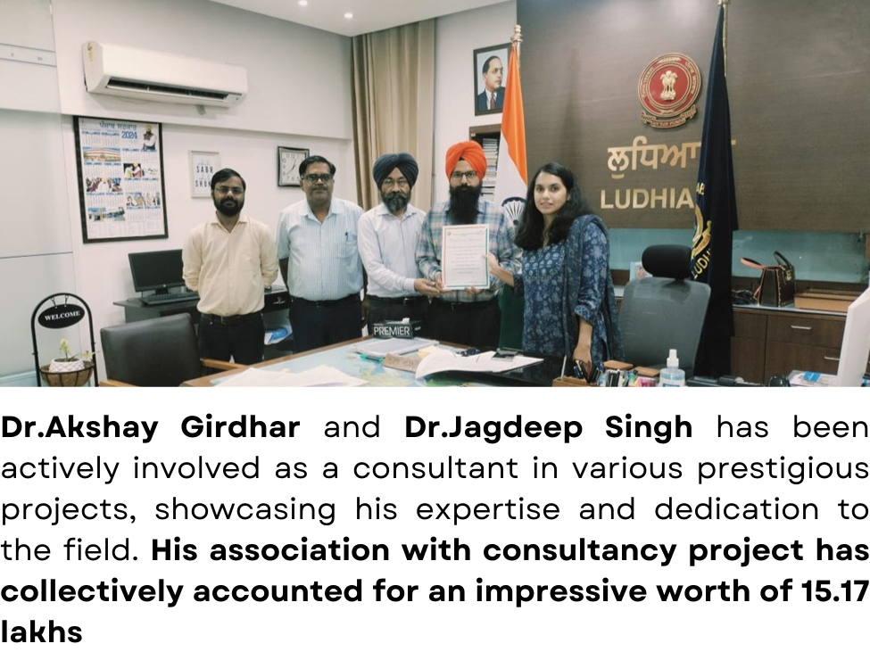
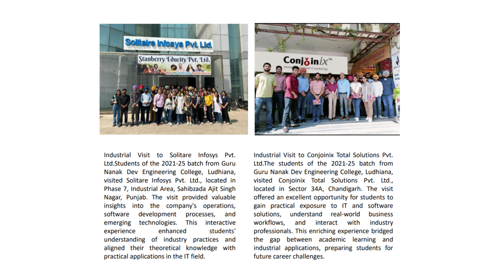
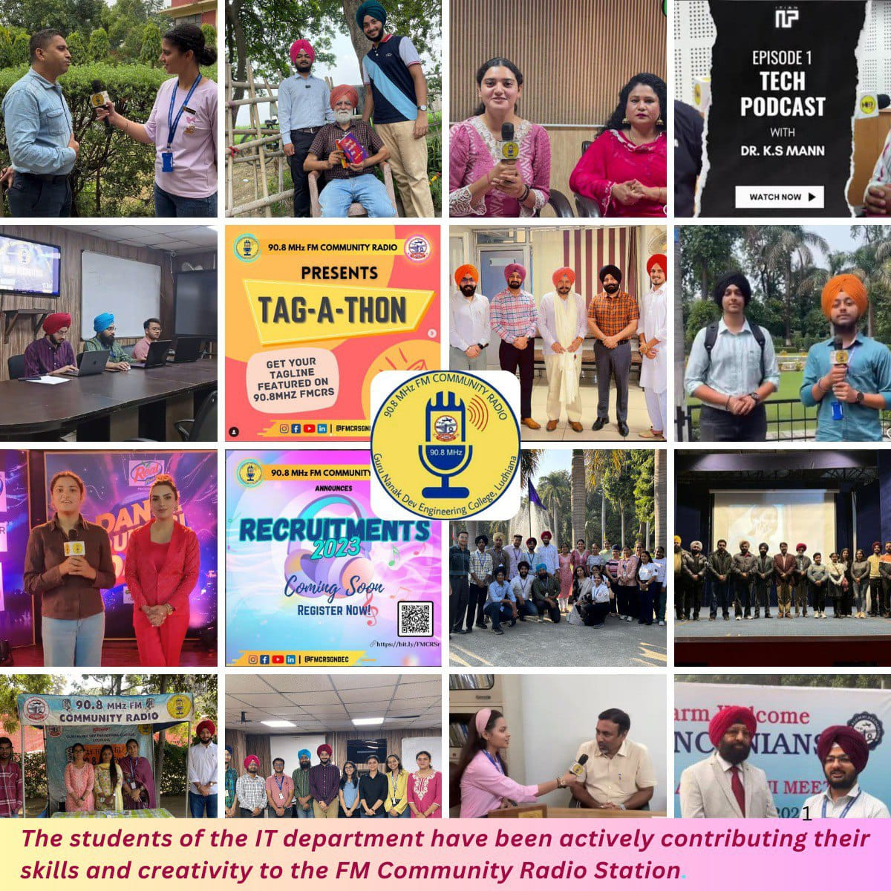
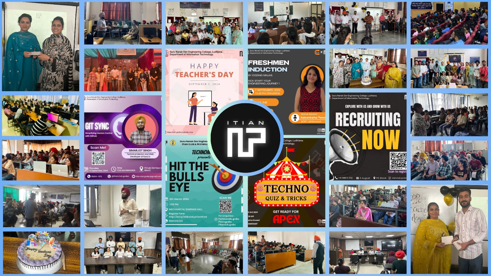
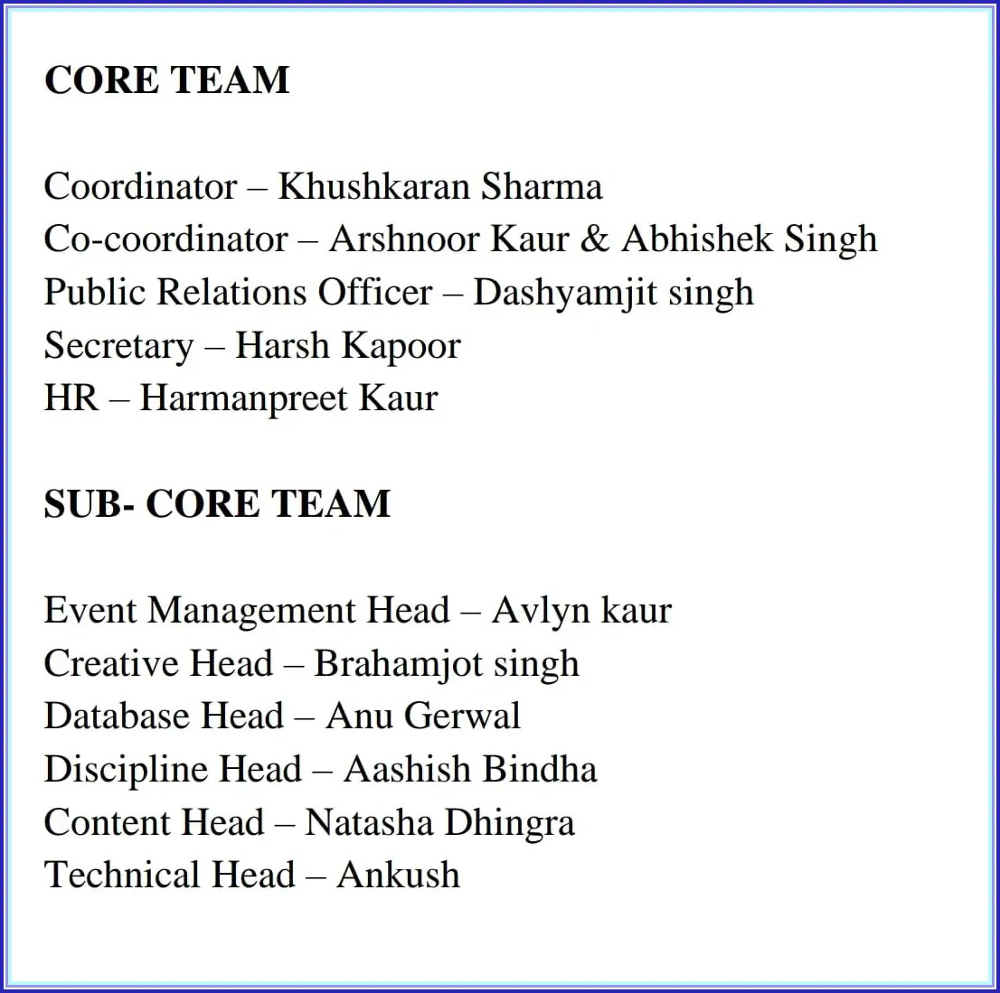
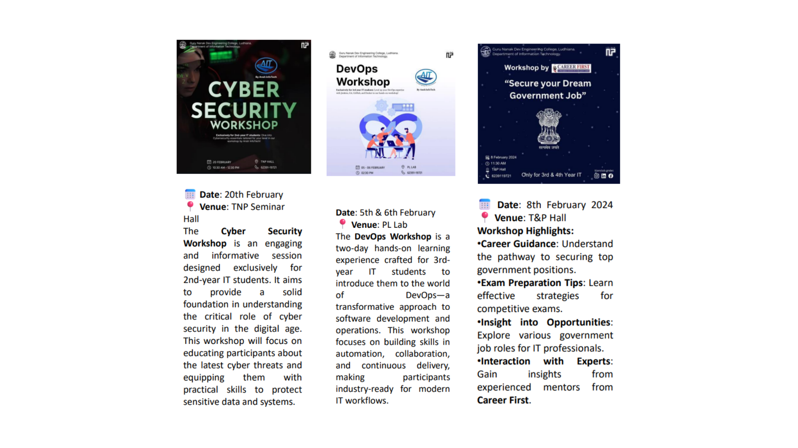
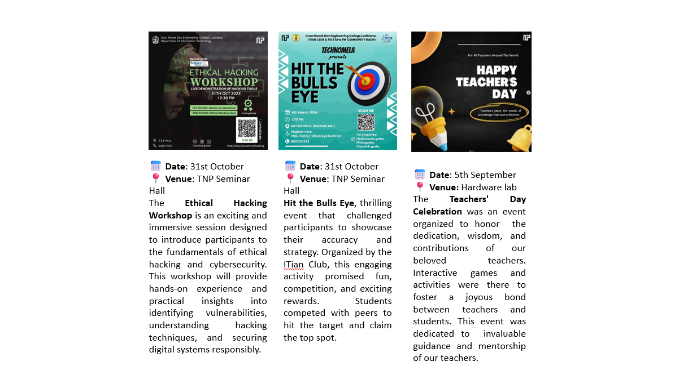

# Department of Information Technology

## Message from HoD's Desk

The Information Technology Department is dedicated to empowering students from diverse backgrounds, bridging the gap between urban and rural education through inclusive and innovative learning opportunities. The department’s approach to education extends beyond the classroom. It cultivates a culture of creativity, critical thinking, and problem-solving, encouraging students to think innovatively and independently. The department also emphasizes personal and professional development, offering a plethora of enriching activities such as technical workshops, hackathons, leadership initiatives, and career development programs. Alongside technical proficiency, the faculty prioritizes essential soft skills, teamwork, and ethical principles to nurture socially responsible and well-rounded individuals.The Information Technology Department stands as a beacon of excellence, committed to producing future-ready professionals equipped to meet global challenges, contribute meaningfully to society, and emerge as leaders in the field of technology and beyond.

## Department at Glimpse

  IT department is NBA Accrediated since 2008. This year again **IT department got the NBA Accrediation till June, 2025**.

  

## Faculty Achievements  

- Dr. Pankaj Bhambri, Assistant Professor(IT),received the “ISTE Section Best Teacher Award 2023” in the ISTE Section Faculty Convention hosted by Bhai Gurdas Institute of Engineering and Technology, Sangrur on 23rd November 2023.

- Dr. Amit Kamra,Received the certificate of appreciation from AICTE on 17th July 2023 for translating the lectures of SWAYAM course Foundations of Wavelets and Multirate Digital Signal Processing in Punjabi language.
  
-   Dr. Amit Kamra,Received the certificate of appreciation from AICTE on 29th November 2023 for validation of lectures of the SWAYAM course Programming in Java in Punjabi language

 
 
## Expert Talk 

 | Sr. No. | Name of Faculty  | Title of the Talk          | Event Name |Date    | Organised by   |
|:--------|:-------------------------------------------------------------------------------------------------------------------------------|:-------------------------------------------------------------------------------------------------------------|:---------|:---------------------------------|:----------------------------------------------------------------------------------------|
| 1 | Dr.Sandeep Singla | Expert Talk |  ATAL Academy Faculty Development Program    | 03 January 2024  |GNDEC, Ludhaina| 
| 2 | Dr.Jagdeep singh | Keynote Session   | Five Days Faculty Development Program on "Recent Advances in Computer Science and Allied Domains"     | 22 September 2023  |Sharda University, Noida| 
| 1 | Dr.Jagdeep singh |Moodle Workshop   |Moodle Workshop   | 21 September 2023  |DAV Public School, Ludhiana| 

## Publications  

- **Rupinder.Kaur**, “Exploring the Intricacies of Machine Learning-Based Optimization of Electric Discharge Machining on Squeeze Cast TiB2/AA6061 Composites: Insights from Morphological, and Microstructural aspects in the Surface Structure Analysis of Recast Layer Formation and Worn-Out Analysis”, Journal of Materials Research and Technology, Sept, 2023

- **Amit. Kamra**, “Enhancing diagnosis of breast cancer through mammographic image segmentation using Fuzzy C-Means”, INTERNATIONAL JOURNAL OF SUSTAINABLE Building Technology and Urban Development, December, 2023.

- **Gagneet.Kaur**, “Emergence of Techno-Enterpreneurship during Covid-19”, PIMT Journal of Research, December, 2023.

- **Rupinder.Kaur**, “Exploring the role of computer vision in product design and development: a comprehensive review”, International Journal on Interactive Design and Manufacturing (IJIDeM), February, 2024.

- **Sachin Bagga**, “PortBlocker: Detection and Mitigation of Hardware Trojan through Re-routing and Bypassing”, 023 IEEE 16th International Symposium on Embedded Multicore/Many-core Systems-on-Chip (MCSoC),23rd December, 2023,SUTD, Singapore,IEEE.
- **K.S. Mann**,"E-Business Innovation Trends and Implications for Private Sector",International Conference on Advancements in Engineering and Technology,23-24 November 2023,Bhai Gurdas Institute of Engienering and Technology, Sangrur, Punjab,IEEE.
- **Amit Kamra**,"A Review on CLAHE Based Enhancement Techniques",International Conference on Contemporary Computing and Informatics,14-16 September 2023,Gautam Budhha Nagar, Uttar Pradesh,IEEE.
- **Sandeep Singla and Rupinder Kaur**,"Forecasting Air Quality of Ludhiana: A Machine Learning Exploration with Dataset Insights",International Conference on Advancements in Engineering and Technology,23-24 November 2023,Bhai Gurdas Institute of Engienering and Technology, Sangrur, Punjab,IEEE.
- **Rupinder Kaur**," Bridging the crop knowledge gap: Machine Learning in Agriculture",International Conference on Advancements in Engineering and Technology,23-24 November 2023,Bhai Gurdas Institute of Engienering and Technology, Sangrur, Punjab,IEEE.
- **Pankaj Bhambri**,"Exploring the Application Domains of ML-based Facial Emotion Recognition Systems: Framework, Techniques and Challenges"Second International Conference on Computing and Communication Networks,25 March 2024,Manchester, United Kingdom,AIP Conference Proceedings.
- **Pankaj Bhambri**,"Plants Recognition using Leaf Image Pattern Analysis with Focus on Advanced Smart Computing Technologies",International Conference on Applied Data Science and Smart Systems,5 December 2023,Chitkara University, Punjab,AIP Conference Proceedings.

## Events Attended (FDPs/Conferences/STCs/SDTs/Workshops/Webinars etc.)  

| Sr. No. | Name of Faculty  | Name of Event          | Duration |Date(s)     | Organizing Institute    |
|:--------|:-------------------------------------------------------------------------------------------------------------------------------|:-------------------------------------------------------------------------------------------------------------|:---------|:---------------------------------|:----------------------------------------------------------------------------------------|
| 1 | Rupinder Kaur| Machine Learning and Its Applications in IoT, Computer Vision and Cloud Computing    | One week   | 10 July to 14 July 2023 |National Institute of Technology, Jamshedpur|
| 2 | Rupinder Kaur | Blockchain revolutionaizing Artificial Intelliegence     | One week   | 21 August to 25 August 2023|Chandigarh University, SAS Nagar|
| 3 | Mohanjit Kaur | Blockchain revolutionaizing Artificial Intelliegence     | One week   | 21 August to 25 August 2023|Chandigarh University, SAS Nagar|
| 4 | Gitanjali | Blockchain revolutionaizing Artificial Intelliegence     | One week   | 21 August to 25 August 2023|Chandigarh University, SAS Nagar|
| 5 |Harjot Kaur |Outcome based Education    | 3 Days   | 24 August to 26 August 2023|Meerut Institute of Technology, Meerut|
| 6 | Jaskiran Kaur| Blockchain revolutionaizing Artificial Intelliegence     | One week   | 21 August to 25 August 2023|Chandigarh University, SAS Nagar|
| 7|Jaskiran Kaur |Outcome based Education    | 3 Days   | 24 August to 26 August 2023|Meerut Institute of Technology, Meerut|
| 8|Sachin Bagga |Cyber Security & SIEM    | 12 days   | 24 July to 04 August 2023|IBM|
| 9|Gagneet Kaur |AI Tools and Prompt Engineering   | One week   | 27 November to 02 December 2023|IBM|
| 10|Gitanjali |Applied Cloud Computing for Full Stack Web Development  | One week   | 04 December to 08 December 2023|TechSaksham|
| 11|Kamaljit Kaur |Quantum Computing  | One week   | 18 December to 23 December 2023|Guru Nanak Dev Engineering College, Ludhiana|
| 12|Rupinder Kaur |Research Papers and Project Writing  | One week   | 01 January to 07 January 2024|CT University, Ludhiana|
| 13|Jaskiran Kaur |Research Papers and Project Writing  | One week   | 01 January to 07 January 2024|CT University, Ludhiana|
| 14|Sandeep Kumar Singla|NBA Accreditation and Teaching Learning in Engineering  | One week   | 01 January to 06 January 2024|Guru Nanak Dev Engineering College, Ludhiana|
| 15|Amit Kamra|NBA Accreditation and Teaching Learning in Engineering  | One week   | 01 January to 06 January 2024|Guru Nanak Dev Engineering College, Ludhiana|
| 16|Pankaj Bhambri|NBA Accreditation and Teaching Learning in Engineering  | One week   | 01 January to 06 January 2024|Guru Nanak Dev Engineering College, Ludhiana|
| 17|Gagneet Kaur|Research Papers and Project Writing  | One week   | 01 January to 07 January 2024|CT University, Ludhiana|
| 18|Gagneet Kaur|Research Papers and Project Writing  | One week   | 01 January to 07 January 2024|CT University, Ludhiana|
| 19|Ranjodh Kaur|Building Advanced Data Analytics Applications with Cloud  | One week   | 08 January to 12 January 2024|NextGen Employability Program|
| 20|Himani Sharma|Building Advanced Data Analytics Applications with Cloud  | One week   |08 January to 12 January 2024|NextGen Employability Program|
| 21|Gitanjali|Recent Trends in Teaching and Learning Pedagogy (Multidisciplinary)  | One week   |  16 January to 20 January 2024|Yashoda Technical Campus, Satara|
| 22|Jaskiran Kaur|Recent Trends in Teaching and Learning Pedagogy (Multidisciplinary)  | One week   |  16 January to 20 January 2024|Yashoda Technical Campus, Satara|
| 23|Rupinder Kaur|Recent Trends in Teaching and Learning Pedagogy (Multidisciplinary)  | One week   |  16 January to 20 January 2024|Yashoda Technical Campus, Satara|
| 24|Sachin Bagga|Micropython Primer | One week   | 22 May to 26 May 2024|NIELIT, Calicut|
| 25|Himani Sharma|Machine Learning and NLP using Python | One week   |  24 June to 28 June 2024|Infosys Springboard|
| 26|Reema Verma|Machine Learning and NLP using Python | One week   |  24 June to 28 June 2024|Infosys Springboard|

## Industry Institute Interaction

## Student's Corner 

### Sports & Extracuricular Achievements

## ITIAN Club

The ITIAN Club is a technology based club created in 2021. The club is open to all students who are interested in technology and its application in the real world. The club provides a platform for students to learn about various aspects of technology and its application. The club also organizes various events and workshops related to technology.

  

**TEAM MEMBERS**

 

 
 

 

## Placements
 **Batch : 2020-2024**
 
| Sr. No. | Candidate Name | Comapny Name          | Package (LPA) | 
|:--------|:-------------------------------------------------------------------------------------------------------------------------------|:-------------------------------------------------------------------------------------------------------------|:---------|
| 1|Chandan Kumar| Argusoft|  7.12|
| 2|Himanshu Mahajan| Stylumia Intelligence Technology Pvt. Ltd.|  7|
| 3|Lovish Malhotra| JMAN Group|  5|
| 4|Ananya Mahajan| KPMG|  5|
| 6|Harleen Kaur| SafeAeon Inc.|  4.12|
| 7|Gaganpreet Singh| SafeAeon Inc.|  4.12|
| 8|Ravleen Kaur| Airnet Travels and Cargo Pvt. Ltd.|  3.6|
| 9|Shubham Choudhary| Airnet Travels and Cargo Pvt. Ltd.| 3.6|
| 10|Divyansh Bhateja| WITS INNOVATION LAB|  3.5|
| 11|Prabhkirat Singh| WITS INNOVATION LAB| 3.5|
| 12|Prabhjot Singh|MWIDM| 3.5|
| 13|Preet Singh Sahota|MWIDM| 3.5|
| 14|Amandeep Singh|MWIDM| 3.5|
| 15|Neeraj Kumar|MWIDM| 3.5|
| 16|Kumar Abhinav|Iotasol Technologies Pvt. Ltd.| 2.7|
| 17|Hemant Sahdev|Airnet Travels and Cargo Pvt. Ltd.| 2.7|
| 18|Sejal Madaan|PIRAMAL GROUP| 2.5|
| 19|Harmanpreet Kaur|Ralson (India) Limited| 2.4|
| 20|Aman Kumar|Deepak Fasteners| 2.16|

 **Batch : 2019-2023**
 | Sr. No. | Candidate Name | Comapny Name          | Package (LPA) | 
|:--------|:-------------------------------------------------------------------------------------------------------------------------------|:-------------------------------------------------------------------------------------------------------------|:---------|
| 1|Shivay Bhandari| Zomato Limited|  20|
| 2|Abhay Tiwari| TCS Digital|  7.6|
| 3|Balram Yadav| XenonStack|  7.5|
| 4|Shubham Chaudhary| XenonStack|  7.5|
| 6|Divya Juhi| Argusoft India Ltd.|  7.12|
| 7|Lokesh Dhingra| Argusoft India Ltd.|  7.12|
| 8|Tanuj Sharma| Stylumia Intelligence Technology Pvt. Ltd.|  7|
| 9|Prabhjot Kaur| Hackwith Infy (INFOSYS) (DSE)| 6.25|
| 10|Sakshi Bhumbla|Brillio|  6|
| 11|Ankush Bansal| Incture Technologies| 6|
| 12|Deepak Kumar|Yatra| 6|
| 13|Ashutosh Sharma|CHICMIC| 5.75|
| 14|Abhay Tiwari|Bizmerlin HR| 5.28|
| 15|Aastha|Alert Enterprises| 5|
| 16|Manpreet Kaur|ShortHill Tech| 4.8|
| 17|Jasnoor Kaur Jassal|Venture Pact| 4.5|
| 18|Aman Kumar Gandhi|TCS Ninja| 4|
| 19|Muskan Sharma|MWIDM| 3.5|
| 20|Raju Kumar Prasad|Tech Mahindra| 2.65|

**Placement Summary**
 | Item | 2020-2024 | 2019-2023  | 
|:--------|:-------------------------------------------------------------------------------------------------------------------------------|:-------------------------------------------------------------------------------------------------------------|
| Total Number of Final year students|131|135|
| No. of students placed in Companies or Government sector|65|65|
| No. of students admitted to higher studies with valid Qualifying scores|11|2|
| No. of students turned entrepreneur in Engineering/ Technology|0|3|

 

