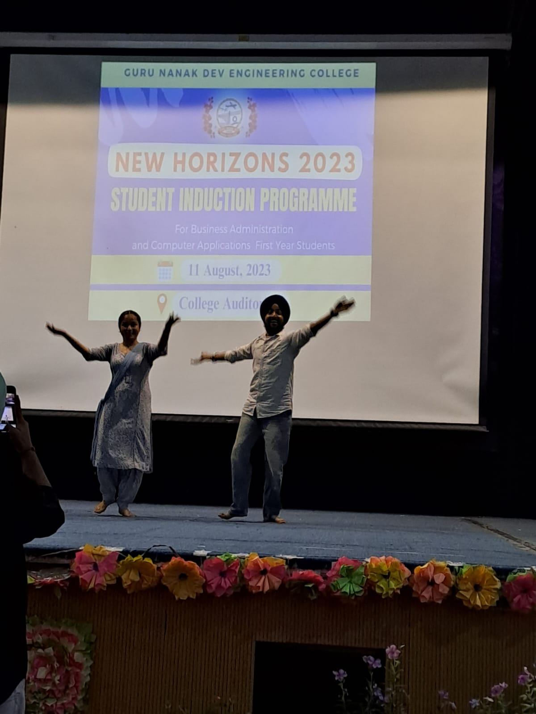
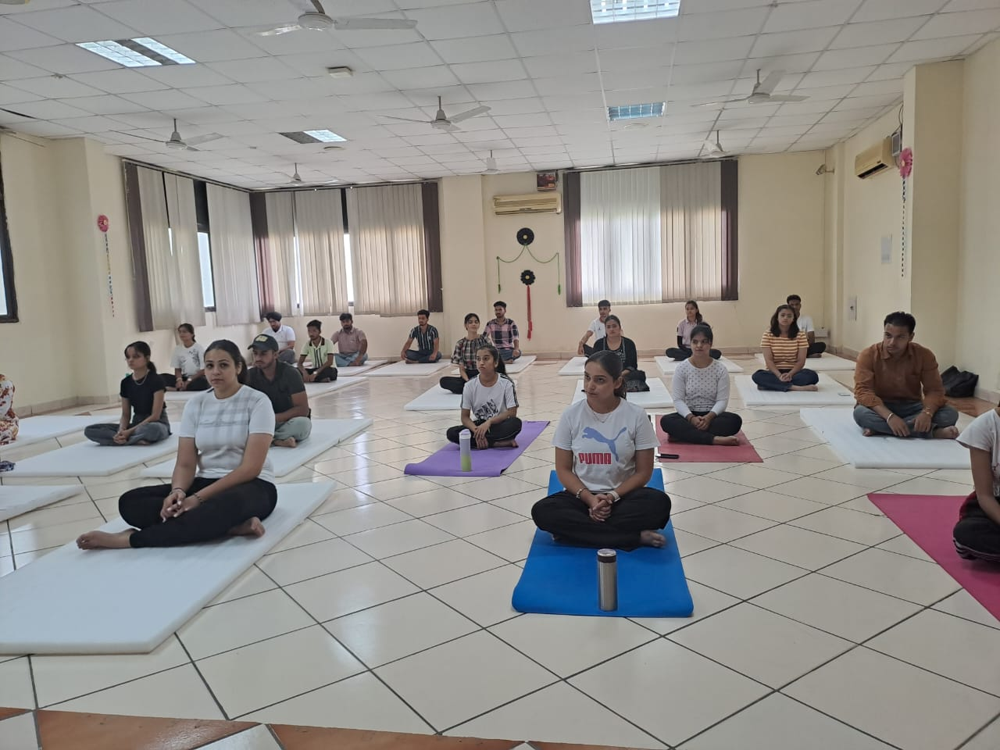
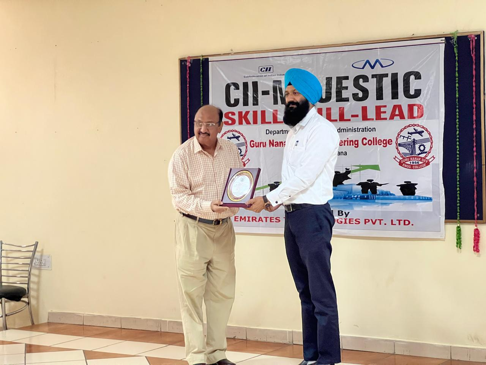
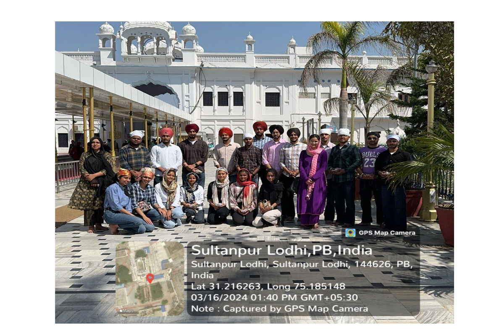
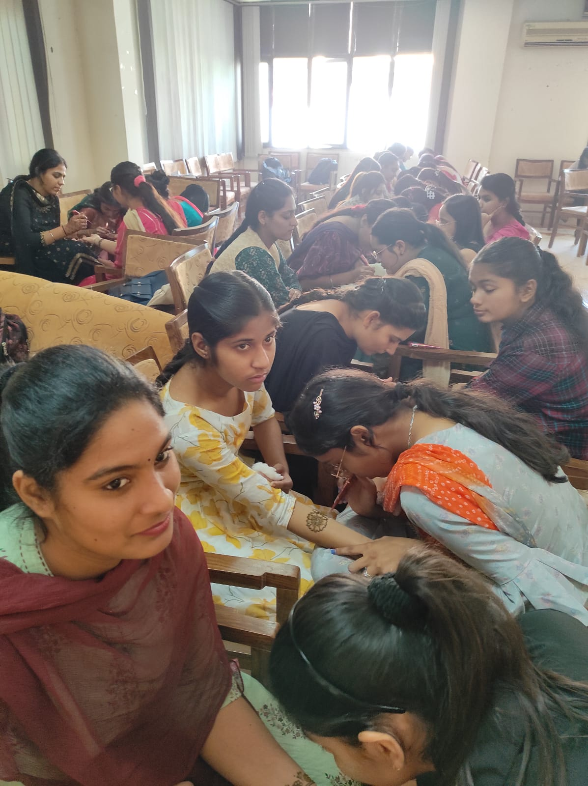
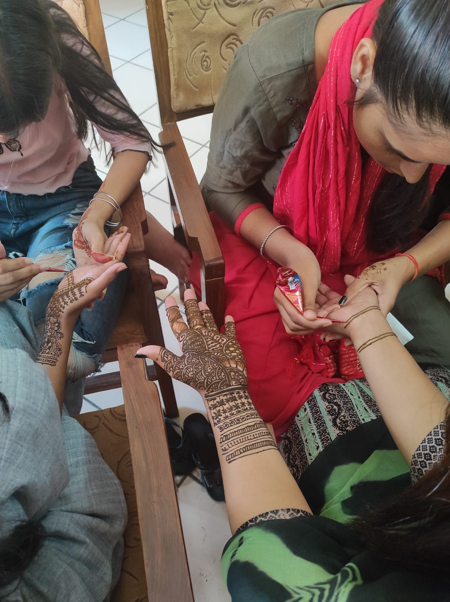

# Department of Business Administration

## Message from HoD's Desk

The Department of Business Administration was established in the year 2007 to impart world class education in the field of Management at the Post-Graduate level. The Department is currently running a two year full time MBA programme, three year under graduate BBA & B.Com (Entrepreneurship) programmes affiliated to (IKGPTU), Jalandhar and duly approved by AICTE. These programmes provide a foundation in general management functions and a range of specialist options to cater to the ever-increasing demand of managerial talent in the industry. The Programmes aims to generate groomed, technically competent and skilled intellectual professionals to meet the current challenges of the modern Business world. The Department of Business Administration has highly experienced, hard working and competent faculty to impart quality education to the budding managers. Besides the core faculty of the department, faculty from the other departments are engaged to teach specialized subjects like Information Technology for Management, Applied Operations Research and Research Methodology etc. Faculty of the department are actively involved in the research work and are engaged in guiding the Ph.D. students of the Punjab Technical University, Kapurthala-Jalandhar. The department has requisite and state of the art infrastructure like Wi-Fi facilities, rich library, e-resources (EBSCO, J-gate and e-books), class rooms with latest audio visual aids, seminar room, Latest computers installed with and well stocked departmental library. Being the department of autonomous institution, the department revises curriculum to cater to the changing business environment and expectations of the industry. The alumni of the department are serving in eminent companies like Trident, Honda, Volkswagen, Kracher, Sonalika Tractors, Flipkart, Indiamart, ICICI bank, HDFC Life Insurance, Muthoot Finance, HDFC Bank, AXIS Bank, Life Style, Coca-Cola, Think gas, and Nahar Spinning etc.  

## Publications  

- [**Dr.Parampal Singh**] (March 2023) Published paper in SEMCOM Management and Technology review, titled, “Impact of perception of broadband users upon their satisfaction from fixed line telephone service segment”. March 2023, Volume 2, Issue 10, ISSN-2321-5968.
- [**Dr.Parampal Singh**] (June 2023) Published paper in GNA journal of Management and Technology, titled, “Perception, Motivation and Buying Behaviour of Shoppers for Organised Retail Stores”. June 2023, Vol. XIV No. I, ISSN-0974-5726.
- [**Dr.Parampal Singh**] (November 2023) Published a paper in IUP Journal of Marketing Management, titled, ”Consumer Insights on Fixedline Broadband Internet Services Adoption In North India”. Page 152-172.
- [**Dr.Parampal Singh**] (November 2023) Published a paper in TIJER, titled, “Analysis of Effect of Elon Musk’s twitter acquisition of Revenue and Market Capitalisation”, Page Number 80-83, ISSN 2349-9249.
- [**Dr. Mandeep Kaur Khosa**](June 2023) Published paper in IJNRD “Financial Literacy: A Case Study of Rural Area of Punjab”

# Professional Activities

|Activities:  | Place  :                                                                                           | Dates:                  |
|:------- |:------------------------------------------------------------------------------------------------------ |:------------------------------------ |
| Induction Program of BBA & MBA | Seminar Hall, MBA Block, GNDEC, Ludhiana | 11th August, 2023 |
| Expert Talk Workshop by Mr. Kanwaljeet Singh 	| Seminar Hall, MBA Block, GNDEC, Ludhiana	| 18th August, 2023 |
| Yoga Session by Mr. Dev Dhillion | Seminar Hall, MBA Block, GNDEC, Ludhiana |	29th August, 2023 |
| CII SKILL – WILL – LEAD | Seminar Hall, MBA Block, GNDEC, Ludhiana | 12th October, 2023 |
| NISM Certification Program by Kona Kona Shiksha | Seminar Hall, MBA Block, GNDEC, Ludhiana | 17th and 18th October, 2023 |
| Industrial Visit for BBA 6th Semester | Mach Auto Sahnewal | 23rd February, 2024  |
| Industrial Visit for BBA 2nd Semester | Swan Auto Industries, Focal Point, Ludhiana  | 28th February, 2024 |
| Industrial Visit for BBA 4th Semester | Rail Coach Factory, Kapurthala | 16th March, 2024 |

# Cultural and Sports Activities

| Activities |  Place |  Dates |
|:---------| :----------------------------------------------------------------------------------------------------|--------------|                          
| Mehndi Competition	|Held in Department of Business Administration, Guru Nanak Dev Engineering College, Ludhiana    | 	1st November, 2023   |
| Lohri Festival  | Held in Department of Business Administration, Guru Nanak Dev Engineering College, Ludhiana     |	12th January, 2024     |
| Visit To Gurudwara Ber Sahib And Haveli | Sultanpur Lodhi & Jalandhar	| 16th March, 2024       |

The students of Department of Business Administration organized the langar in November, 2023 in connection with the worth of Jagat Guru, "Guru Nanak Dev Ji's". The motive was to instill the principles of Vand Shako among the students.

## Events Attended (FDPs/Conferences/STCs/SDTs/Workshops/Webinars etc.)  

| Sr. No. | Name of Faculty   | Name of Event | Duration        | Date(s)              | Organizing Institute   |
|:------- |:----------------- |:--- |:--------------- |:-------------------- |:------------------------------ |
|  1       | Dr.Kshma Kaushal       | Fostering Innovations &Trends : Role of Academia & Industry (FIT-RAI 2024) | One day           | 31st January,2024  | Dr. Ambedkar Law University, Tamil Nadu |  
| 2       | Dr.Kshma Kaushal      | Innovative Management Strategies in Business : A Path towards Sustainability | One Day         | 15th March, 2024     | Punjab Engineering College, Chandigarh |         
| 3       | Dr.Kshma Kaushal      | Twenty Fourth Global Conference on Flexible Systems Management (GLOGIFT 24)   | One Day          | 4th April, 2024      | Indian Institute of Management , Bodh Gaya |                   

## Miscellaneous (Lab Upgradation, Infrastructure augmentation etc.)  

- All class rooms are wi-fi enabled and Latest ICT Techniques.
-Replacement of convention CRT Monitors WITH LED ones.

## Student's Corner  

**Induction Program organised by Dept. of Business Administration on 11th August, 2023**  

**Yoga Session organised by Dept. of Business Administration on 29th August, 2023**   

**Dr. Parampal Singh HOD Department of Business Administration giving a token of gratitude to Mr. Mahesh Munjal in the event of CII Majestic SKILL-WILL-LEAD event on 12th October 2023**  

**A Visit to Sultanpur Lodhi, Gurudwara Ber Sahib by Dept. of BusienssAdminstartion on 16th March, 2024**   

**Students demonstrating their skills in Mehndi Competition organized by Dept. of Business Administration**    

**Students of Dept. of Business Adminstartion posing in front of Mahendra Chaudhary Zoological Park with HOD Dr. Parampal Singh & Dr. Mandeep Kaur Khosa**   

**The students of Department of Business Administration organised the langar on the occassion of Guru Nanak Dev Ji Gurpurab**

