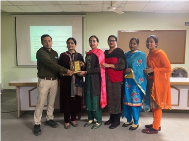

# Department of Computer Applications  

## Message from HoD's Desk

The Department of Computer Applications is dedicated for ensuring great careers for its students. For us, this means forging deeper industry linkages than ever before, creating a research culture from day one and ensuring seamless education using the best technology available anywhere. The excellent infrastructure, teaching faculty of the best kind of the Department ensuring quality education such as interaction among students, parents and staff, along with a Training and Placement Cell ensures a bright future to its students. We strongly encourage innovation in research, in teaching and in service to the profession, the local community and industry. Our faculty and students are constantly striving to excel and to advance the state of the art in Computer Applications. I invite you to be part of our efforts as we propel the department of Computer Applications to ever-greater heights. In closing, I wish all the students and faculty a good academic career.

Sincerely, and with best wishes,

Prof. Jasbir Singh Saini     
Associate Professor and H.O.D.    
(Department of Computer Applications)

## Department at Glimpse

 The Master of Computer Application Program was started in the year 2009. The M.C.A. is bestowed with an experienced team of members with excellent academic records and proficiency. Excellent infrastructure, state-of-the-art computers with the latest advances in technology and comprehensive study material make a class apart.

The M.C.A. helps in providing the I.T. and Computer Industry with world-class talent and creating some of the finest software professionals year after year. By providing concept-oriented subject knowledge through a high quality teaching that is supplemented with practical training, the aims to bring out some of the brightest minds into the world of computers and technology.

The success of the M.C.A. is attributed to its motivating and inspiring faculty members who handle subjects like Artificial Intelligence, Software Quality Management, Computer Networks, Mobile Computing, Distributed Computing and much more.

## Faculty Achievements

-	Prof. Jasbir Singh Saini is Life Member of Indian Society for Technical Education, New Delhi- LM-38794.
-	Prof. Jasbir Singh Saini is Fellow of Institution of Engineers (I), Kolkata- F-1215525.
-	Prof. Jasbir Singh Saini is Life Member of Computer Society of India, Navi Mumbai.
-	Prof. Jasbir Singh Saini is Charted Engineer of Institution of Engineers (I), Kolkata- F-1215525.
-   Prof. Jasbir Singh Saini has served as Member of Organizing Committee in Workshop on 'Virtual Labs' conducted by IIT Roorkee and Organized by GNDEC.

## Publications

- Anand, D., kaur, A. & Singh, M. (2024),” Research on Internet of Medical Things: Systematic Review, Research Trends and Challenges”, Recent Advances in Computer Science and Communications (RACSC) Volume 17, Issue 6, 2024
	DOI: 10.2174/0126662558248187231124052846 (Scopus)

- Anand, D., kaur, A. & Singh, P. (2024),” Enhancing Healthcare Monitoring with efficient Computation Offloading in Fog Computing”,  International Journal of Computer Networks and Applications (IJCNA), Volume 11, Issue 4, July – August (2024)  PP: 506-518 DOI: 10.22247/ijcna/2024/32 (Scopus) 

## Events Organized

| Sr. No. | Name of Event                                                                                                                 | Faculty Coordinator                                           | Duration | Date(s)                | Sponsor(s)                                     |
|:--------|:------------------------------------------------------------------------------------------------------------------------------|:--------------------------------------------------------------|:---------|:-----------------------|:-----------------------------------------------|
| 1       |  A One-day seminar on Drug De-addiction            | Prof. Jasbir Singh Saini and Prof. Dinesh Anand | 1 day | 09 December, 2022   | GNDEC |

	 

  

Faculty and students attending the Seminar 

## FDPs/Seminars Attended

| Sr. No. | Name of Faculty   | Name of Event                                                                                     | Duration | Date(s)               | Organizing Institute                                        |
|:------- |:----------------- |:------------------------------------------------------------------------------------------------- |:-------- |:--------------------- |:----------------------------------------------------------- |
|1| Prof. Dinesh Anand |NSQF Aligned Curriculum Design and Implementation   | 1 week | 18/9/2023 to 22/9/2023 | NITTTR, Chandigarh |
|2|Prof. Jasbir Singh Saini|Virtual Labs| 3 days| 1-3 December, 2021| GNDEC & IIT ROORKEE|
|2|Prof.Harmandeep Kaur|Role of Techical Institutions in Rural Infrastructure Development| 1 Week|24-04-2023 to 28-04-2023| Rural Development Department NITTTR, Chandigarh|
|3| Dr.Manreet Sohal|Building Advanced Data Analytics Applications With Cloud|5 Days|16/10/2023 to 20/10/2023|	Edunet Foundation and AICTE|
|9|Prof.Preeti Aggarwal|Machine Learning & NLP using Python|5 Days|24th June, 2024 to 28th June, 2024|Infosys Springboard|
|4|Dr.Manreet Sohal|Designing Course Outcomes and Outcomes-focused Questions|1 Day|09/08/2023|	InPods Ed-tech|
|5|Dr.Manreet Sohal|Workshop on Communication Skills|1 Day|07/08/2023|	Dept. Of Applied Sciences& IQAC, GNDEC|
|6|Prof.Kamalpreet Kaur|Workshop on Communication Skills|1 Day|07/08/2023|	Dept. Of Applied Sciences& IQAC, GNDEC|
|7|Prof.Amanpreet Kaur|Workshop on Communication Skills|1 Day|07/08/2023|	Dept. Of Applied Sciences& IQAC, GNDEC|

### Rangoli Competition

A rangoli competition in lieu of Diwali celebration was organized by the department of Computer Applications on 21/10/2022 for the students of BCA and MCA. Prof. Birpal Kaur and Prof. Amanpreet Kaur were the coordinator faculty for the event.

Following are the Winners of the Competition:

- 1st  Prize- Ritu and Pooja Rani (BCA 2nd year)
- 2nd Prize- Jai Kaundal (BCA 3rd  year) and Mittali makkar(BCA 1st year)
- 3rd Prize- Sukhpreet Kaur and Arshpreet Singh (MCA 1st year)

 

 

**Dr. Parminder Singh (Head, CSE) along with the faculty of Computer Applications giving away the prizes to the winners**

### Students' achievements

#### **Sports Day 2023- Held on 2-3 March,2023**

***List of winners:***

|S.No.|	Name                      |	Roll No.	|Class	|Event 	|Prize|
|:--------|:----------|:-----------|:------|:---------|:---------|
|1.	|Satleen Singh|	2191050	|BCA 2nd|	Shot put Throw | 2nd|
|2.	|Satleen Singh|	2191050|	BCA 2nd |	Discuss Throw|	1st|
|3.	|Devinder Kumar|	2191001|	BCA 2nd|	10 km Race	|2nd|
|4.	|Devinder Kumar|	2191001 |	BCA 2nd	|1500 m Race|	2nd|
|5.	|Girls|	|BCA 1st	|4 X 400 Relay Race|	2nd|
|6.	|Girls |			|BCA & MCA|Tug Of War	|1st|

 

 
 Winners from Sports meet 2023 
 

### **Youth Festival**

***Positions held by students:***

|S.No.|	Name                      |Class	|Event 	|Prize|
|:--------|:----------      |:-----------|:------|:---------|
|1| Amritpreet Kaur	      |MCA 2nd	|Punjabi Folk Dance Giddha (Inter Zonal)|	1st|
|2.|Gurbhej Singh|	MCA 1st	|Punjabi Folk Dance Bhangra (Inter Zonal)|	1st|
|3.|Jagjot Singh	|BCA 2nd	|Indian Group Song (Inter Zonal)|	2nd|
|4.|Jagjot Singh|BCA 2nd|Non Percussion Solo (Inter Zonal)|	3rd|
|5.|Minaz|	BCA 1st|	One Act Play (Inter Zonal)|	1st|
|6.|Minaz	|BCA 1st	|Skit (Zonal) & Mimicry (Zonal)|	2nd|
|7.|Vikas Pal|	BCA 1st|	Mime (Zonal)|	1st|

### Technical Events/Cultral Events

|S.No.|Name of students |Class|Event|Organized by|Date|Prize|
|---|----|---|-----|------|---|--|
|1.|Surya Dev & Vishal|MCA 1st|Java Maestros(Coding using JAVA)|Tech Disha,Arya College, Ludhiana|16-02-23|2nd|
|2.|Simranjeet Kaur & Rajan|MCA 1st|Photography|Tech Disha,Arya College, Ludhiana|16-02-23|2nd|

### Computonics Club
|S.No.|Name of event|Event type |Date|
|---|----|---|-----|
|1.| Recruitments| Interview| 31-01-2024|
|2.| Linkedin Link Up| Technical|22-01-2024|
|3.| LINUX UNLEASHED|Technical |05-02-2024|
|4.| APPLICATION OASIS|Technical |13-02-2024|
|5.| RECAPITULATE|Technical|27-02-2024|
|6.| CYBER SECURITY|Technical|15-03-2024|
|7.| Fresher’s Day Celebration|Cultural |02-09-2023|
|8.| Recruitment|Interview |15-09-2023|
|9.| Programming Contest| Technical|18-09-2023|
|10.| Mock Interview|Interview |21-09-2023|
|11.| Quiz|Technical |06-10-2023|
|12.| Group Discussion|Technical |16-10-2023|

### Placements  

	

-	Himanshi Rani student of MCA placed in Cognizant. (2023)
-	Aprajita Kumari student of MCA placed in Education Pvt Ltd. (2023) 

