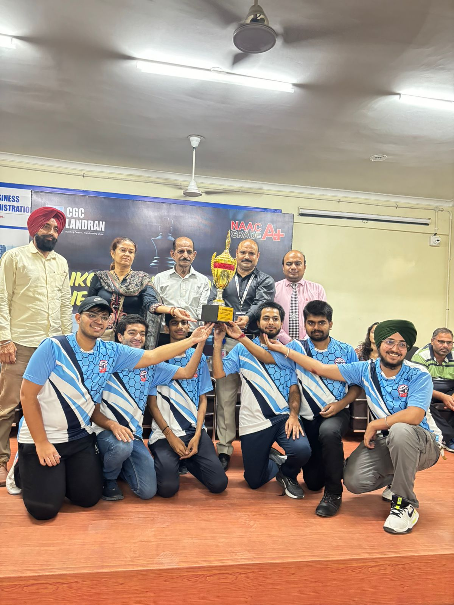
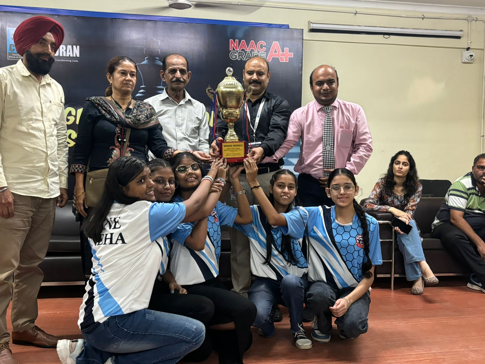
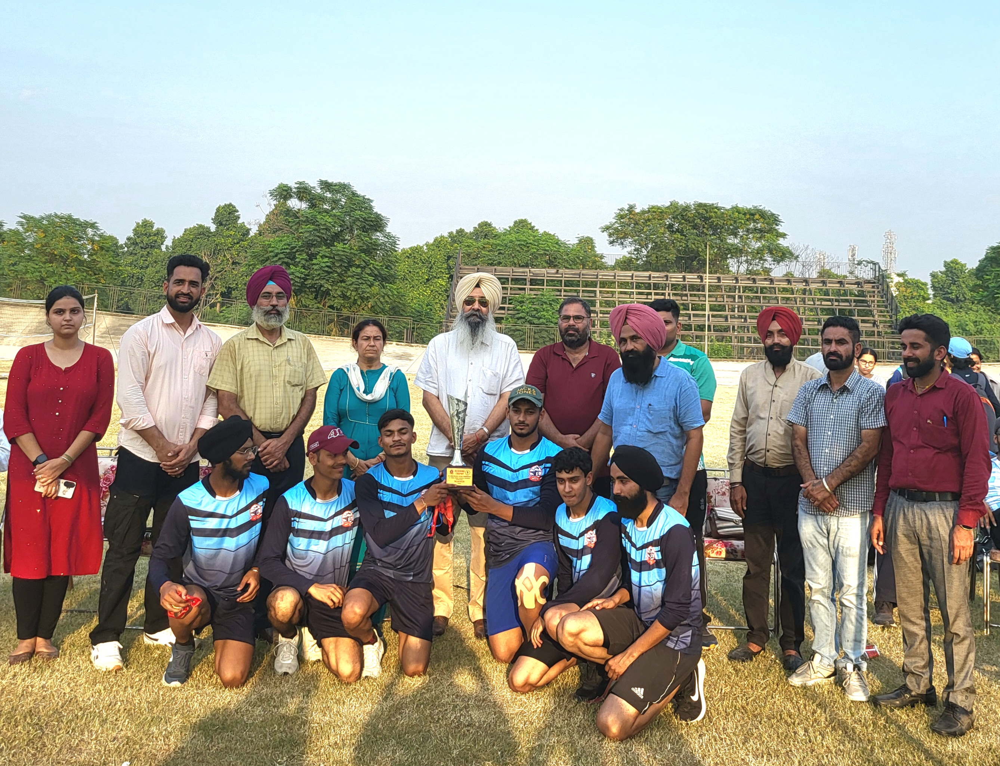
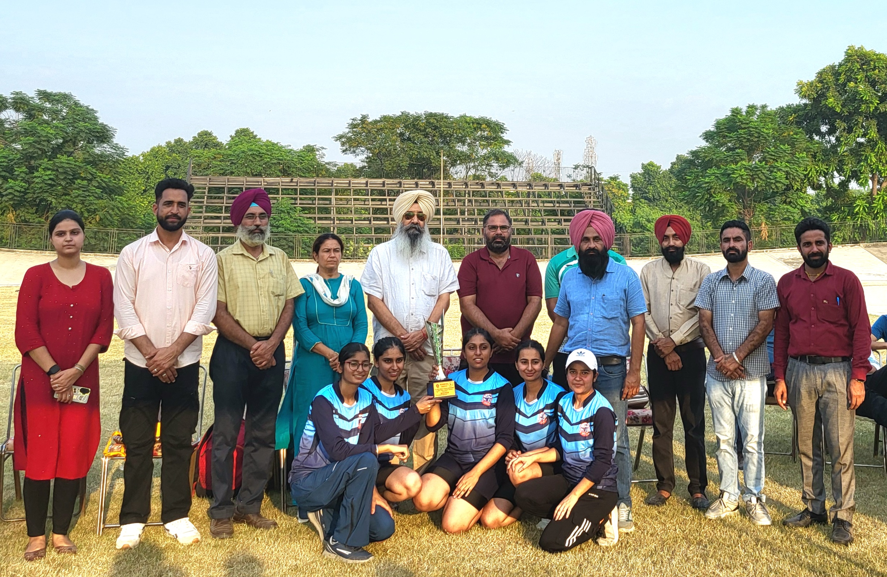
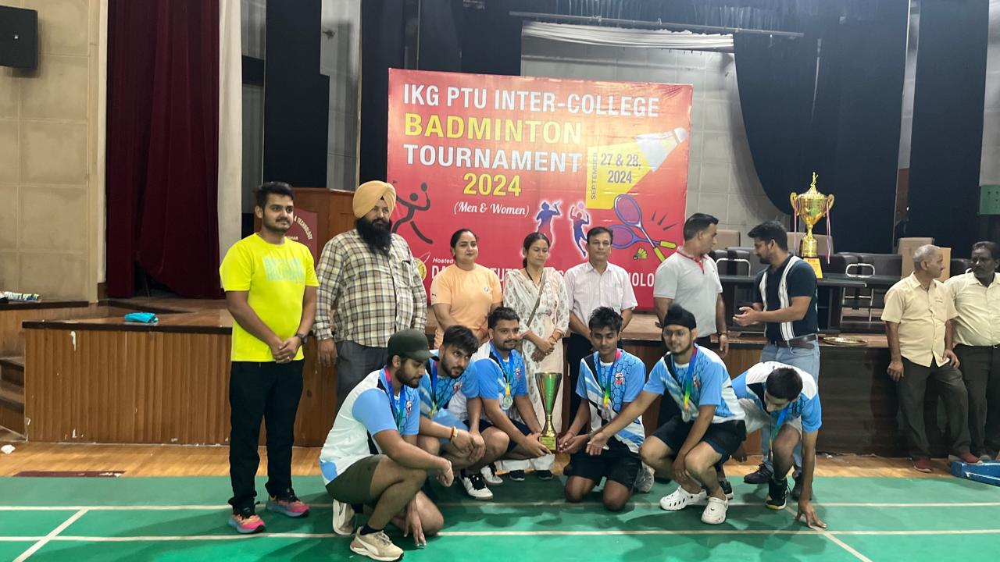
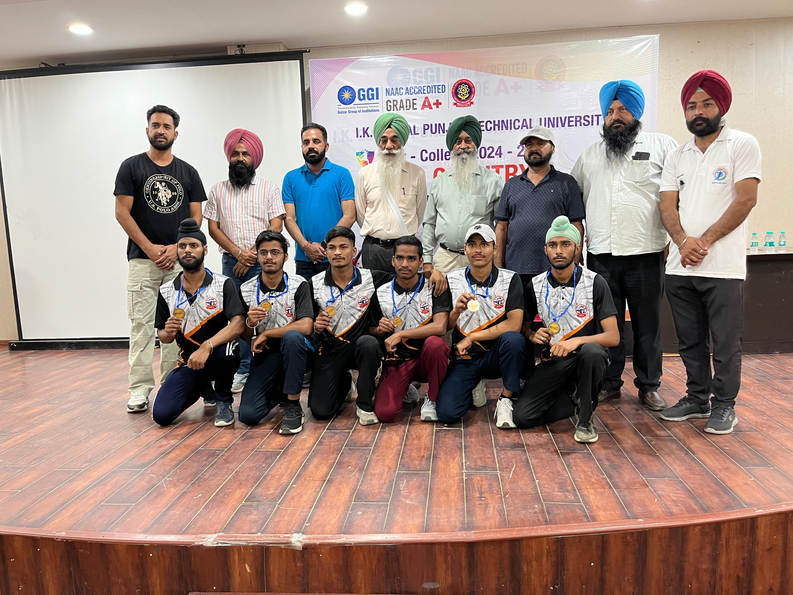
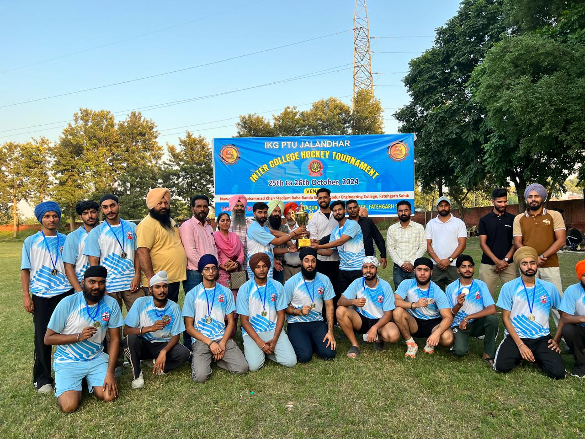
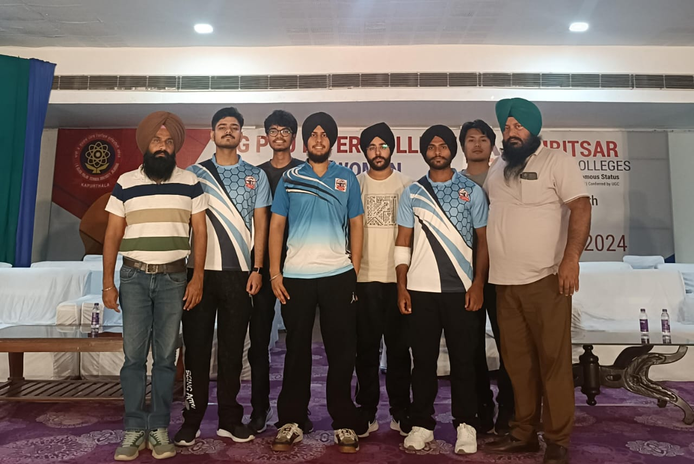

# Extramural Activities
## PTU Inter-college Tournaments

  

**Shubhdeep Kaur of B.Tech 2nd  year(2135212) became IKG-PTU BEST CYCLIST  in PTU Inter-college Cycling Competition at PAU "Velodrome",Ludhiana   on 15th October 2022**  

  

**IKGPTU Inter-varsity Participation**

| Sr. No. | Name | Roll No. | Branch | Game | Venue | Dates | Photograph |
| - | -- | - | - |-| - | - | - |
| 1. | Nikhal Singh|2204002 | B.Tech.3rd yr ME |Kabaddi |Lovely Professional University|13th  to 16th  November 2024 |  |
| 2. | Prabhjot Singh | 2104546 | B.Tech.4th yr IT |Basketball  |kurukshetra university |25th -28th November 2024 |  |
| 3. | Anmol Singh| 2104242 | B.Tech.4th yr EE |Basketball |kurukshetra university |25th-28th November 2024 | |
| 4. | Saumya Dhingra | 2302667 | B.Tech.2nd yr CSE |Basketball |Kurushetra  University,Kurushetra |25th to 28th November 2024 | |
| 5. | Manvir Singh | 2302396 | B.Tech.2nd yr CE |Basketball |Kurushetra University,Kurushetra| 25th to 28th November 2024 | |
| 6. | Davinderpal Singh|2316104| B.Tech 2nd  yr|Basketball |Kurushetra  University,Kurushetra|25th to 28th November2024| |
| 7. | Sushant Pal | 2416087 | B.Tech.1st yr EE |Badminton |Chitkara  University, Chandigarh| 30th Oct 1st  November 2024 | |
| 8. | Vansh Singh|2203907| B.Tech 3rd  yr  IT |Badminton |Chitkara  University,Chandigarh|30th oct 1st November2024| |

***IKGPTU CYCLING COMPETITION***

