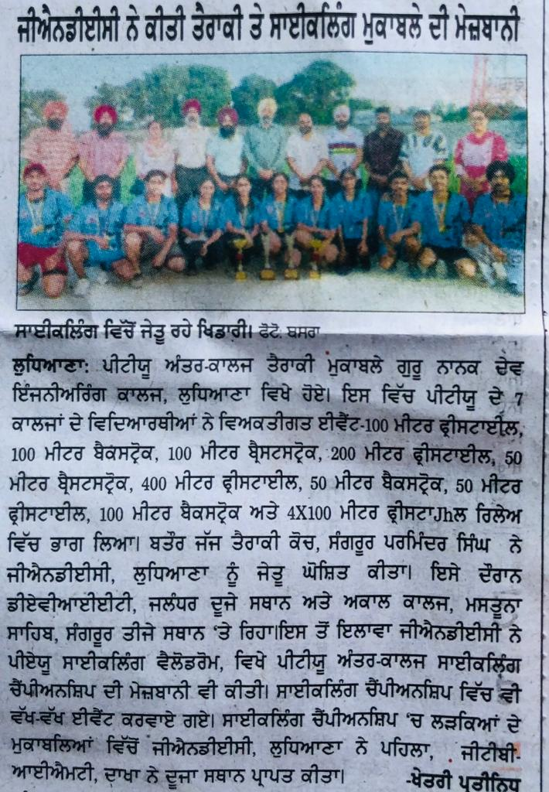

# Department of Physical Education & Sports

## Message from HoD's Desk

The Sports department works on promotion of personal and professional development of students through designing and implementing programs that support healthy lifestyles and inculcate moral,ethical and spiritual values among them through intra-mural and extra-mural activities.Thus,all students must actively take part in sports activities offered by the college within the campus.

**"Stay Active Stay Fit"**

## Sport's Committee

## Sport's Department at Glimpse

- [Athletic Meet 2023](Meet.md)
- [Infrastructure](Infra.md)
- [Intra-murals](Intra.md)
- [Extra-murals](Extra.md)

## News

## Events Organized   

| **Sr. No.** | **Name of Event**                          | **Faculty Coordinator(s)**        | **Duration**  | **Date(s)**                      | **Sponsor(s)**   |
|-------------|--------------------------------------------|------------------------------------|---------------|-----------------------------------|------------------|
| 1           | PTU Inter-college Swimming Competition     | Dr. Gunjan Bhardwaj & S. Suminder Singh | One Day      | 9th September 2024               | IKGPTU fund      |
| 2           | PTU Inter-college Cycling Competition      | Dr. Gunjan Bhardwaj & S. Suminder Singh | One Day      | 1st October 2024                 | IKGPTU fund      |
| 3           | PTU Inter-college Basketball Competition   | Dr. Gunjan Bhardwaj & S. Suminder Singh | Two Days     | 16th to 17th October 2024        | IKGPTU fund      |
| 4           | "GPK" GNE Premier Cricket League           | Dr. Gunjan Bhardwaj & S. Suminder Singh | Five Days    | 7th to 11th October 2024         | Sports fund      |
| 5           | GNE Inter-year Football League Tournament  | Dr. Gunjan Bhardwaj & S. Suminder Singh | Three Days   | 10th to 12th September 2024      | Sports fund      |
| 6           | 62nd Annual Athletic Meet                  | Dr. Gunjan Bhardwaj & S. Suminder Singh | Two Days     | 22nd to 23rd February 2024       | Sports fund      |
| 7           | PTU Inter-college Zonal Cricket Tournament | Dr. Gunjan Bhardwaj & S. Suminder Singh | Four Days    | 15th to 18th February 2024       | IKGPTU fund      |
| 8           | Inter-year Basketball League Tournament    | Dr. Gunjan Bhardwaj & S. Suminder Singh | Two Days     | 3rd to 4th September 2024        | Sports fund      |
| 9           | GNE Open Cross Country                     | Dr. Gunjan Bhardwaj & S. Suminder Singh | One Day      | 23rd August 2024                 | Sports fund      |
| 10          | Kabaddi                                    | Dr. Gunjan Bhardwaj & S. Suminder Singh | One Day      | 13th August 2024                 | Sports fund      |
| 11          | Badminton                                  | Dr. Gunjan Bhardwaj & S. Suminder Singh | Two Days     | 20th to 21st October 2024        | Sports fund      |

