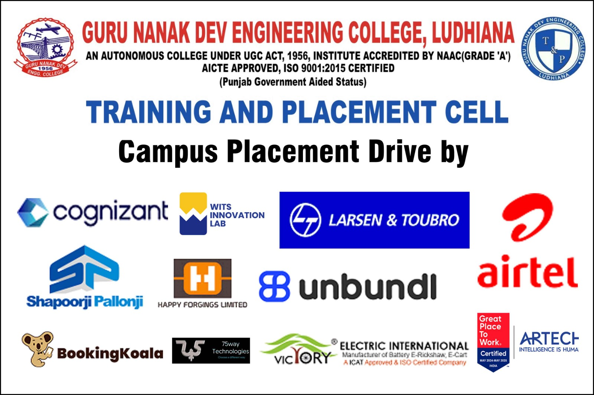
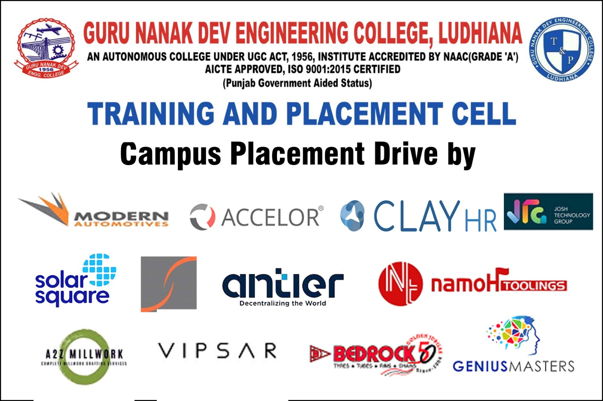
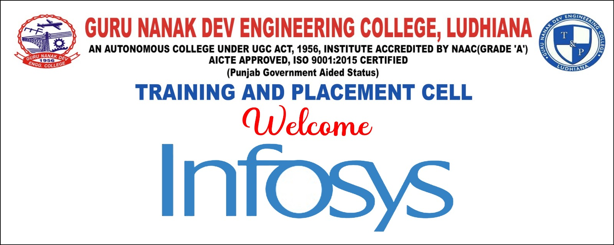
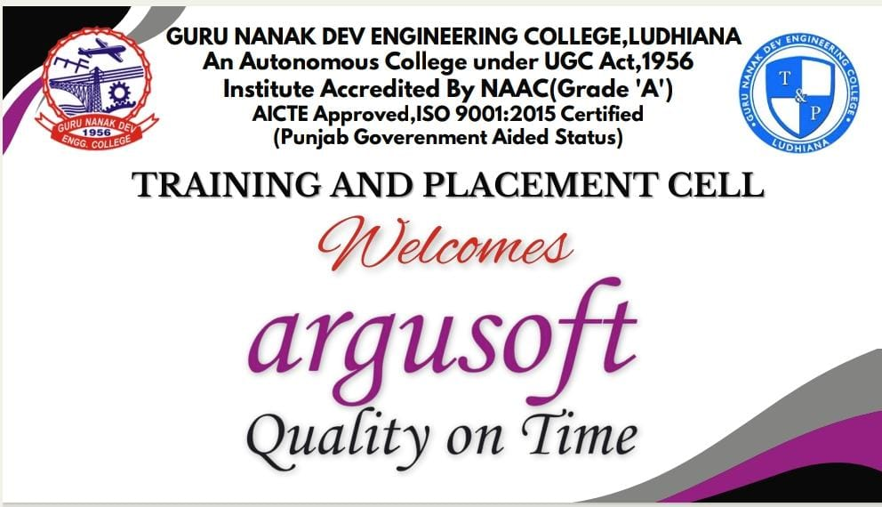
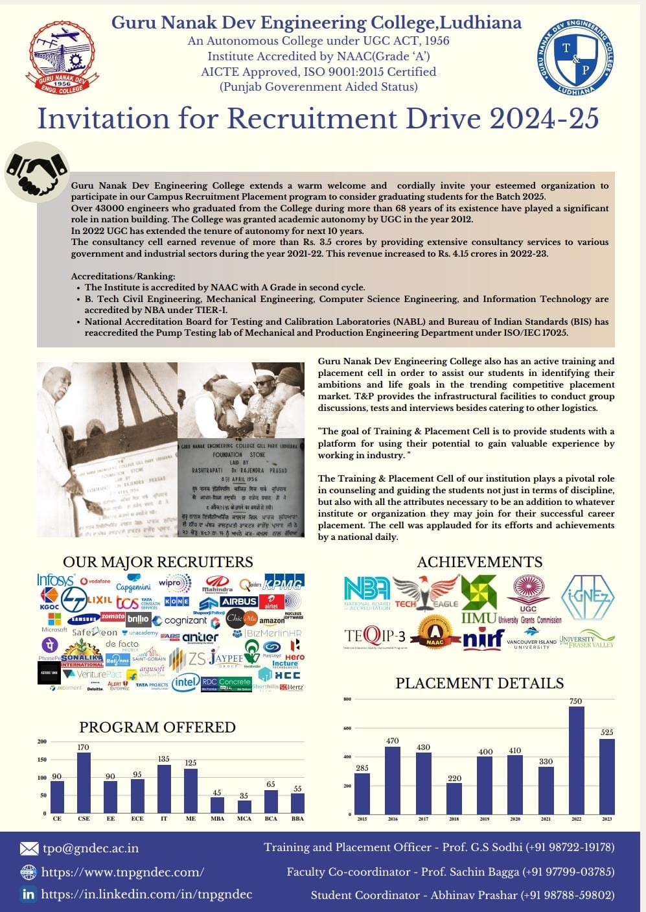
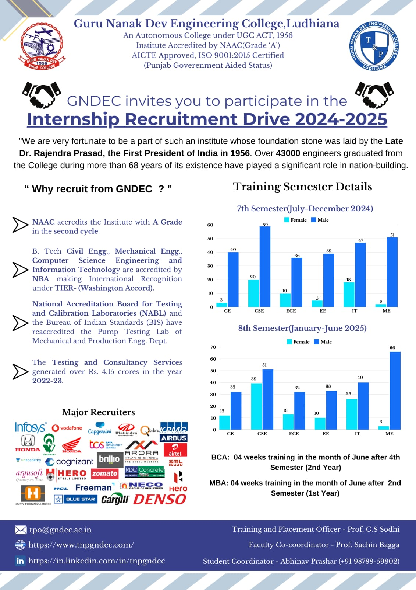
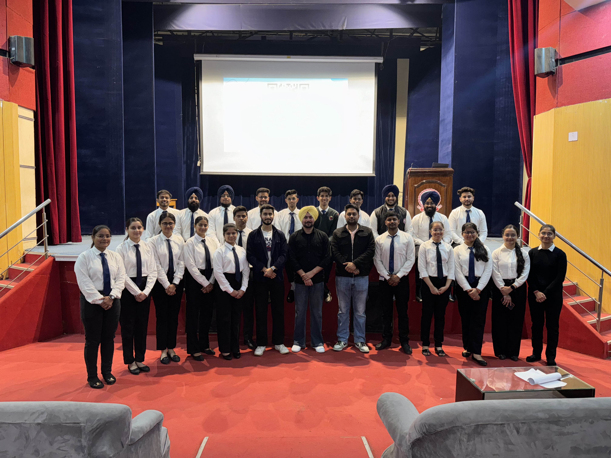

# Training And Placement Cell

The Training and Placement cell aims to provide students with an environment where they can use their potential to extreme along with gaining valuable experience of working in the industry, it is a network of communication between various companies seeking talented young graduates and post graduates in various disciplines. The cell is complete in terms of infrastructure having Testing halls, Consultancy Hall, Conference room for Pre Placement Talk, Presentations etc.  The cell also has video conference facility available for the students.

### Training

The cell contrives to provide training in industries for 6 weeks at the end of 4th semester and for 6 months in 7th or 8th semester. Every Engineering Department student goes through a minimum of 12 weeks of industrial training and minimum 6 weeks of software training within the 6 months training. Many students of the cell got the chance of getting trained from reputed companies like TCS, Mahindra & Mahindra, Delhi Metro Rail Corporation, Maruti Udyog Ltd, Havells, DRDO, CISCO, Ericsson, Siemens, Reliance Group, HCL, Samsung, LG, EICHE, Volkswagen etc.

### Placements

Many National and Multinational companies visit the college for recruitments. The Cell is a link that provides students with all the information they require at the fastest rate possible. A common placement brochure gets published annually covering all aspects. The Training & Placement Cell works day and night in order to develop 'Industry-Institute Interaction'. Along with Developing relations with the industries, the cell organizes technical talks and national seminars to provide a platform for budding engineers to interact with professionals from various industries, it encourages college students to visit the industries. 

---

## Message from TPO's Desk

I gladly bring a warm welcome to you on the behalf of Training & Placement Cell of Guru Nanak Dev Engineering College, Ludhiana.

Globally accepted as a source of academically and professionally excellent students, Guru Nanak Dev Engineering College, Ludhiana, is known for its professional approach, cultural activities and academic rigour. Our college showcases its rich heritage and knowledge through the hands of its highly-rated faculty all over Punjab and provides students with an opportunity to carve a new path in their life. It is a moment of great pride to state that Guru Nanak Dev Engineering College is being awarded as the “Best College for Placements” under PTU every year since 2013. Further achievement being, the accreditation of Autonomous College by UGC in the year 2012.

The Training and Placement Cell, GNDEC along with giving an outstanding placement record, also serves as a platform for students to gain a market exposure and groom their personalities as well. The prime focus is not to just create engineers rather leaders which may lay the foundation for the future development of our nation. The Training & Placement Cell is an interface that looks after the students and the recruiting organizations, taking care of the interests of both.
Students of the previous batches have further assured the solid foundation of our institution by taking placements in companies with top global reputation. The bonds developed with the industries ultimately lead to a great future ahead, providing an environment for research and education. Thus,  I invite the recruiting organizations and graduating students to find the best match between their needs and capabilities and look forward to have your active participation.

 

---

## Major Recruiters

\

\

\

\

 

---

## Invitation for Placements and Internships

\

\

## Training And Placement team

\

\

Guru Nanak Dev Engineering College also has an active training and placement cell in order to assist our students in identifying their ambitions and life goals in the trending competitive placement market. T&P provides the infrastructural facilities to conduct group discussions, tests and interviews besides catering to other logistics.

The Training & Placement Cell was applauded for its efforts and achievements by a national daily.

We have a training placement team which includes Student Coordinators, Deputy Coordinators, Co-coordinators, Student moderators, Student Advisor, Database head Administrator, Public relation officer, Media Head, Executive Team, Who perform their duties well and efficiently.
  

---

## Placement Insights

| Company Name                                     | Package(LPA)          |
|------------------------------------------------|-----------------------|
| TCS Prime                                        | 9                    |
| Argusoft                                         | 7.12                 |
| Stylumia Intelligence Technology Pvt. Ltd.       | 7                    |
| TCS (Digital)                                    | 7                    |
| Ultra Tech Cement Ltd                            | 6.5                  |
| 75way Technologies Pvt. Ltd.                     | 6                    |
| Larsen & Toubro Limited                          | 6                    |
| Nebero Systems Private Limited                   | 6                    |
| Vodafone Idea                                    | 6                    |
| Cargill                                          | 5.66                 |
| Airtel                                           | 5.57                 |
| SRVA Education                                   | 5.46                 |
| JMAN Group                                       | 5                    |
| KPMG                                             | 5                    |
| Kent RO                                          | 4.8                  |
| ShortHill Tech                                   | 4.8                  |
| BizMerlin HR.                                    | 4.82                 |
| Shapoorji Palloni & Co, Ltd                      | 4.25                 |
| Mahindra & Mahindra Ltd.                         | 4.2                  |
| SafeAeon Inc.                                    | 4.2                  |
| Capgemini                                        | 4                    |
| Cognizant                                        | 4                    |
| Kion Group-Dematic                               | 4                    |
| Corizo                                           | 4                    |
| IndiaMart IndiaMesh Ltd.                         | 3.6                  |
| Amber Enterprises                                | 3.5                  |
| WITS INNOVATION LAB                              | 3.5                  |
| Vardhman Special Steels Ltd.                     | 3.38                 |
| RDC Concrete (India) Pvt. Ltd.                   | 3.36                 |
| TCS (Ninja)                                      | 3.36                 |
| Consort Builders Pvt. Ltd.                       | 3.24                 |
| Ralson (India) Limited                           | 3.24                 |
| Zydex Industries Private Limited                 | 3.2                  |
| Spectrum Automation & Controls                   | 3.18                 |
| Continental Engineering Consultants              | 3                    |
| Genius Masters                                   | 3                    |
| Happy Forgings Limited                           | 3                    |
| International Tractors Limited                   | 3                    |
| NUHOME FURNISHINGS                               | 3                    |
| Pearce Services Global, Mohali                   | 3                    |
| Ultafine                                         | 3                    |
| HMC E-Valley Pvt. Ltd.                           | 2.64                 |
| NAHAR INDUSTRIAL ENTERPRISES LIMITED             | 2.64                 |
| Brosis International                             | 2.64                 |
| Freeman Group                                    | 2.58                 |
| Hero Ecotech                                     | 2.52                 |
| DNK Chemicals & Coatings Pvt. Ltd.               | 2.5                  |
| Volkswagen Lally Motors Ludhiana                 | 2.4                  |
| AlphaNumeric Ideas Pvt. Ltd                      | 2.4                  |
| Spectrum Talent Management Limited               | 2.4                   |
| Relinns Technologies Pvt. Ltd.                   | 2.31                 |
| New Era Machines                                 | 2.3                  |
| Deepak Fasteners                                 | 2.16                 |
| Rama Steel Forge Ludhiana                        | 2.16                 |
| Metro Tyres Limited                              | 1.8                  |
| New Swan Group                                   | 1.8                  |
| ALPHA POWER-SOLAR SYSTEM                         | 1.44                 |
| Maa Chintpurni Construction Company              | 1.44                 |

---

## [Placement Highlights 2024](Placement_highlights_2023.md)

---

## [Glimpses](Glimpses.md)

---

## Events

- [Events held in collaboration with Mahindra & Mahindra](Events_MM.md)

- [Events held in collaboration with Infosys](Events_Axis_Bank.md)

- [Events held by the Training and Placement Cell](Events_T&P.md)

- [Recent Placement Activities](https://www.tnpgndec.com)
